# Table of Contents
- [Table of Contents](#table-of-contents)
- [Introduction](#introduction)
    - [Lab Objective](#lab-objective)
    - [Pre-requisite](#pre-requisite)
    - [Quick Links](#quick-links)
- [Lab Section](#lab-section)
  - [Step 1. Quick response template creation](#step-1-quick-response-template-creation)
  - [Step 2. Search and view conversation transcripts](#step-2-search-and-view-conversation-transcripts)
  - [Step 3. Enable and Access Debug Logs](#step-3-enable-and-access-debug-logs)
  - [Step 4. Share Flow](#step-4-share-flow)

# Introduction

### Lab Objective

In this Lab, we will go a bit deeper into the web Chat capabilities. You will configure templates for quick responses, see how to search for the conversation transcripts and learn troubleshooting the flows.

### Pre-requisite

1. You received an admin credentials to configure in Management Portal and Webex Connect.
2. You have successfully completed the previous **Basic Lab configuration** lab

### Quick Links

> Control Hub: **[https://admin.webex.com](https://admin.webex.com){:target="_blank"}**\
> Portal: **[https://portal.wxcc-us1.cisco.com/portal](https://portal.wxcc-us1.cisco.com/portal){:target="_blank"}**\
> Agent Desktop: **[https://desktop.wxcc-us1.cisco.com](https://desktop.wxcc-us1.cisco.com){:target="_blank"}**\
> Connect: https://cl2pod**X**.imiconnect.io/ (where **X** is your POD number)

# Lab Section

## Step 1. Quick response template creation

- This section applies to all channels, not just Live chat. You can preset quick responses that agents can use when they respond to customer queries. You can set up the responses in Templates, and group them in a Template Group to organize the content and make the templates easier to find. We'll configure some so you can test them in all the successive lab exercises

- Go to `Assets` > `Templates` and click the + icon besides Template Groups table header.

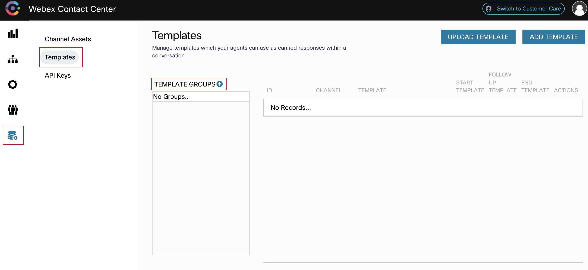
 
 

- In the Group Name field, enter the template group name and click `Add`

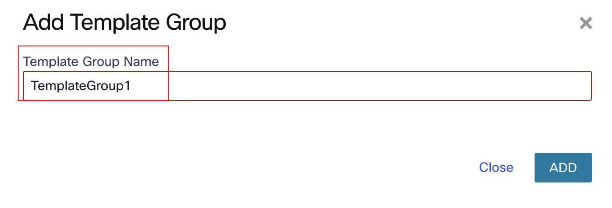
 
 

- You can choose to create a common template for all channels or create channel-specific templates. We will create a common template but also feel free to create other channel specific templates. Channel specific templates will only be shown to the agent when they receive a contact from that channel. Click `Add Template` button at the top right

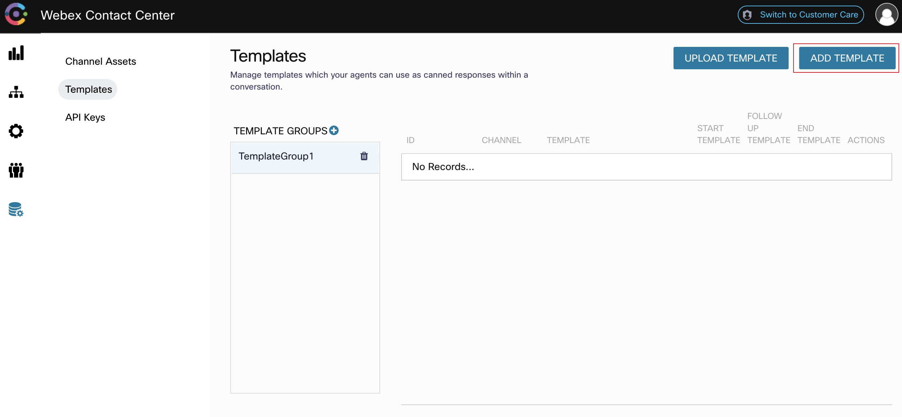
 
 

- Enter the template name in the `Template ID` field.

- Click on the `Is Start Template` checkbox to mark this as a template available at the start of the conversation as an opening statement.

- Enter the template text in the `Template Text` field. You can use variables by typing `@@` and also custom fields between chevron brackets `<>`. Variables will be autopopulated based on the active task and custom fields will be editable even if the template is locked. You can use the example on the screenshot or some other text.

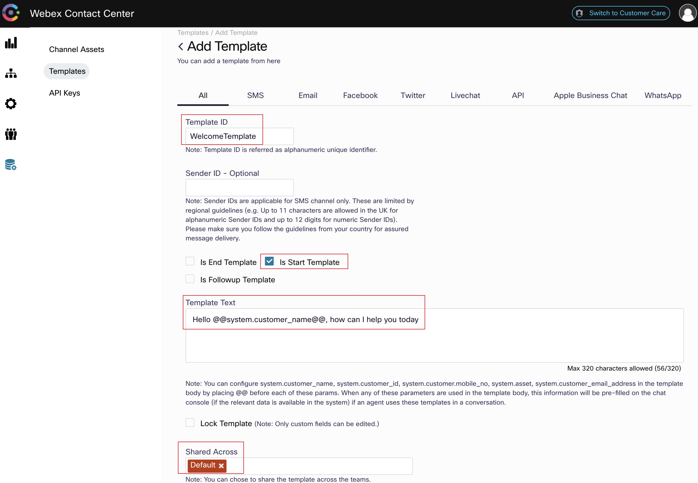
 
 

- To share the template with other teams, choose the team from the Shared Across field. We only have one team created which is the Default Team but you can create templates that are only show to specific teams.

- Click `SAVE CHANGES`

- Add another common template that has the checkboxes `Is End Template` and `Is Follow-up Template` checked like in the following screenshots

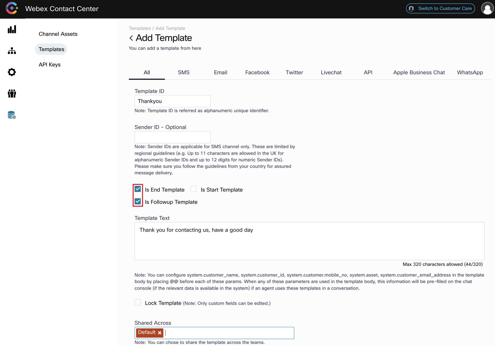
 
 

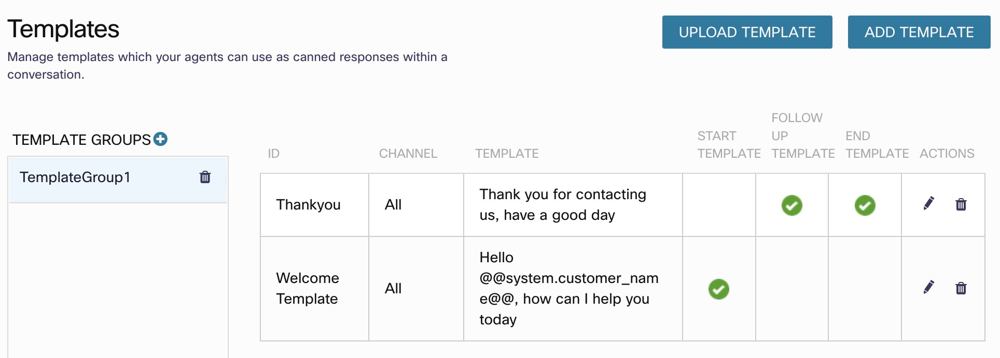
 
 

## Step 2. Search and view conversation transcripts

- You can search and view conversation transcripts from the New Digital Channels Engage interface. Go to the already openned tab or from Management Portal, access the menu and cross launch **New Digital Channels Admin Portal**  by choosing `New Digital Channels`. Then click on Switch to Customer Care button at the top right.

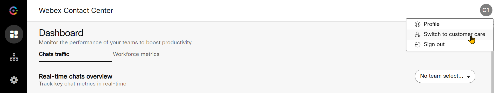
 
 

- Click on the Search button at the top left

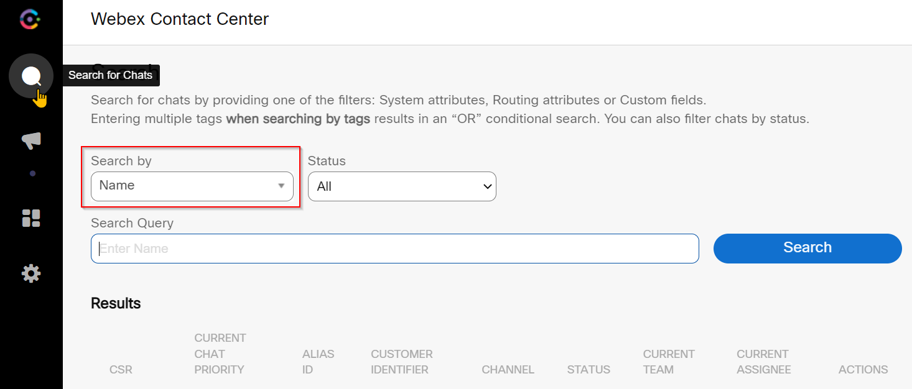
 
 

- You can search for transcripts using many fields depending on the channel. In this case use the Name field and search using the Customer Name used while testing in Step 7. Once the conversation transcript shows up, click on the button in the last column.

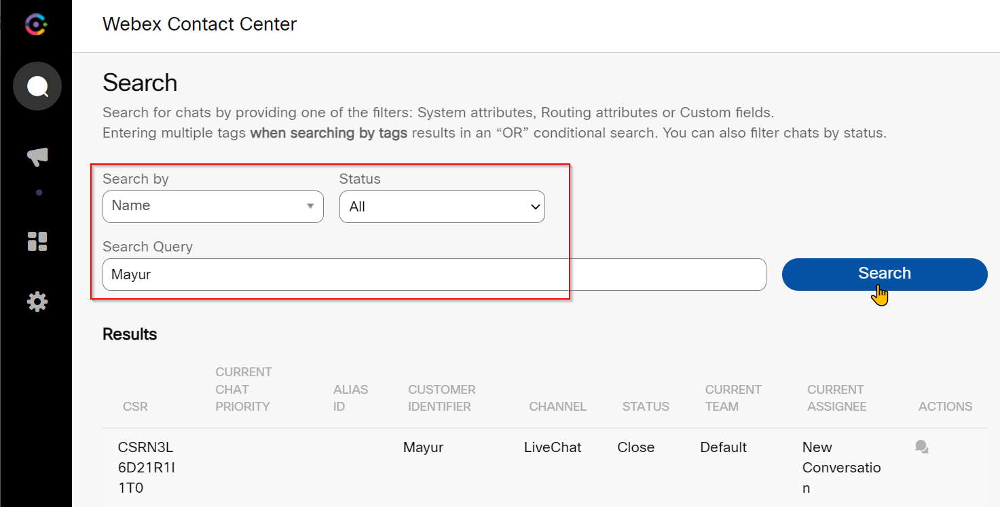
 
 

- Conversation transcript will load and you have the option to print as PDF

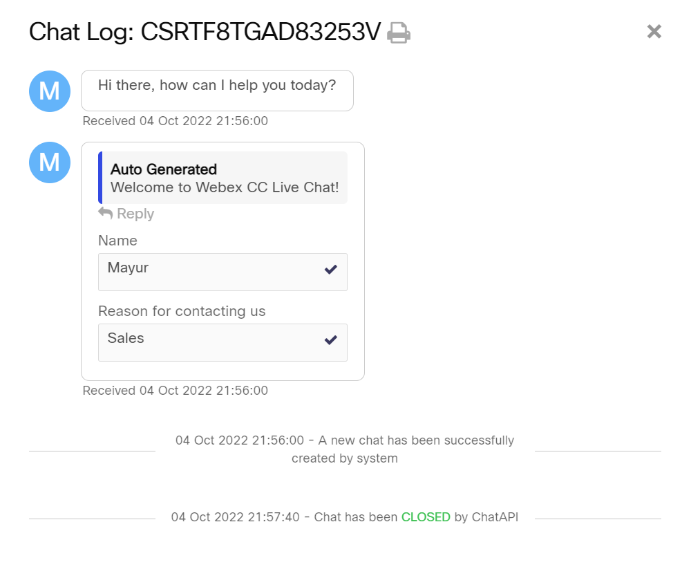
 
 

- On the customer end, they can also access the transcript by emailing it to their personal email account. Once conversation ended, click on the chat bubble hamburger icon and then select `Email transcript` option

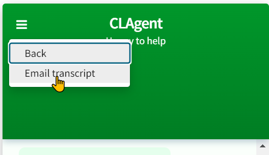
 
 

- Enter email address to send the transcript to

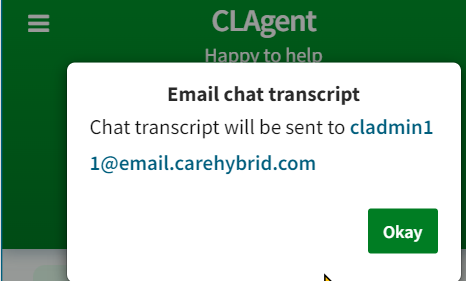
 
 

- Conversation transcript will be received in the following format:

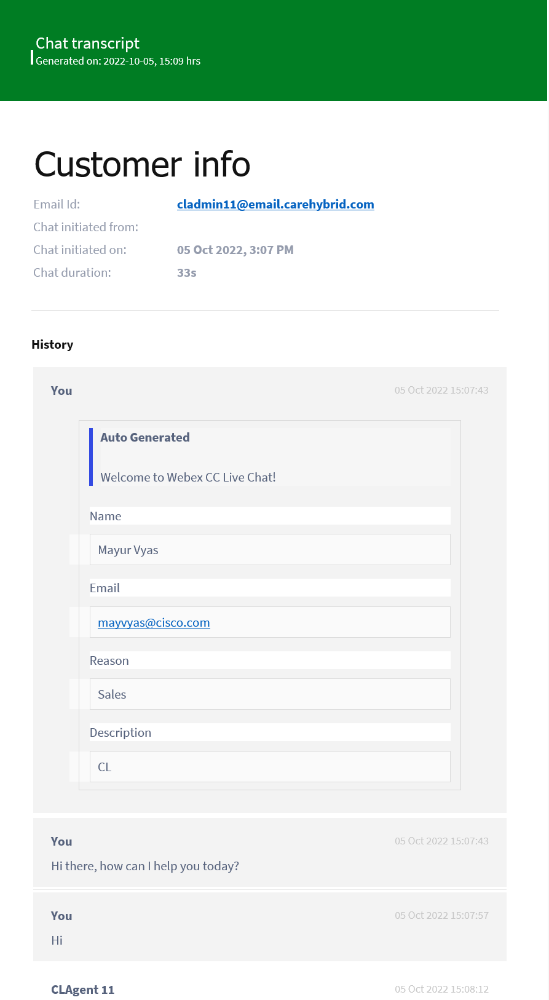
 
 

## Step 3. Enable and Access Debug Logs

>**Note**: Each Webex Connect tenant will have one owner added when the tenant is created. This owner will have decryption access by default. For any additional users added to the Connect tenant, please ensure that decryption access is enabled.

- Login to Webex Connect and navigate to Settings > Team mates 

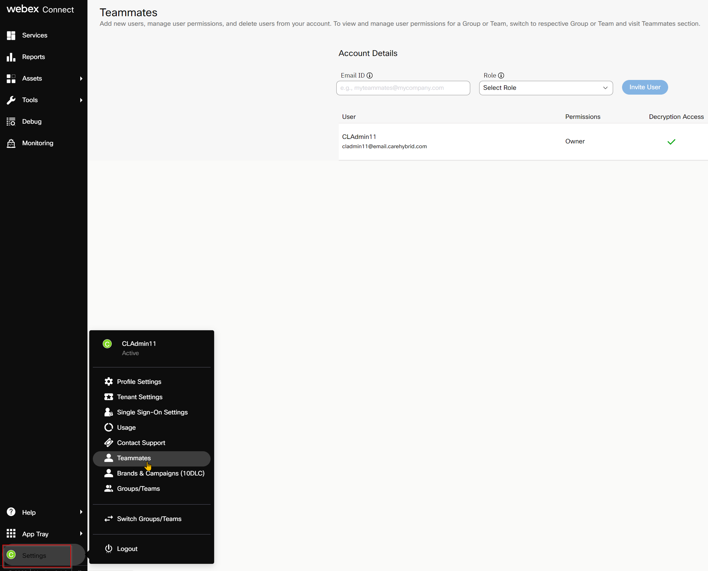
 
 

- Verify that decryption access is enabled for the owner of the Webex Connect tenant 

>**Note**: By default only standard logs will be enabled. To enable debug logs, the below steps have to be completed

- Login to Webex Connect and navigate to your respective service and select the flow you would like to debug 

- Under actions click on 'arrow' mark and select manage. This will bring up flow workspace.

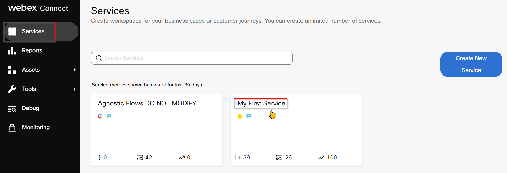
 
 

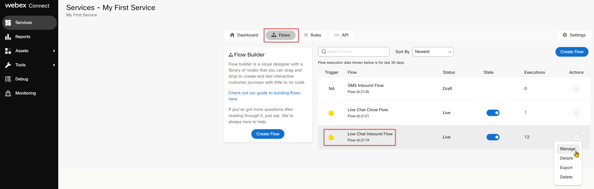
 
 

- In order to enable debug logs to see the complete HTTP request and response, Click on settings icon from top right and enable the toggle 'descriptive logs'

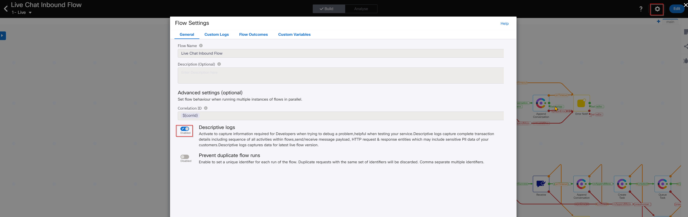
 
 

- On the right pane click on debug which will bring up a window at the bottom of the screen

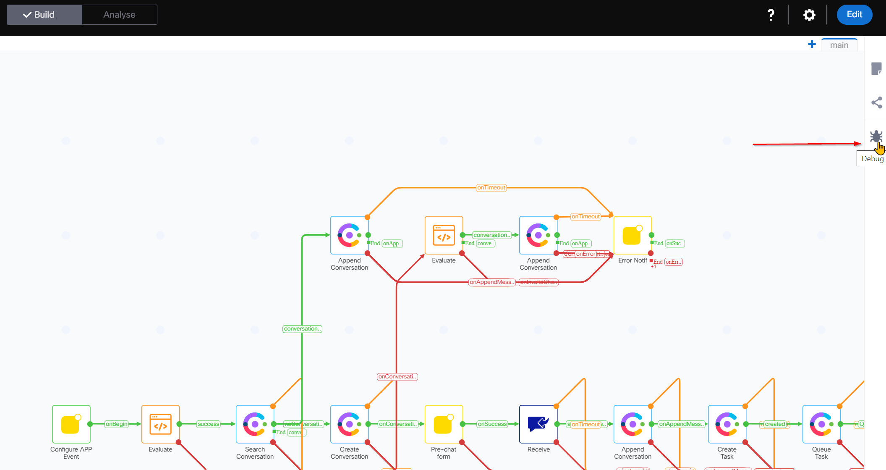
 
 

- Each row here represents logging for one task, click on 'decrypt logs' on the right side to see debug logging.

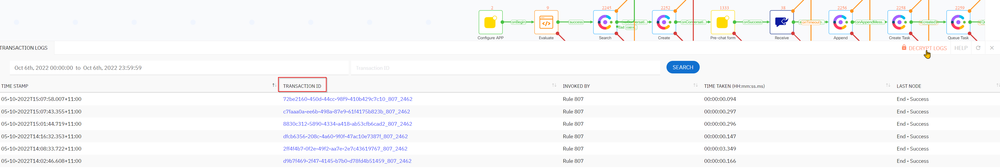
 
 

- Click on the trasactionID, you can see nodes that were executed as part of the flow along with node ID's.

- For example, click on create conversation, you can see the HTTP request and response cycle on the right.

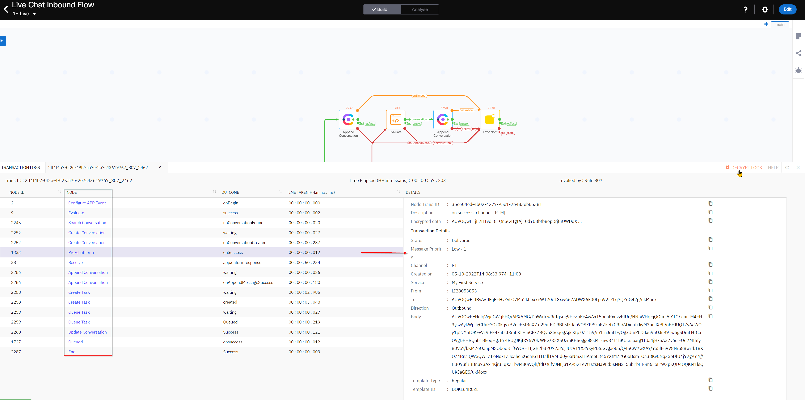
 
 

- Each node will have either a success or error outcome. When debugging, we can review the individual interaction and based on the outcome of the node, further debugging steps can be taken. 

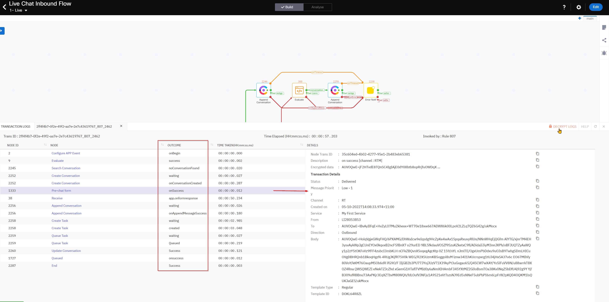
 
 

- **Now it's your turn! Go ahead and feel free to "break" anything in your Flow**.
	- *For example: You can delete the link after the Receive node*

-  Once you made the required changes and save them, try to start a new chat conversation and see what is the result.

- Then, go to the Flow, open the Debug Logs and analyze at what point is the flow stopped or broken

## Step 4. Share Flow 

- You can generate a shareable link for flow and share the flow with other users. 
  
- Anyone with the link can view the flow. Users who view the flow can see it in a view-only mode.

- You can decide if you want to include/exclude the Analyse mode in the flow that you share. When you include the Analyse mode, all the execution counters along with the Sankey charts become part of the shared flow. 

- Open the flow and on the right side click 'Share Flow' option to configure a password and share the flow in view only mode 

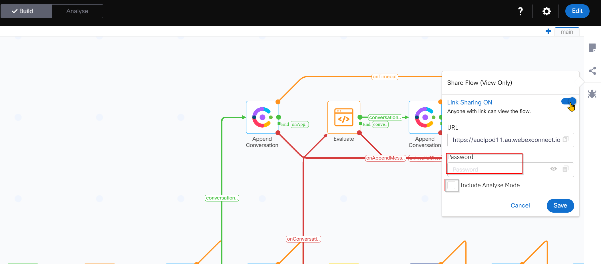
 
 

[Back to top](#table-of-contents)

### Congratulations, you have completed this section!

<button onclick="mainPage()" style="
  border-radius: 5px;
  background-color: rgb(116,191,75);
  padding: 10px;">Go To Previous Lab</button>

<button onclick="nextLab()" style="
  border-radius: 5px;
  background-color: rgb(116,191,75);
  padding: 10px;">Webex Connect Bot</button>

Or 
<button onclick="nextLabB()" style="
  border-radius: 5px;
  background-color: rgb(116,191,75);
  padding: 10px;">Dialogflow</button>

