# Table of Contents
- [Table of Contents](#table-of-contents)
- [Introduction](#introduction)
    - [Lab Objective](#lab-objective)
    - [Pre-requisites](#pre-requisites)
    - [Quick Links](#quick-links)
    - [AI Terminology](#ai-terminology)
- [Lab Section](#lab-section)
  - [Step 1. Navigate to Bot builder and create Bot](#step-1-navigate-to-bot-builder-and-create-bot)
  - [Step 2. Create Article, Custom Synonyms, select NLU engine and Make bot live](#step-2-create-article-custom-synonyms-select-nlu-engine-and-make-bot-live)
  - [Step 3. Preview Bot](#step-3-preview-bot)
  - [Step 4. Bot testing](#step-4-bot-testing)

# Introduction

### Lab Objective

In this Lab, we will go through the tasks that are required to complete the general pre-configuration of Question and Answer bot in Webex Connect. 

### Pre-requisites

- You have received the access credentials with a full admin access 

### Quick Links

> Control Hub: **[https://admin.webex.com](https://admin.webex.com){:target="_blank"}**\
> Portal: **[https://portal.wxcc-us1.cisco.com/portal](https://portal.wxcc-us1.cisco.com/portal){:target="_blank"}**\
> Agent Desktop: **[https://desktop.wxcc-us1.cisco.com](https://desktop.wxcc-us1.cisco.com){:target="_blank"}**\
> Connect: https://cl2pod**X**.imiconnect.io/ (where **X** is your POD number)

### AI Terminology

- **Utterances**: Anything a user says to the bot​

- **Intents**: Task or action that the user wants to perform​

- **Entities**: Metadata that specifies the user's intent​

- **Responses**: Message sent from the bot to converse to the user​

- **Fallback**: The state when a bot is unable to understand the utterance​

- **Handover**: Bot stops processing messages and transfers to an agent

- **NLU (Natural Language Understanding)**: engines used to assess the intent from the consumer inputs and respond with an accurate response

# Lab Section

> **NOTE**: Please read carefully the lab guide and follow the instructions. It might be possible that some GIFs are not accurate.
{: .block-warning }

## Step 1. Navigate to Bot builder and create Bot

- Login to your respective Webex Connect UI using the provided URL https://cl2pod**X**.imiconnect.io/ (where **X** is your POD number).
  
- Navigate to App Tray and Bot Builder
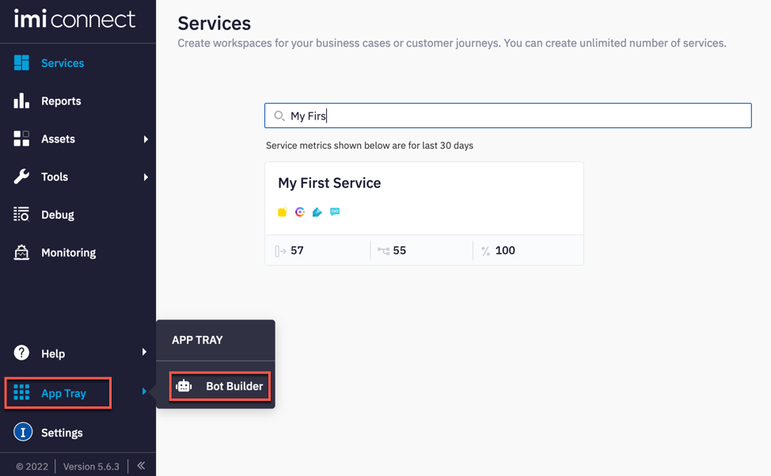
 
- Select QnA bots and click 'New Q&A Bot'
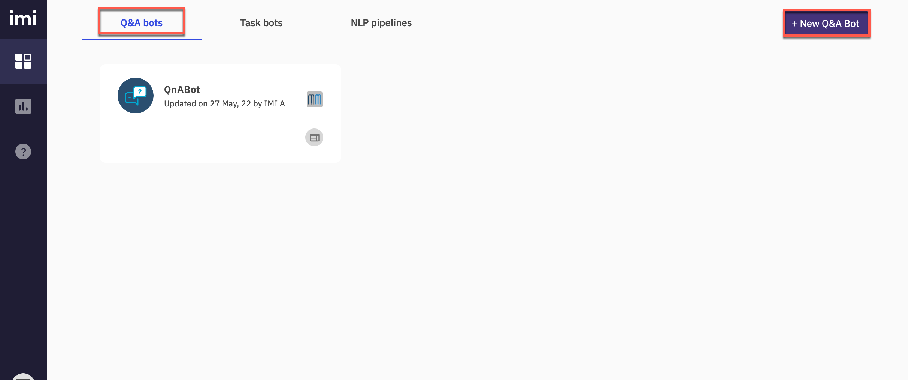
 
- Input a name for this bot in the **_Bot Name_** section and enable **_Allow Agent Handover_**. Click **_Done_**
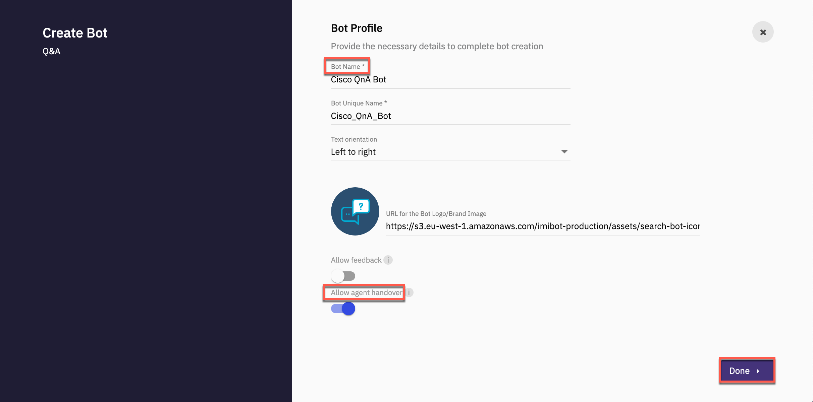
 
## Step 2. Create Article, Custom Synonyms, select NLU engine and Make bot live

- Articles form the crux of Q&A Bots. An article is the combination of a question, its variations & response to this question.

- All the articles configured in a bot together constitute the Bot’s knowledge base or corpus. Every user’s query is compared to this knowledge base and the answer that returns the highest confidence level is returned to the user as the response of the bot.

- Navigate to **_Articles_** and click **_Create new article_**
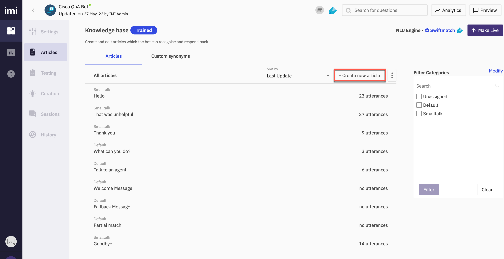
 
- Input Title and fill the **_Variants_** for this article

- Add the response that should be displayed for these questions on the right
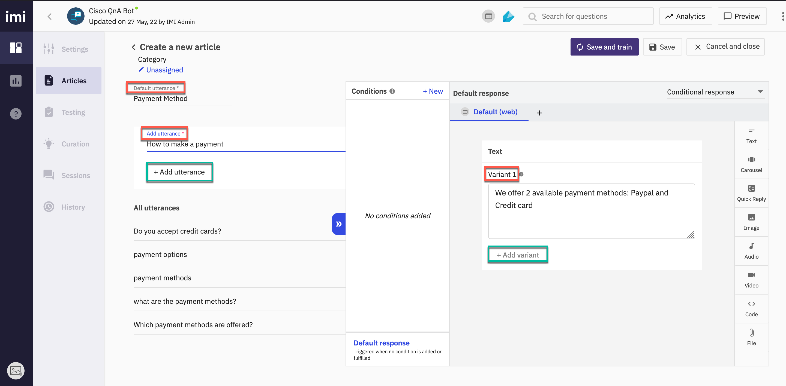
 
- Assign this category to an existing or new category by selecting a category on the top left. This step can be skipped here and performed when saving the article.

- Click **Save** on the top right or Save and train if you want to train your existing model with the current corpus.
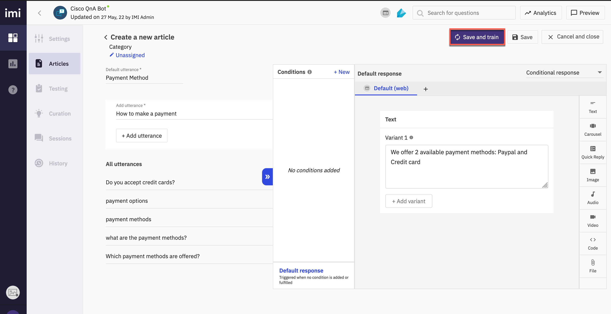
 
- Select **Add to new category** option and input a category name. Click **Change and Save**
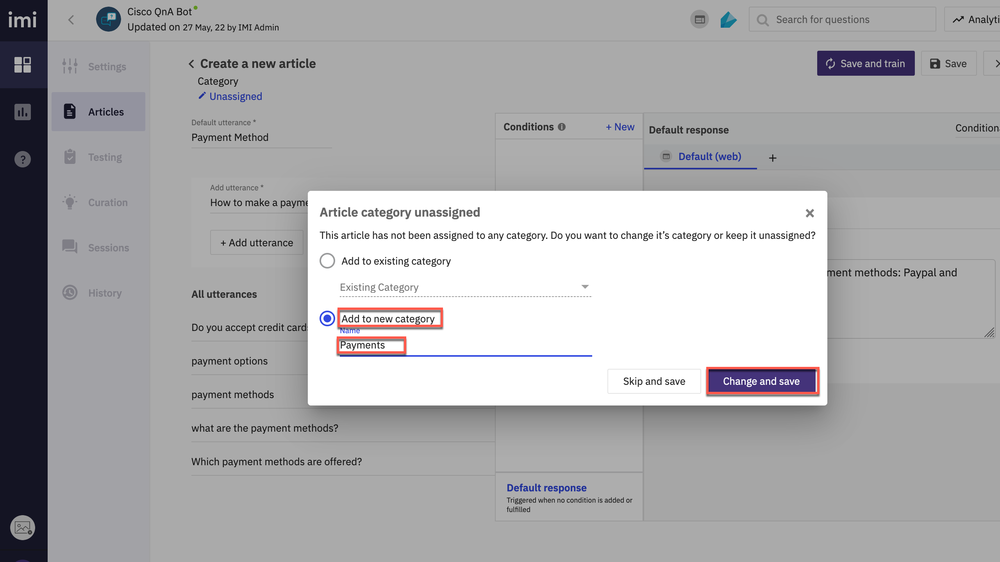
 
- This knowledge base should show as Trained with the new article added along with the utterances
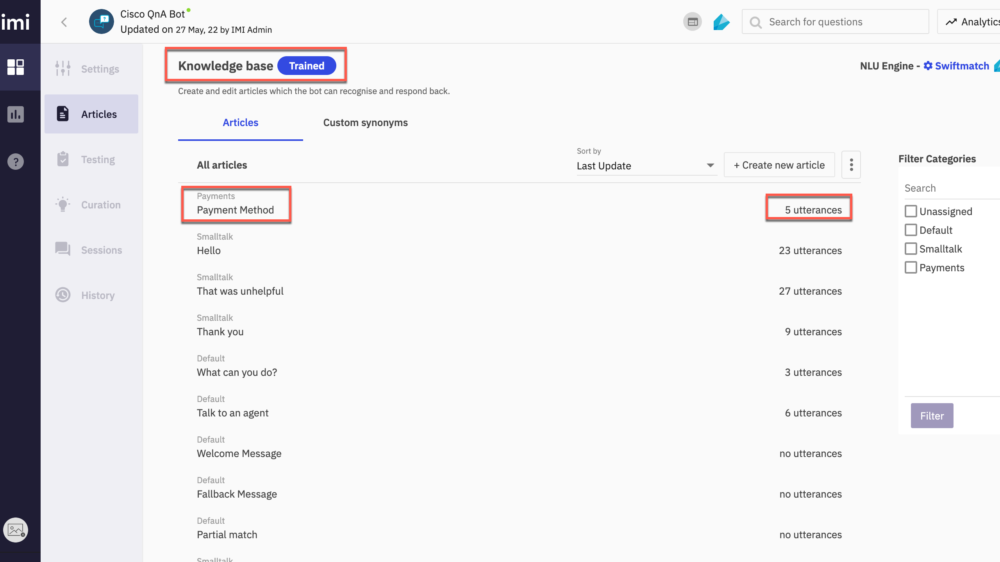
 
>**Note**: There are also other ways to work with articles. Import from csv or from a FAQ link. These options will be covered in the later stage of the lab. 
{: .block-warning }

- You can also configure synonyms in the **Custom synonyms** tab beside the existing “Articles” within a Q&A bot. Any of the synonyms of each root word gets replaced with the root word at runtime by the platform automatically.

- Navigate to **Custom synonyms** tab in the articles section and click on **+ New root word**

- Configure the **root word** value and its synonyms and click **Save**

>**Note**: You also have the option to import from and export to a .CSV file.
{: .block-warning }

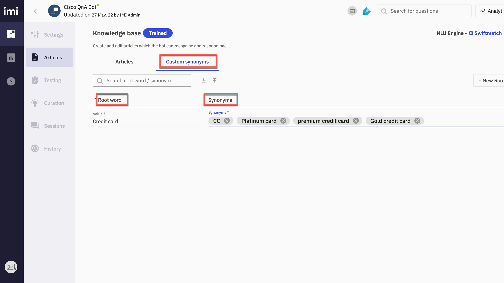

 

- Click **NLU Engine** on the right side of the page. The Change training engine window appears. Select **Mindmeld** and click **Update**
	- Swiftmatch is a fast, lightweight training engine that supports multiple languages
	- RASA is a leading open-source conversational AI framework
	- Mindmeld (Beta) is an advanced conversational AI framework that produces quality conversational flows and offers various NLU capabilities.
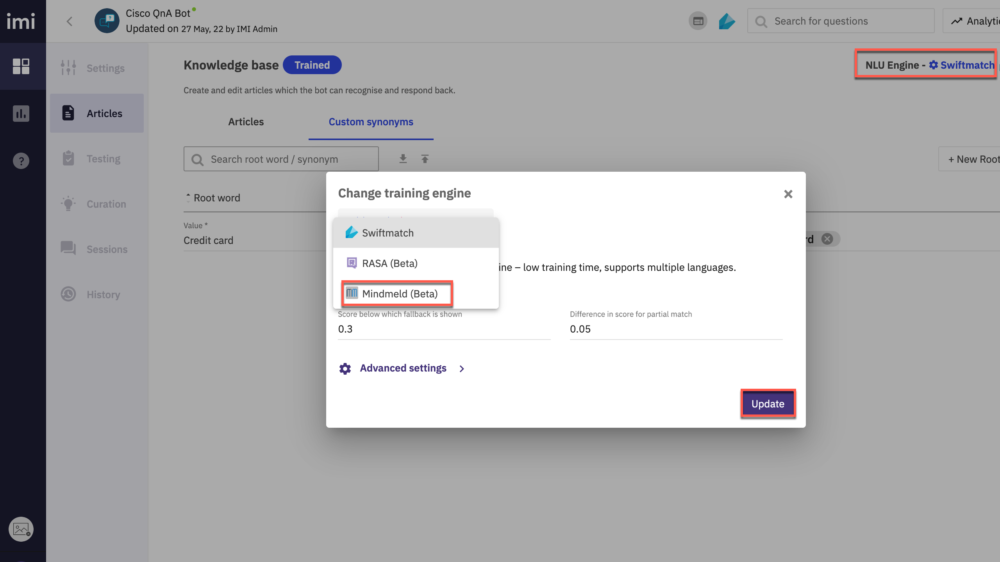
 
- Verify that the NLU update has taken effect 
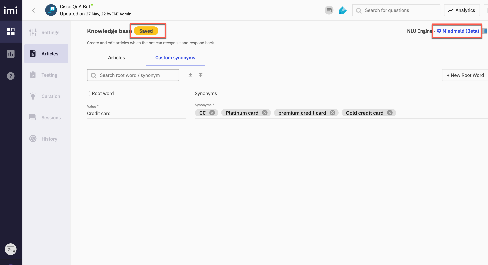
 
- Once all the desired articles are created, users should train their bot
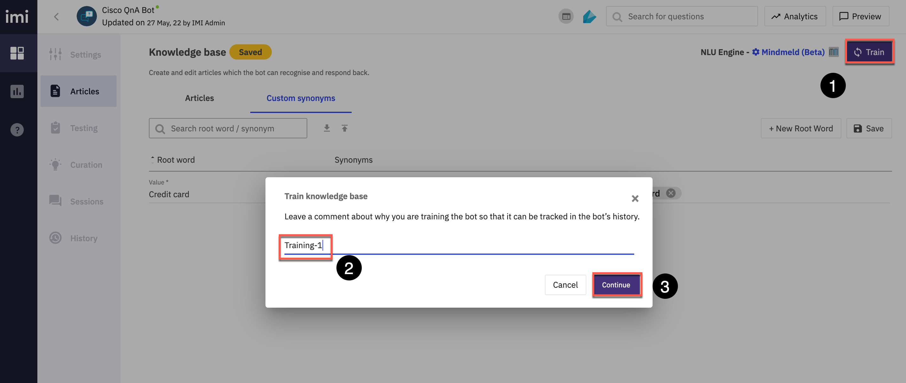
 
- Make it Live 
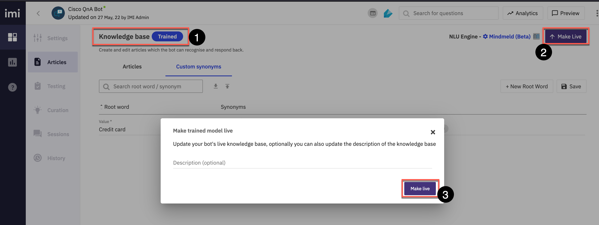
  
- Verify the bot is **Live**
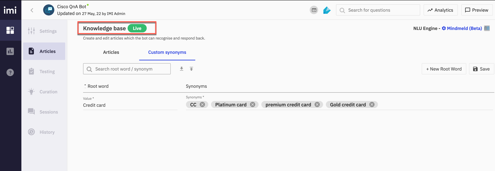
 
## Step 3. Preview Bot
 
- Click on **preview** on top right and test the bot. 
	- Bot builder platform provides users with an easy way to preview their bots while developing it and even after development is done. This provides developers with an easy way to test the functioning of their bots and determine if the desirable responses are generated corresponding to respective input queries.

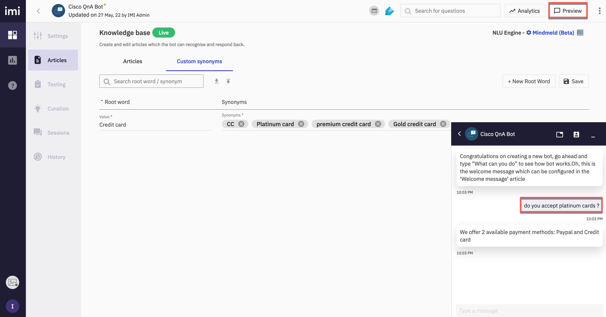
 
- The shareable preview widget enables bot developers to share their bot with stakeholders and consumers in a presentable manner without the need of developing a custom UI to surface the bot. 

- Click the three dots next to the **Preview** option on the top right and **Copy Preview Link**
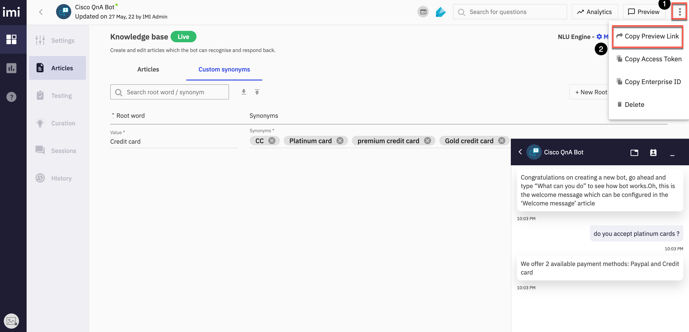
 
- Open the link in a new browser tab. By default, the copied preview link renders the bot with phone casing. Developers can do some quick customization by changing certain parameters in the preview link.
  
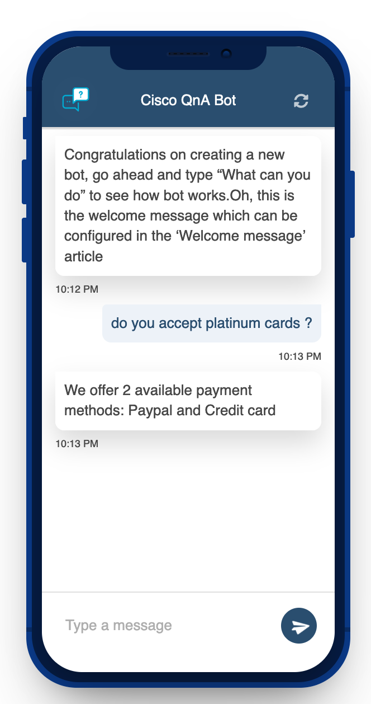
 
- **brandColor** and **phoneCasing** parameters in the link can be customized. 

## Step 4. Bot testing 

- Click on **Testing** and add test case. The test cases can be configured by entering a message and an Expected Template in the respective columns as shown below
	- Bot Builder platform provides a built-in one-click bot testing framework that is extremely helpful in testing a large set of test cases easily and quickly.
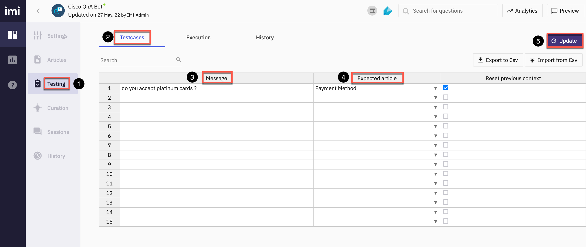
 
-  Each row in the above table is an individual test case

- Tests defined on the **Test cases** tab can be executed from the **Execution** tab. Click the  **Execute tests** button and **Continue** 
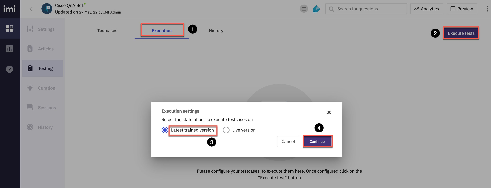
 
- All the test cases defined on the previous tab will be run sequentially and the result of each test case run is shown next to the test case
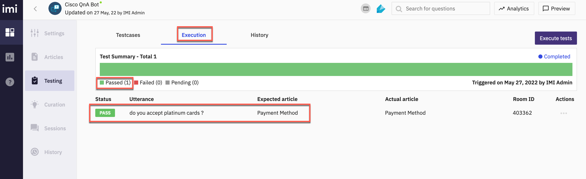
 
- All test case executions are available to be viewed on-demand in the “History” tab. 
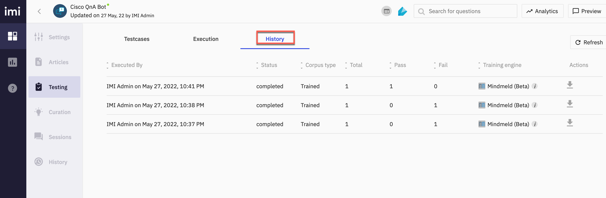
 

[Back to top](#table-of-contents)
---

### Congratulations, you have completed this section! 

<button onclick="mainPage()" style="
  border-radius: 5px;
  background-color: rgb(116,191,75);
  padding: 10px;">Go To Previous Lab</button>

<button onclick="nextLab()" style="
  position: absolute;
  right: 200px;
  border-radius: 5px;
  background-color: rgb(116,191,75);
  padding: 10px;">Go to the Next Lab</button>

