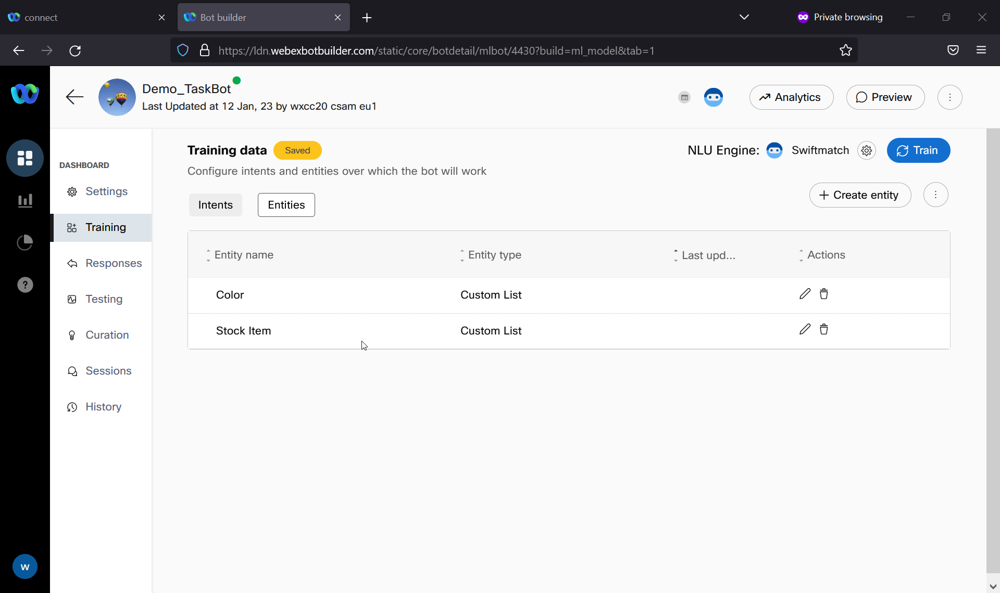
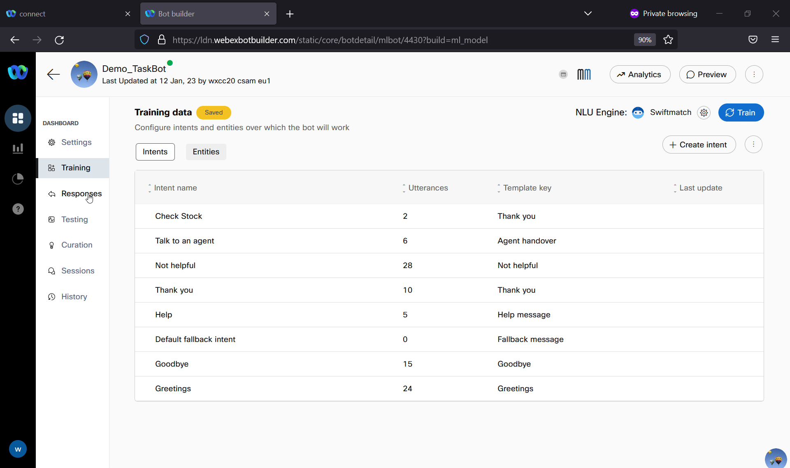

# Table of Contents
- [Table of Contents](#table-of-contents)
- [Introduction](#introduction)
  - [Lab Objective](#lab-objective)
  - [Pre-requisites](#pre-requisites)
  - [Quick Links](#quick-links)
  - [Use Case](#use-case)
  - [AI Terminology](#ai-terminology)
- [Lab Section](#lab-section)
  - [Step 1. Create Task bot and Entities](#step-1-create-task-bot-and-entities)
  - [Step 2. Create Intents](#step-2-create-intents)
  - [Step 3. Create Responses](#step-3-create-responses)
  - [Step 4. Testing Bot](#step-4-testing-bot)

# Introduction

## Lab Objective
In this lab we will be creating a task bot using the bot builder in Webex Connect. We will be creating Intents and Entities that might be coming in the requests from end-customers. Based on this information, our task bot will be able to automatically provice an answer of handoff to a real agen.

### Pre-requisites

1. You have received the access credentials with a full admin access 
2. Lab 2 should be completed successfully and chat routing to agent is working

### Quick Links

> Control Hub: **[https://admin.webex.com](https://admin.webex.com){:target="_blank"}**\
> Portal: **[https://portal.wxcc-us1.cisco.com/portal](https://portal.wxcc-us1.cisco.com/portal){:target="_blank"}**\
> Agent Desktop: **[https://desktop.wxcc-us1.cisco.com](https://desktop.wxcc-us1.cisco.com){:target="_blank"}**\
> Connect: https://cl2pod**X**.imiconnect.io/ (where **X** is your POD number)

### AI Terminology

- **Utterances**: Anything a user says to the bot​

- **Intents**: Task or action that the user wants to perform​

- **Entities**: Metadata that specifies the user's intent​

- **Responses**: Message sent from the bot to converse to the user​

- **Fallback**: The state when a bot is unable to understand the utterance​

- **Handover**: Bot stops processing messages and transfers to an agent

- **NLU (Natural Language Understanding)**: engines used to assess the intent from the consumer inputs and respond with an accurate response

## Use Case
-  Check if an item is in stock
   - Entities:
     - Stock Item (Custom list): Widget, Bobble
     - Color (Custom List): Green, Red, Yellow, Blue, Purple, Silver, Orange
    - Intent:
      - Check Stock
    - Utterances:
      - Do you have green bobbles?
      - Do you have red widgets?

# Lab Section

> **NOTE**: Please read carefully the lab guide and follow the instructions. It might be possible that some GIFs are not accurate.
{: .block-warning }

## Step 1. Create Task bot and Entities

- Navigate to the Webex Connect portal (https://cl2podXX.imiconnect.io)

- Click App tray -> Bot Builder

- Select the Task bots option at the top of the screen

- Click the new Task Bot button, give the bot a name and click done

- Click Training -> Entities -> Create Entity

- For Each Entity, give it a name and select the data type (Custom List if you decide to copy the proposed Use Case)
	- Don't use spaces in the name of the entities (for example: StockItem)
	- Populate the custom list with values using commas.
	- You can also add new values if you click on the edit button
	- Add any Synonyms that are necessary

 
## Step 2. Create Intents
- Click Training -> Intents -> Create Intent

- Name your intent (Example: Check Stock)

- Add utterances (you can copy the ones mentioned in the Use Case)

- In the slots section, click on Link Entity and select the entities that you will use for the intent
 > Click the **Required** checkbox if they are required
 > 
>  Select or create a new **Template Key** that will be used to prompt when there is missing information (Example: Fallback)
   
- Click on words which represent **Entities** 
    >
    > 
    >   

- In the **Response** Section Click on final template key
> Select or create a Template key which will be used to respond to the intent once required slots are filled. (Example: Lookup Item)
> 
 >Toggle reset slots after completion to True

- Save the configuration and click on Train

 

## Step 3. Create Responses
- Go to Responses 

- Locate the templates that you selected when some Entity information is missing
  - Add some responses that will ask the customer to enter the correct information (Example: Which Color?)

- Locate the template which you created to respond to your intent once required slots are filled
  - Populate the response with the Entities and Intents that you will be using as variables. (Example: ${entity.Color} ${entity.Stock Item} ${intent})

- Locate the Greetings template
	- Update the response to include ${consumerData}

- Click Update and Make Live

 
## Step 4. Testing Bot

- Switch back to Training section

- Select Mindmeld as NLU Engine
	- This is only needed if you have configured Custom List values separated by commad
	- If you defined the values as different entries or you have set synonimes, you can use Swiftmatch

- Click Preview and test your bot by using training phrases.

 
[Back to top](#table-of-contents)

### Congratulations, you have completed this section! 

<button onclick="mainPage()" style="
  border-radius: 5px;
  background-color: rgb(116,191,75);
  padding: 10px;">Go to the Previous Lab</button>

<button onclick="nextLab()" style="
  position: absolute;
  right: 200px;
  border-radius: 5px;
  background-color: rgb(116,191,75);
  padding: 10px;">Go to the Next Lab</button>

