# Table of Contents
- [Table of Contents](#table-of-contents)
- [Introduction](#introduction)
    - [Lab Objective](#lab-objective)
    - [Pre-requisites](#pre-requisites)
    - [Quick Links](#quick-links)
- [Lab Section](#lab-section)
  - [Step 1. Integrate Task bot into the flow](#step-1-integrate-task-bot-into-the-flow)
  - [Step 2. Add Live Chat and Append Conversation nodes](#step-2-add-live-chat-and-append-conversation-nodes)
  - [Step 3. Check Intent, parse Entities and get number of Items](#step-3-check-intent-parse-entities-and-get-number-of-items)
  - [Step 4: Send the answer to the created conversation](#step-5-send-the-answer-to-the-created-conversation)

 

# Introduction

## Lab Objective

In this lab we will modify the default Chat Flow to integrate our task bot. We will collect the intents from the end-customer and get the value of the requested information using HTTP Requests.

### Pre-requisites

1. You have received the access credentials with a full admin access 
2. Lab 2 should be completed successfully and chat routing to agent is working
3. The previous sections in Lab 4 should be completed successfully

### Quick Links

> Control Hub: **[https://admin.webex.com](https://admin.webex.com){:target="_blank"}**\
> Portal: **[https://portal.wxcc-us1.cisco.com/portal](https://portal.wxcc-us1.cisco.com/portal){:target="_blank"}**\
> Agent Desktop: **[https://desktop.wxcc-us1.cisco.com](https://desktop.wxcc-us1.cisco.com){:target="_blank"}**\
> Connect: https://cl2pod**X**.imiconnect.io/ (where **X** is your POD number)

# Lab Section

> **NOTE**: Please read carefully the lab guide and follow the instructions. It might be possible that some GIFs are not accurate.
{: .block-warning }

## Step 1. Integrate Task bot into the flow
- Retun to Services

- Click on the service that you created and Copy from existing flow > View My Flows > Create Flow

- Open the Receive Node and update the Transition Actions:

    > Add Action
    >
    > Time: On-Leave
    > 
    > Action: Set Variable
    >
    > Variable: message
    >
    > Value: Output Varriables > InApp - Form Response > inappmessaging.message $(n38.inappmessaging.message)
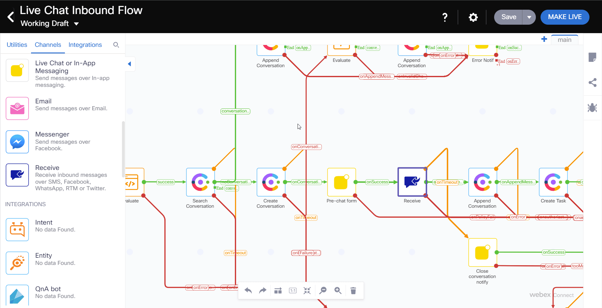

 
- Find the Create Task node and delete the green line that says created, which connects to the queue Task node.

- Add Task Bot node and link it with the Create Task node
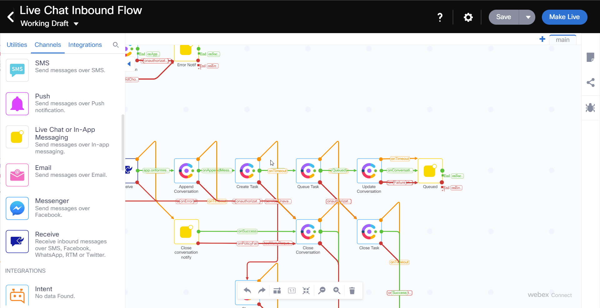

 
- Open the Task Bot node and update the following parameters
    >Message: Custom Variables > messageForBot $(messagetext)
    >
    >Channel: In-App
    >
    >Unique ID: Custom Variables > conversationId $(conversationId)
    >
    >Customer Parameters 
    >> Key: name
    >> Value: Receive > inappmessaging.formFields.Name

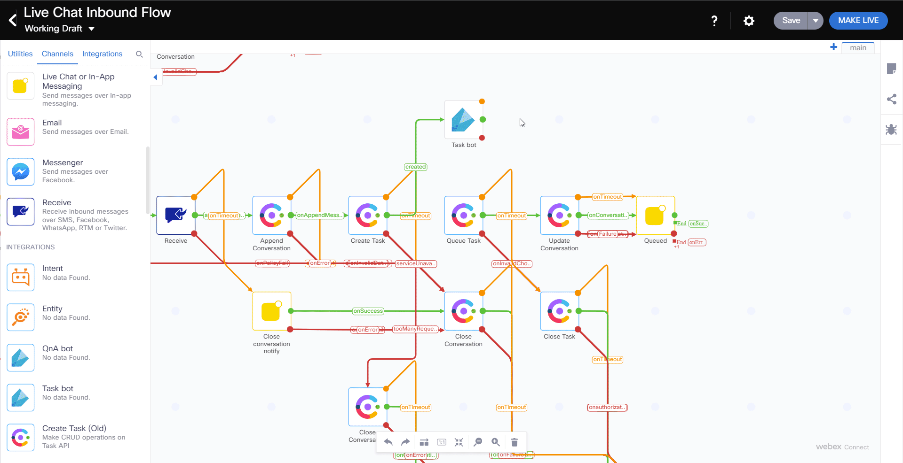
 
## Step 2. Add Live Chat and Append Conversation nodes

- Add Live Chat or In-App Messaging Node and link it with the Task Bot node

- Link the Task Bot node also with the Queue Task Node. It will automatically create the connection for onAgentHandover
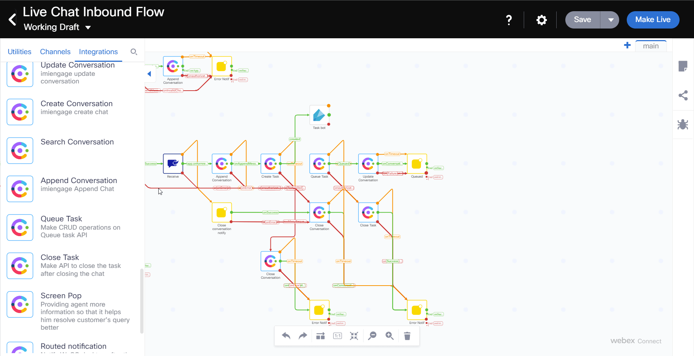
 
- Open the Live Chat or In-App Messaging Node and update the following parameters:
    > Destinaton Type: UserId
    >
    > Destination Type: Start > inapppessaging.userId $(n2.inappmessaging.userId)
    >
    > Message: Task Bot > taskbot.text_response $(n2303.taskbot.text_response)
    >
    > Thread ID: Start > inappmessaging.threadId $(n2.inappmessaging.threadId)

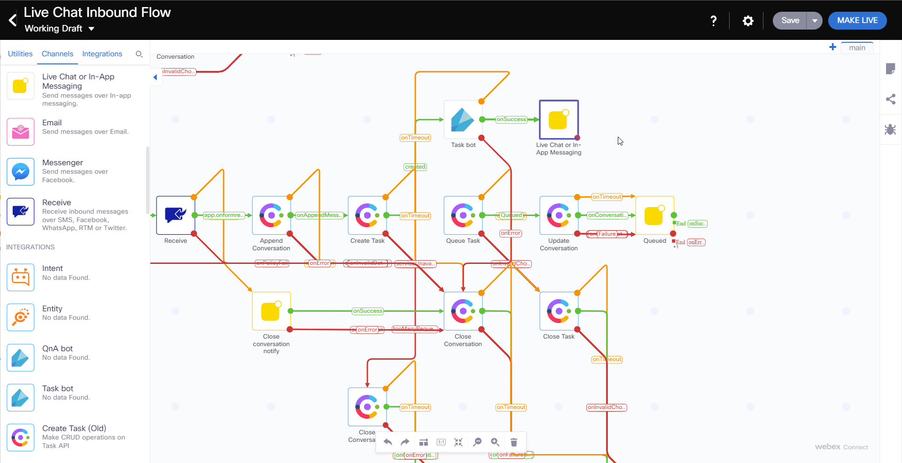
 
- Add Append Conversation Node and link it with the Live Chat or In-App Messaging node
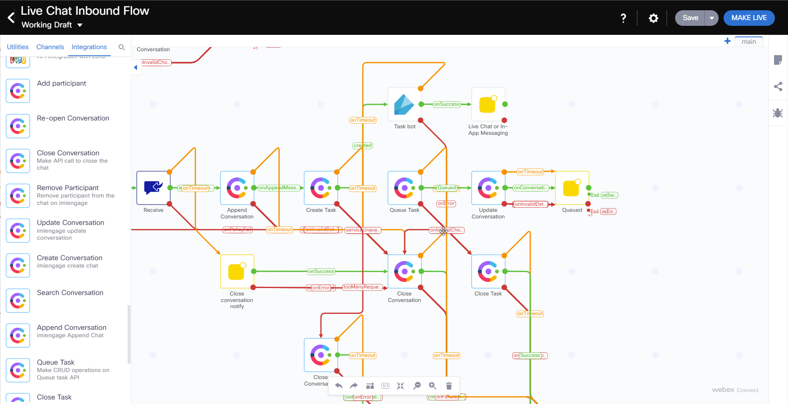
 
- Open the Append Conversation Node and update the following parameters:
    
	> Method Name: Append Chat
	>
	> Node Runtime Authorization: Pick default
	>
    > Channel: Livechat
    >
    > Conversation ID: Custom Variables > conversationId  $(conversationId)
    >
    > Message Type: Text With Attachments
    >
    > Direction: Outbound
    >
    > Text: Task Bot > taskbot.text_response $(n2303.taskbot.text_response)
    >
    > Timestamp: Start > inappmessaging.timestamp $(n2.inappmessaging.timestamp)
    >
    > Attachments: null
    
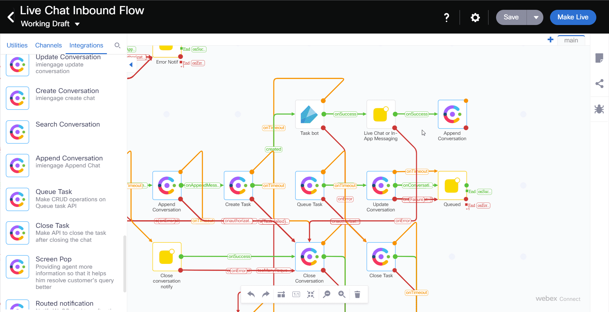

 
- Add a Receive node and link it with the Append Conversation node
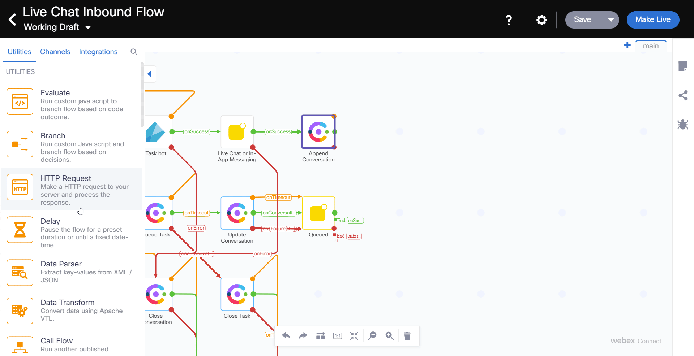
 
- Open the Receive Node and update the following parameters:
	> Select Incoming Message/Event: Receive In-App Messaging   
	>
	> Max timeout: 300
    >
    > From(threadID): Start > inappmessaging.threadId $(n2.inappmessaging.threadId)
    >
    > From(userId): Start > inappmessaging.userId $(n2.inappmessaging.userId)
    >
    >Event name: Incoming Message
    >
    >Transition Actions:

    >> Add Action
    >
    > >Time: On-Leave
    > 
    > >Action: Set Variable
    >
    > >Variable: messagetext
    >
    > >Value: Output Variables > inappmessaging.message $(n2311.inappmessaging.message)

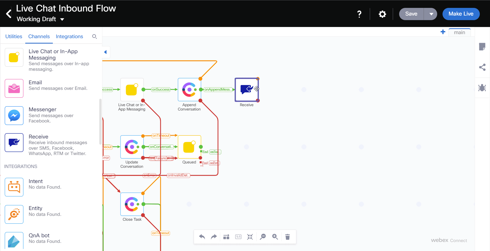
 

- Add Append Conversation Node and link it with the Receive node
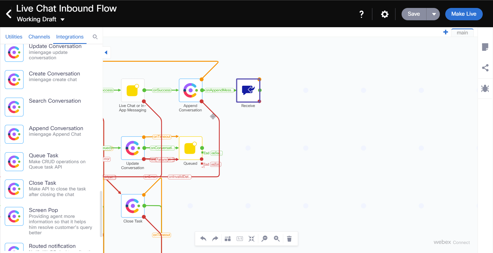
 

- Open the Append Conversation Node and set the following parameters
    
	> Method Name: Append Chat
	>
	> Node Runtime Authorization: Pick default
	>
    > Channel: Livechat
    >
    > Conversation ID: $(conversationId)
    >
    > Message Type: Text With Attachments
    >
    > Direction: Inbound
    >
    > Text: messagetext $(messagetext)
    >
    > Timestamp: Start > inappmessaging.timestamp $(n2.inappmessaging.timestamp)
    >
    > Attachments: null
    >

 

- Drag the green node edge from the Append Conversation Node and connect it to the Task Bot Node    

- For each Red or Orange edges of each Flow nodes that we just added, drag a connector to the Close Conversation node until you can no longer grab any new node edges.

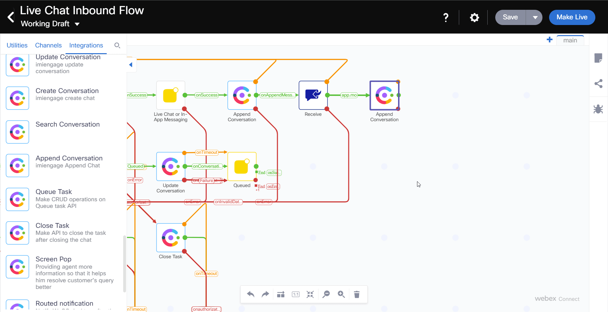

 

- Save the Flow and click on Make Live

- Select your Application and add any publish comments 

## Step 3. Check Intent, parse Entities and get number of Items

- Find the Task bot node and **delete** the **onSuccess** connector

- Add a Branch node and link it with the Task bot node

- Open the Branch node and set the following parameters
  > Rename Branch1: checkStock
  >  
  > Variable: Task Bot > taskbot.intent
  >
  > Condition: Equals
  >
  > Value: intent value (Check stock)
  >
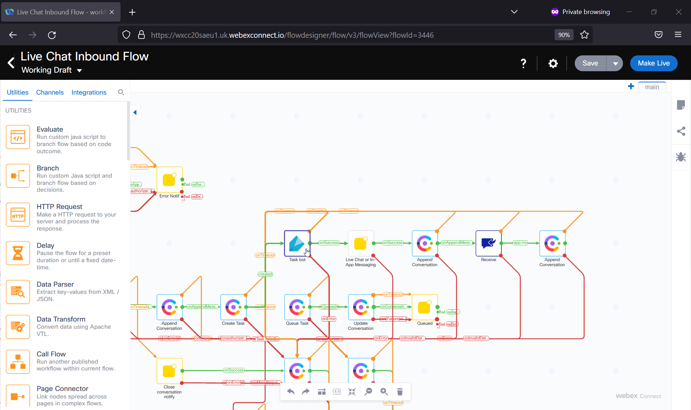

 

  - Drag a new Data Parser node and link it with Branch node

  - Connect both red node edges from the Data Parser to the Live Chat on In-App Messenger

  - Open the Data Parser node and set the following parameters:
    > Input: Task Bot > taskbot.entities
    >
    > Sample Body: {
       
								    "Color": {
								        "metadata": {
								            "confidence":100
								        },"synonym":"Red","name":"Color","entity_id":"2","value":"Red"
								    },"StockItem": {
								        "metadata": {
								            "confidence":100
								        },"synonym":"Bobbles","name":"StockItem","entity_id":"1","value":"Bobbles"
								    }
							    }

    > >Click Parse
    >
    > Select the $.Color.name and $.stockItem.value
    > 
    > >Click Import
    >
    > Create Output variable names (like color and item)
    > 	$.Color.value -> color
    > 	$.StockItem.value -> item
    >
    > >Make both Variables Mandatory

 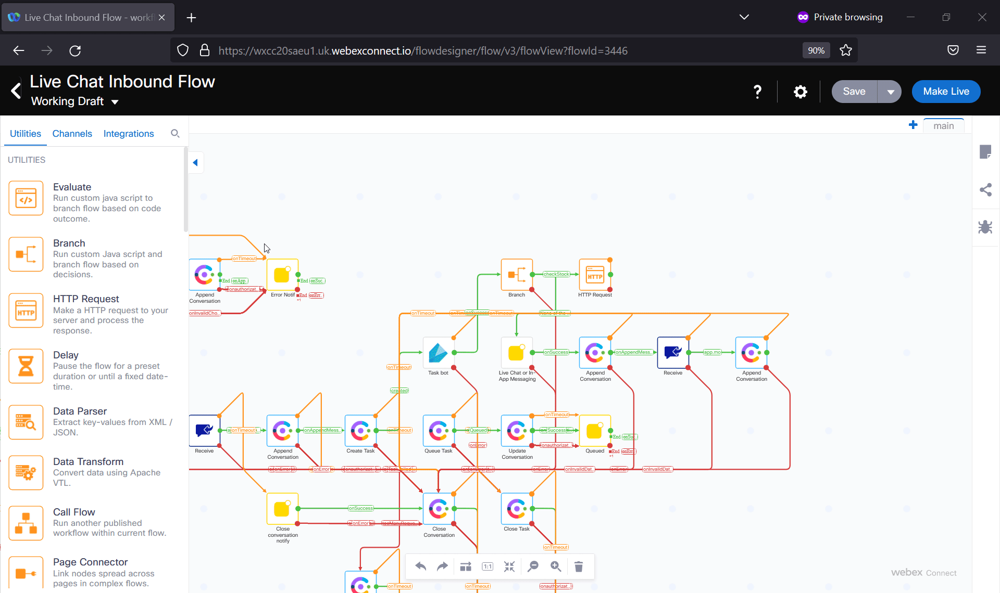
 
  - Drag a new Branch node and link it with the Data Parser node

  - Open the Branch node and set the following parameters:
    > Rename Branch1 to Widget
 >> Variable: Data Parser > item
 >> Condition: Equals
 >> Value: Widget
 >> Add branch
 >> 
 >Rename Branch2 to Bobble
 >> Variable: Data Parser > item
> > Condition: Equals
 >> Value: Bobble

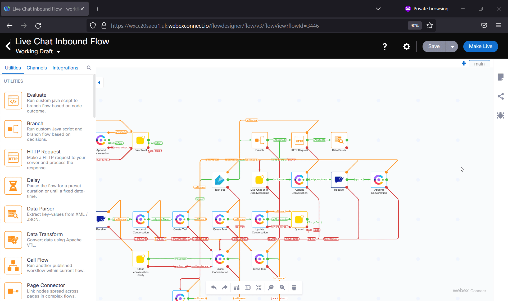
 
  - Drag 2 HTTP Request nodes into the flow and connect them with the Branch node (select Widget for one of them and Bobble for the other one)

  - Open one of the HTTP Request nodes

  - Click on Transition Actions and set the following parameters:
    > Click Add Action
    >
    > Time: On-Enter
    >
    > Action: Set Variable
    >
    > Variable:
      >>
      >> Add an new variable
      >>
      >> Variable name: stockURL
      >>
      >> Click Save
    >
    > Value: the url with the param left empty and then Data Parser > color (Example: https://629f77cc8b939d3dc2987fa4.mockapi.io/api/v1/Widget?$(n2316.color))
    > 	Be aware that n2316 is an example, make sure to put correct NodeID of Parser node
    >

  - Click Configuration
    > Method: GET
    >
    > Endpoint URL: Custom Variables > stockURL
    >
    > Connection Timeout: 1000
    >
    > Request Timeout: 1000
    >
    > Output Variable Name: itemCount
    >
    > Response Entity: Body 
    >
    > Response Path: $[0].stockcount (from Postman and JSON Path Finder/Import from Sample)
    >
  - Click Transition Actions
    > Add action
    >
    > Time: on-leave
    >
    > Action: Set variable
    >
    > Variable: messagetext
    >
    > Value: There is (output variables > itemCount) (Data Parser > color) (Data Parser > item)s in stock. Is there anything else I can do for you?  
    >
  

 
- Do the same with the other HTTP Request node
  - You just need to change the Value of the stockURL with the appropiate entity: (Example: https://629f77cc8b939d3dc2987fa4.mockapi.io/api/v1/Bobble?color=$(n2316.color))

## Step 4. Send the answer to the created conversation

- Drag a new Live Chat or In-App Messaging node and link it with both HTTP Request nodes

  - Open the Live Chat or In-App Messaging node and set the following parameters:
    > Destination type: UserId
    >
    > Destination: Start > inapppessaging.userId $(n2.inappmessaging.userId)
    >
    >Message Type: Message 
    >
    >Message: Custom Variables > messagetext
    >
    > Thread ID: Start > inappmessaging.threadId $(n2.inappmessaging.threadId)
    >
    
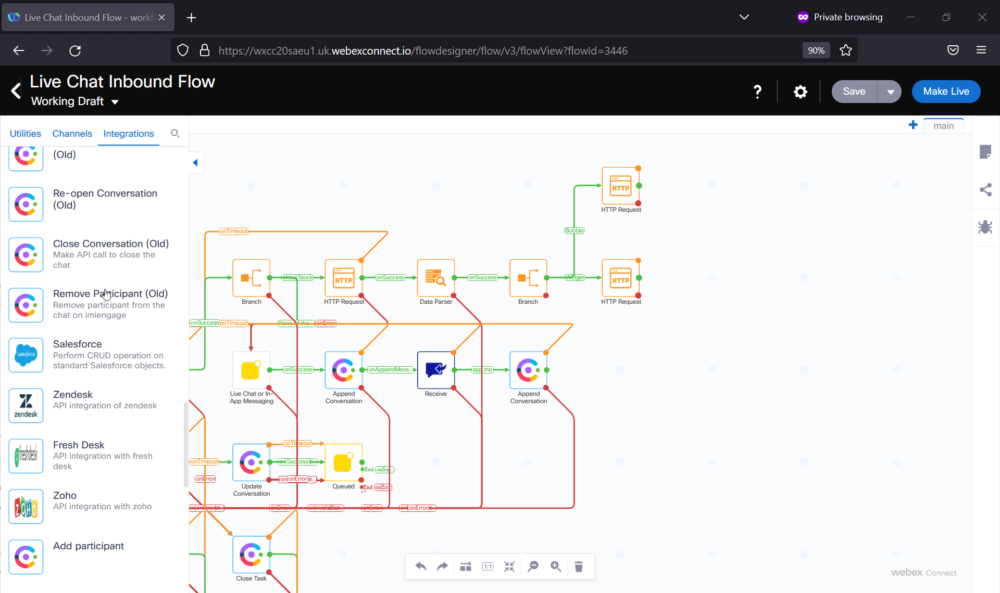
 
  - Drag a new Append Conversation and link it with the Live Chat or In-App Messaging node

  - Open the Append Conversation node and set the following parameters:
    > Method Name: Append Chat
    >
    > Node Runtime Authorization: Pick default
    >
      > Channel: Livechat
      >
      > Conversation ID: Custom Variables > conversationId
      >
      > Message Type: Text With Attachments
      >
      > Direction: Outbound
      >
      > Text: messagetext $(messagetext)
      >
      > Timestamp: Start > inappmessaging.timestamp 
      >
      > Attachments: null
      >

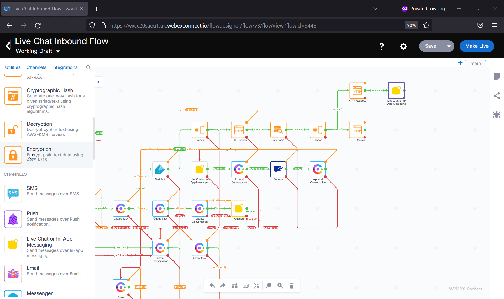
 
  - Connect the Green node edge to the Receive node 

  - Connect all remaining Red and Orange node edges to the Close Conversation node 

  - Click Save in the upper right corner and make it live

  - Confirm the proper application is selected and Click Make Live again.

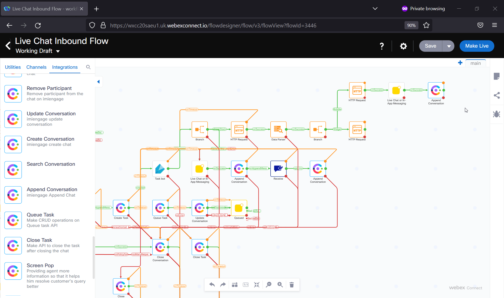
 
- Navigate to your website (The one defined as Channel Asset in Webex Engage) and test your bot from 

  

[Back to top](#table-of-contents)

### Congratulations, you have completed this section! 

<button onclick="mainPage()" style="
  border-radius: 5px;
  background-color: rgb(116,191,75);
  padding: 10px;">Go to the Previous Lab</button>

<button onclick="nextLab()" style="
  position: absolute;
  right: 200px;
  border-radius: 5px;
  background-color: rgb(116,191,75);
  padding: 10px;">Go Back to the Beginning</button>

