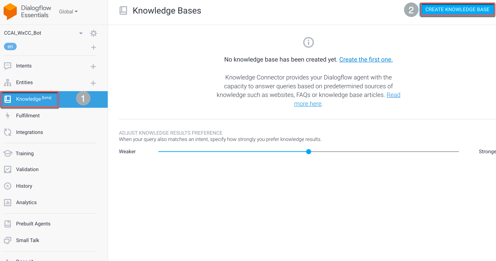

# Table of Contents
- [Table of Contents](#table-of-contents)
- [Introduction](#introduction)
  - [Step 1. Enabling FAQ in Dialogflow](#step-1-enabling-faq-in-dialogflow)
  - [Step 2. Importing FAQ](#step-2-importing-faq)
  - [Step 3. Testing from within Dialogflow](#step-3-testing-from-within-dialogflow)
  - [Step 4. Testing via Webex Connect chat](#step-4-testing-via-webex-connect-chat)
    - [Congratulations, you have completed this section!](#congratulations-you-have-completed-this-section)

# Introduction
In this lab we are going to import a FAQ in Google Dialogflow from an existing website, which will act similarly to the Q&A bot in Webex Connect.  We will then select some Questions and transform them into intents.

## Step 1. Enabling FAQ in Dialogflow
- Login to the Dialogflow portal https://dialogflow.cloud.google.com using the Gmail account created (or used) in the earlier lab
- Click the Cog next to the name of your bot
- Under General Toggle "Enable beta features and API" and click save

## Step 2. Importing FAQ
- We are going to import our FAQ from the Cisco Live Amsterdam FAQ. [Cisco Live FAQ website](https://www.ciscolive.com/emea/attend/event-details/faq.html)
- Click on the Knowledge (Beta) menu option and click Create Knowledge base

-  Name it "Cisco Live FAQ" and click Save

- Click "Create the first one" and create the document with below mentioned details

    > Document Name: Cisco Live FAQ
    >
    > Knowledge Type: FAQ
    >
    > Mime Type: text/html
    >
    > Data Source: URL: `https://www.ciscolive.com/emea/attend/event-details/faq.html`
    >
    > Enable Automatic Reload: True
    >
    > Click Create

- Click the "Add Response" button. A response string automatically populates that looks like `$Knowledge.Answer[1]` . Click Save at top of the page.

  
## Step 3. Testing from within Dialogflow
- In the upper right corner, you will see a "try it now" prompt
- Using one of the questions from the FAQ, ask a question or a variation of the question and verify there is a response.
- 

## Step 4. Testing via Webex Connect chat
- Launch your chat from your website
- Using one of the questions from the FAQ, ask a question or a variation of the question.

[Back to top](#table-of-contents)

### Congratulations, you have completed this section! 

<button onclick="mainPage()" style="
  border-radius: 5px;
  background-color: rgb(116,191,75);
  padding: 10px;">Go To Previous Lab</button>

<button onclick="nextLab()" style="
  position: absolute;
  right: 200px;
  border-radius: 5px;
  background-color: rgb(116,191,75);
  padding: 10px;">Go to the Next Lab</button>

