# Table of Contents
- [Table of Contents](#table-of-contents)
- [Introduction](#introduction)
  - [Step 1. Converting Questions to Intents](#step-1-converting-questions-to-intents)
  - [Step 2. Create additional questions with entities](#step-2-create-additional-questions-with-entities)
  - [Step 3. Create branch for 'YES' response from customer](#step-3-create-branch-for-yes-response-from-customer)
  - [Step 4. Create new branch for agent handover](#step-4-create-new-branch-for-agent-handover)
  - [Step 5. Create branch for 'NO' response from customer](#step-5-create-branch-for-no-response-from-customer)
  - [Step 6. Let's test our bot from inside Dialogflow](#step-6-lets-test-our-bot-from-inside-dialogflow)
  - [Step 7. Testing using your website.](#step-7-testing-using-your-website)
- [Seize the Opportunity](#seize-the-opportunity)
    - [Congratulations, you have completed this section!](#congratulations-you-have-completed-this-section)

# Introduction
In this lab we are going to improve on our FAQ Dialogflow bot, by converting some of our FAQs into intents, requiring some entities, and taking an action on the information that we gather.

## Step 1. Converting Questions to Intents
- Let's make a question become an intent so that we can move into the role of providing a service
- Go into Knowledge and click on the FAQ created, Click "View Detail"
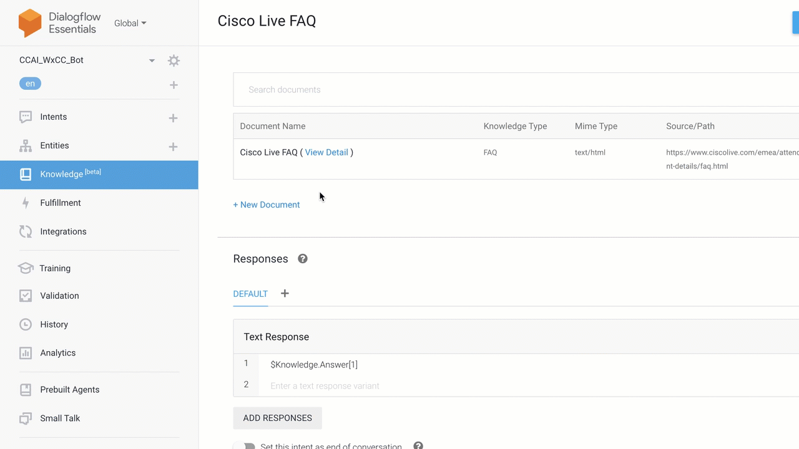

- Find the question about 'schedule my sessions' , select the question and click 'convert it to intents', click 'convert' and 'Save' 
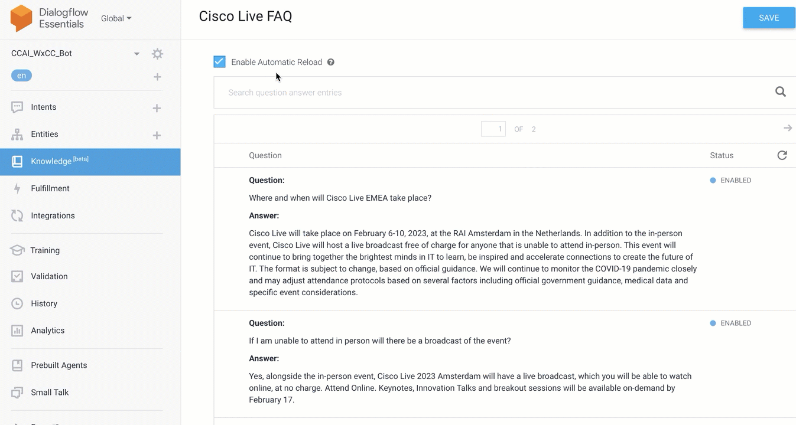

## Step 2. Create additional questions with entities

- Click Intents and select your newly created intent
- Find the newly created Intent and edit the response to include `Are you looking for a specific track?`
- Click Save
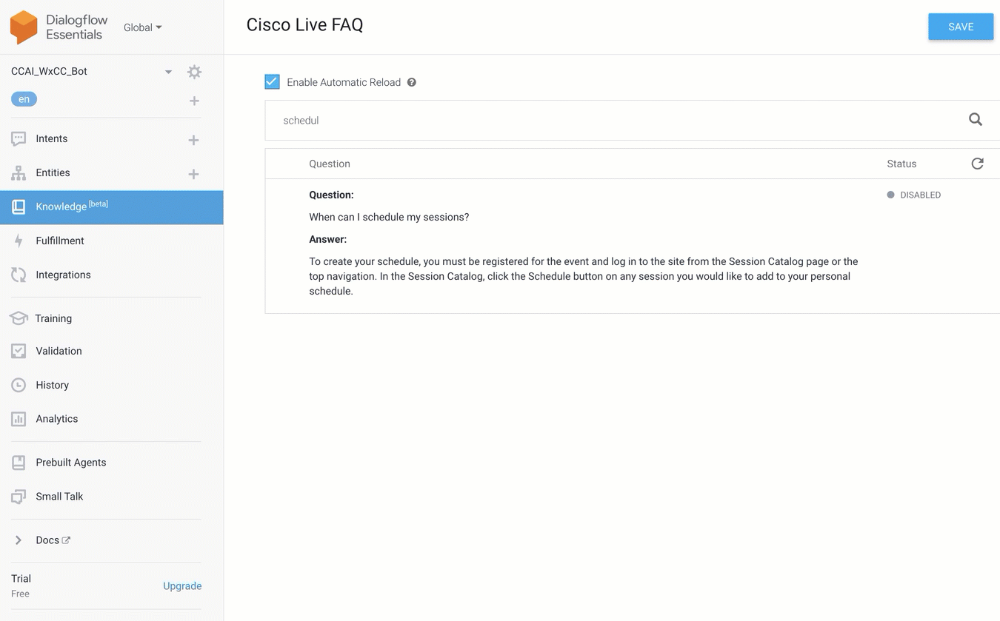

- Add an Entity to capture the answer to the question that we are asking
  
    > Click on Entities
    >        
    > Click Create Entity
    >
    > Name: Track
    >
    > Create the following: Contact Centre, Security, Wireless
    > 
    > Add some synonyms like `Webex CC`, `CCX` , `CCE` for 'Contact Centre'
    >
    > Make sure that allow automated expansion is toggled on
    >
    >Click Save

  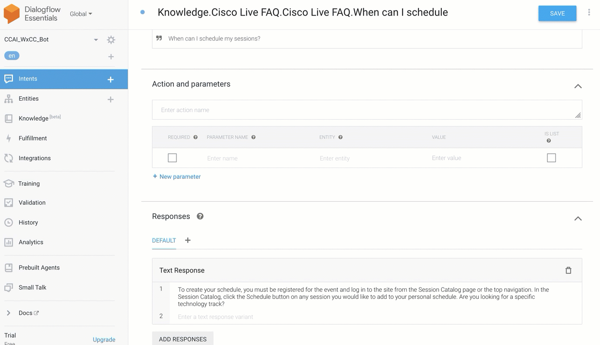

## Step 3. Create branch for 'YES' response from customer

- Click Intents again and hover over the Intent that you just updated and Click the 'add a follow-up intent'
- Select the `Yes` intent
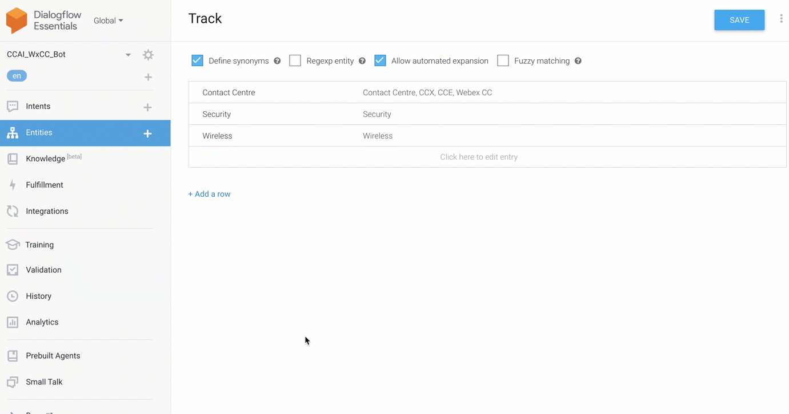

- Open the new intent branch and under Actions and Parameters, add the 'Track' Entity, Mark it as Required, Mark it as a List, Add a prompt and Click Save
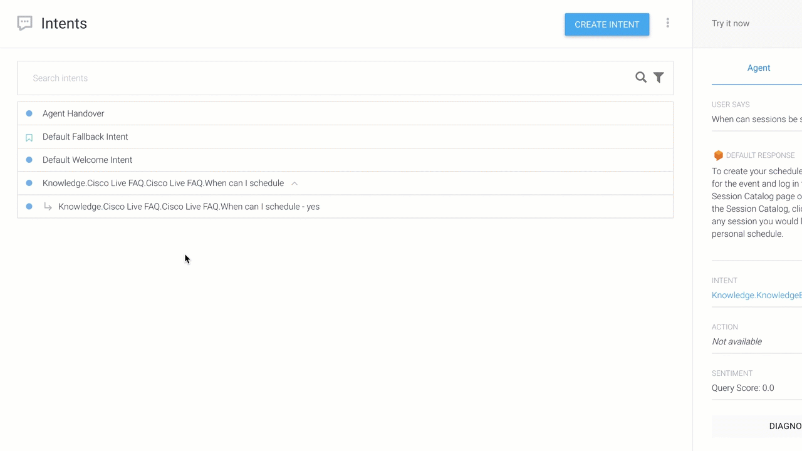

- Under the response section, Create a response like `Great. You can schedule $Track sessions here : https://www.ciscolive.com/emea/learn/sessions/session-catalog.html?search.learningmap=1614364767910004wK10#/`
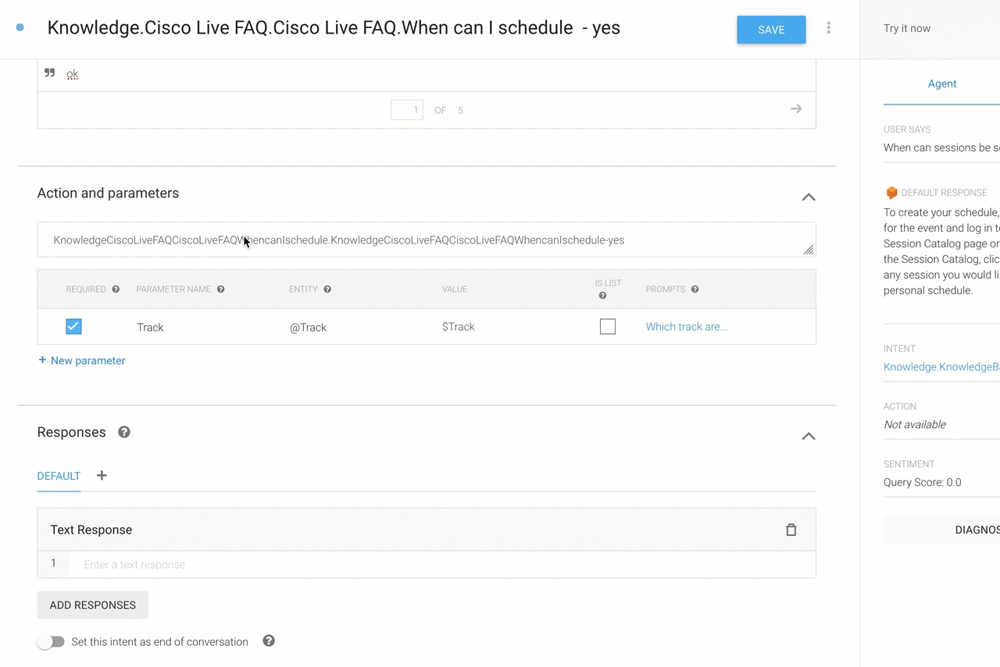

## Step 4. Create new branch for agent handover

- Go back to Intents and add an additional branch off from the `Yes` branch and select `custom` and open the new Intent
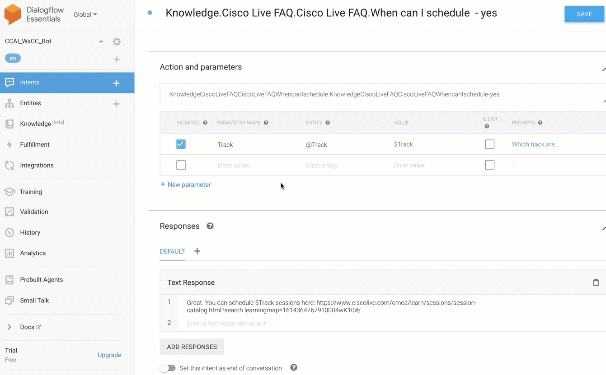
- In Actions and parameters, Remove any test in the text box and replace it with `LIVE_AGENT_HANDOVER`
- Make your response `Sending you to an agent for additional assistance` and Click Save
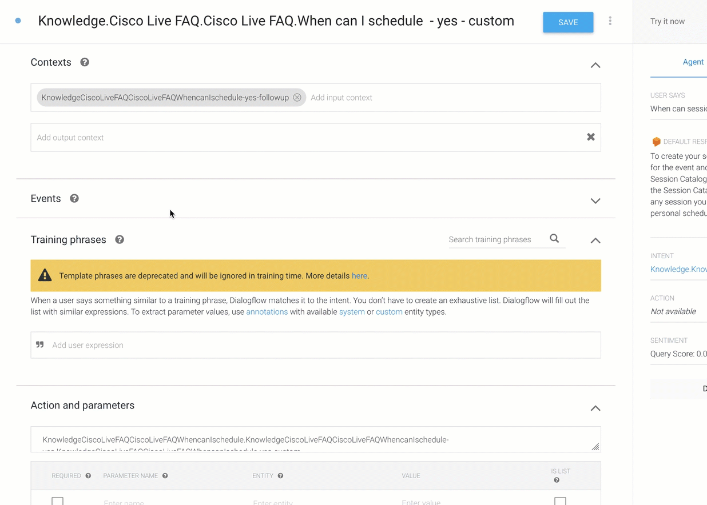

## Step 5. Create branch for 'NO' response from customer
- Go Back to Intents and add a new branch off from the `Knowledge.Cisco Live FAQ.Cisco Live FAQ.When can I schedule` and select `No`
- Open the new Intent and add the response `Is there anything else that I can do for you?` and Click Save
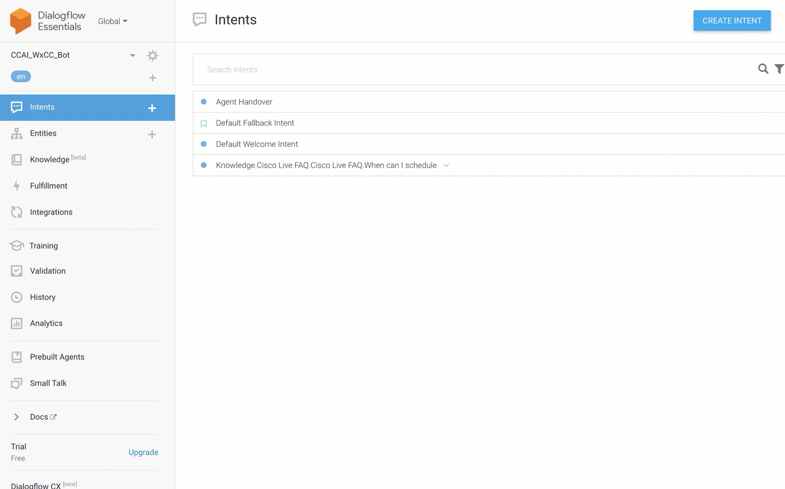

  
## Step 6. Let's test our bot from inside Dialogflow
  - In the "Try is now" section in the upper right corner
  - Enter the test phrase `When can Cisco Live sessions be scheduled?`
  - In the response you should see the question that was added. Now, Enter `yes` in the user input field
  - When prompted for the track, Enter `Contact Centre` or any other variations (`Webex CC`, `CCE`, `CCX`)
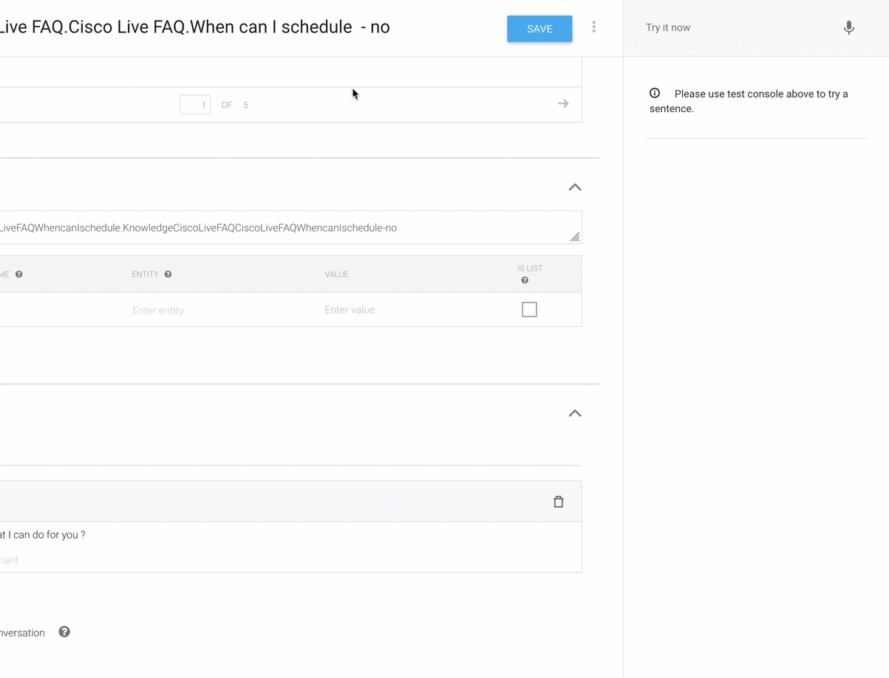 

## Step 7. Testing using your website.
  - Go to your Glitch website and launch the chat
  - Run the same tests as above.

# Seize the Opportunity 
Take these new found concepts and let them run wild.  Improve on the use cases that are in these labs or create your own.  Challenge yourself to create solutions by breaking down problems into independent and deliverable steps.

[Back to top](#table-of-contents)

### Congratulations, you have completed this section! 

<button onclick="mainPage()" style="
  border-radius: 5px;
  background-color: rgb(116,191,75);
  padding: 10px;">Go To Previous Lab</button>

<button onclick="nextLab()" style="
  position: absolute;
  right: 200px;
  border-radius: 5px;
  background-color: rgb(116,191,75);
  padding: 10px;">Go Back to the Beginning</button>

