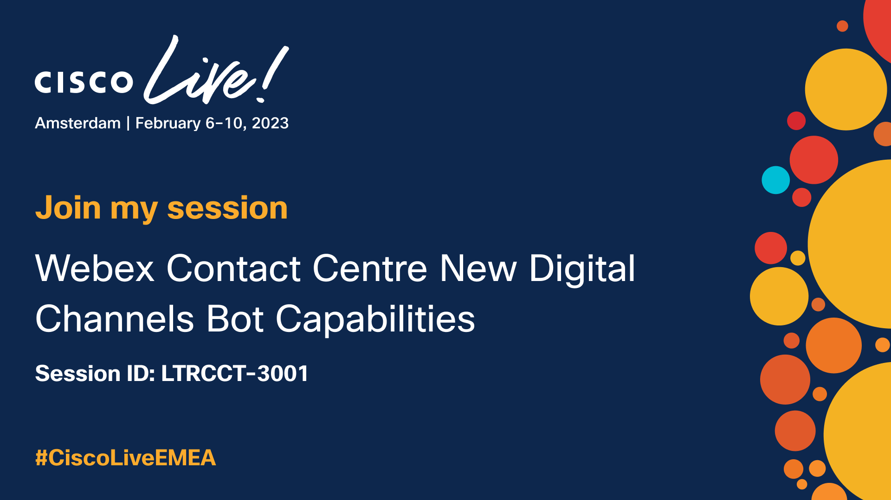

Welcome to the Lab Guide Library. Here you will find the step-by-step guides on how to setup bot capabilities with New digital channels in Webex Contact Centre.

## Lab Exercises

| Lab Number      | Topic                    | Difficulty  | Duration                                      |
| --------------- | -------------------------| ------------|-------------------------------------------------|
| **Lab 0** | **[Lab Information](0_LabInfo.md)**{:target="\_blank"}  | **NA** | **5 mins** |
|||||
| **Lab 1** | **[Environment setup](1_PreReq.md)**{:target="\_blank"} | **Easy** | **25 mins**  |
|||||
| **Lab 2** | **Live Chat Configuration** |  |**60 mins** |
| Lab 2.1 | [Basic Chat](2.1_BasicChat.md){:target="\_blank"} | Medium | 40 mins | 
| Lab 2.2 | [Additional Capabilities](2.2_AdditionalCapabilities.md){:target="\_blank"}| Easy | 20 mins |
|||||
| **Lab 3** |**Question & Answer Bot Configuration** |  | |
| ***Path A*** | ***Webex Connect Bot*** |  |***40 mins*** |
| Lab 3.1 | [QnA Bot setup](3.1_QnABotConfiguration.md){:target="\_blank"} | Easy | 10 mins |
|Lab 3.2 |[QnA Bot Integration within Flow](3.2_QnABotFlowConfiguration.md){:target="\_blank"} | Medium | 20 mins |
|Lab 3.3 |[FAQ Integration](3.3_QnABotAdvanced.md){:target="\_blank"}| Easy | 10 mins |
|||||
| ***Path B*** | ***Dialogflow*** | | ***90 mins*** |
| Lab 3.1 | [DialogFlow setup](5_CCAI.md){:target="\_blank"} | Easy |20 mins |
| Lab 3.2 | [DialogFlow Integration within Flow](5.2_CCAIFlowConfig.md){:target="\_blank"} | Medium | 30 mins |
| Lab 3.3 | [FAQ integration](6_CCAI_FAQ.md){:target="\_blank"} | Easy |20 mins |
| Lab 3.4 | [Advanced features](7_CCAI_Advanced.md){:target="\_blank"}| Hard |20 mins |
|||||
| **BONUS: Lab 4** | **Task Bot Configuration**|  |**50 mins** |
| Lab 4.1 |  [Task Bot setup](4.1_TaskBotSetup.md){:target="\_blank"} | Medium |10 mins |
 | Lab 4.2 | [Task Bot Integration within Flow](4.2_TaskBotFlow.md){:target="\_blank"}| Hard |40 mins   |

