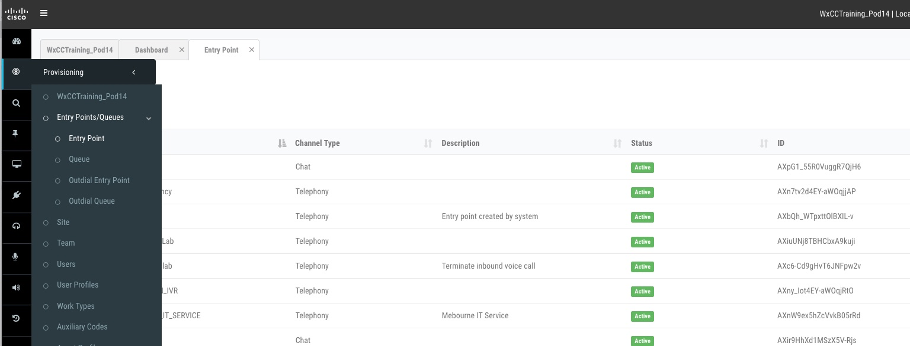
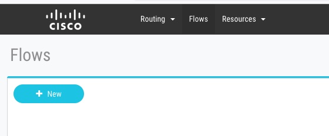
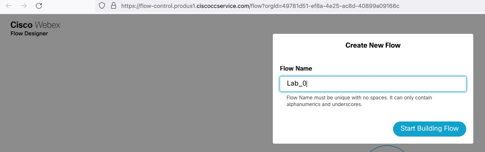
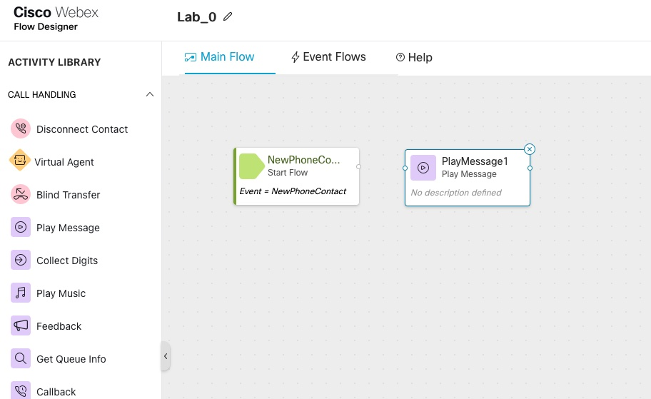

title: 'Lab 1: Agent_login'
---

# Table of Contents

- [Table of Contents](#table-of-contents)
- [Introduction](#introduction)
    - [Recap](#Recap)
    - [Lab Objective](#lab-objective)
    - [Pre-requisites](#pre-requisites)
    - [Quick Links](#quick-links)

- [Lab Section](#lab-section)
  - [Step 1. Site,Team,Agent](#Site,Team,Agent)
  - [Step 2. Webex Calling Settings](#webex_calling_Settings)
  - [Step 3. Entry Point, Routing Strategy & Flow )](EP_RS_Flow)
    - [1. Create new Entry Point](#1-create_EP)
    - [2. Create new Routing Strategy](#2-create-RS)
    - [3. Create new Flow](#3-create-new-flow)
    - [Congratulations, you have completed Lab1 tasks!](#congratulations-you-have-completed-prereq-tasks)

# Introduction

### Recap

 In the first Lab, we Learned
 1. Map Dial number to Entry point
 2. Create basic flow with Play Message node
 3. Dial Number-->Entry Point --> Routing Point-->Flow
 4. Successfully routed a contact into Webex Contact Center and heard initial welcome prompt

### Lab Objective

In this section, we will go over the steps that are required to Login an Agent . In this Lab you will learn the following
1. Creating Site, Queue, Team
2. Agent Desktop Login
3. Enhance the Flow created in Lab 0 to add steps to queue contact to Agent

### Pre-requisites

- Basic IVR flow worked, caller can connect to WXCC and hear welcome music

### Quick Links

> Control Hub: **[https://admin.webex.com](https://admin.webex.com){:target="_blank"}**\
> Portal: **[https://portal.wxcc-us1.cisco.com/portal](https://portal.wxcc-us1.cisco.com/portal){:target="_blank"}**\
> Agent Desktop: **[https://desktop.wxcc-us1.cisco.com](https://desktop.wxcc-us1.cisco.com){:target="_blank"}**\

# Lab Section

## Step 1. Site,Team Agent

> **Site** -- A site is a physical contact center location under the control of your enterprise. For example, enterprise Acme can have sites in Chicago, Manila, and Bangalore with agents to handle customer contacts.

>.

- **Important Note** For this lab, we use the site tagged to admin user,  check your admin user and create team part of the same site

### Team
>**TEAM** -- A team is a group of people who support a specific group of functions. For example, supporting the Gold customers or managing billing, and so on. A team consists of agents.

> Team is tagged to the site, and agents will login into team.
Agent can have Skill and multimedia profile at the team level.If agents has skill and multimedia profile configured under **Users** that supersedes the one configured at team level

### Agent aka Users

>All the users added at control hub are by default synched to WxCC portal under **Provisioning-->Users**  Based on the user profile, a User take different role(Agent, Supervisor, Administrator)

> User with premium Agent license can log in as Agent as well as perform Admin tasks

- Upon verifying the user, Click **Cancel** and from the mainPage click on **Calling** and verify Directory Number is assigned to this user, if not click on **Add Number** to add a Directory Number.

## Step 2. Webex Calling Settings
> All the lab orgs are pre configured with Webex Calling &  Cloud connected PSTN, to validate numbers are already available  

1) In the  **Control hub** Click **Calling** from the left menu and make sure the user calling Numbers are added here

> Main number is tagged to the location, the second number will be used through out this lab to call and test flows

## Step 3. Setup Entry Point, routing Strategy and Flow

> Control Hub offers a holistic view of all your Webex services. Contact center is also a Services under Control Hub, to cross launch to contact Center portal.

1) In the  **Control hub** Click **contact Center** under Services
2) click on **Settings**

> Voice Channel setting for Webex Contact Center can be validated here, in the screen shot about, this Org is programmed with Webex calling and Cloud connected PSTN, note there are 3 options available

>  **Webex Contact Center PSTN:** This option is available when you order the Cisco PSTN for Contact Center add-on.

>  **Voice POP Bridge:** This option allows you to use the PSTN services with Webex Contact Center. The PSTN services can be either from your own PBX or procured from a carrier partner.

> **Webex Calling:** This option allows you to use the Cloud Connected PSTN or Local Gateway option provided by your Webex Calling subscription for voice capabilities in Webex Contact Center.

> Please note For trials, **only the Voice POP Bridge or Webex Calling voice options are available**; the Webex Contact Center PSTN option **isn't** available. When you convert the trial to a subscription, Webex Contact Center retains the voice option, however you can use **PSTN Switch** option to change the PSTN connection.

  ### Create Entry Point on Contact Center Portal

1. In the  **Control hub -->contact Center -->Settings**
2. click on **Go to Webex Contact Center Management Portal** under **Advanced configuration** to cross launch to Webex Contact Center Portal.

3.From the Portal Click **Provisioning-->Entrypoint/Queues-->Entrypoint**

4. Click on **New Entry Point** to create a new Entry point

> Name  -->    The name of the entry point.

>Channel Type Choose a channel type, such as Telephony, Email, and Chat.
>The default channel type is Telephony.

>Service Level Threshold -->Enter the duration for which a customer request can be in a queue before the system flags it as outside the service level. If the agent completes a customer service request within this time interval, the system considers it within the service level.

> Time Zone (Routing Strategies Only)
	(Optional) Enter the time zone that routing strategies use for this entry point.
The default time zone is the Tenant's time zone.

5. To Map an Entry point  created with a Dial Number, Click **Provisioning-->EntryPoint Mapping**

6. Click on **New Mapping**

7. upon selecting  **Location** all  number  associate to that  location will be
available for mapping, choose available **Number** and map it with the **Entry point** created  at step 4

8. Next step is creating a flow, to create first flow click on **Routing Strategies** from the portal and click on **Flows** and click **New**

9. Give any name and click on **Start Building Flow**

10. From the Flow Pallete, drag and drop **Play Message Node** and **Disconnect Node** and connect all nodes

11. Click on **Play Message** node to select the voice prompt

>Note all the prompts are pre loaded in the lab under **Routing Strategies-->Resources**

12. Enable **Validation** and **Publish** the flow

13. Routing Strategies tags the flow created with an Entry point, to create routing  strategies click on **Routing Strategies-->New Strategy**

14. Create and Routing strategy which act as a  Bridge between an EntryPoint and Flow

>For each entry point, you should create a set of default routing strategies that cover all time intervals. In addition, you can schedule an alternate strategy beyond the default strategy for any time interval. For example, EP 1 could have a BusyHourStrategy for the normal day shift and an OffHoursStrategy for non-business hours.

>Flag the normal daily schedule as the default strategy. You can create a non-default strategy, such as a holiday schedule for a time interval that overlaps the default strategy. A strategy that is not flagged as default overrides a default strategy and is used as an exception to the default schedule. This means that the system first checks for a strategy that is not flagged as default, and if none exists, the system uses the default strategy.

15. As a last step make sure the routing strategy becomes **Current**

### Dial the Number from your mobile phone and make sure you hear the welcome voice prompt

### Congratulations, you have completed prereq tasks!

---

<button onclick="mainPage()" style="
  border-radius: 5px;
  background-color: rgb(116,191,75);
  padding: 10px;">Home Page</button>

<button onclick="nextLab()" style="
  position: absolute;
  right: 200px;
  border-radius: 5px;
  background-color: rgb(116,191,75);
  padding: 10px;">Go to the Next Lab</button>

