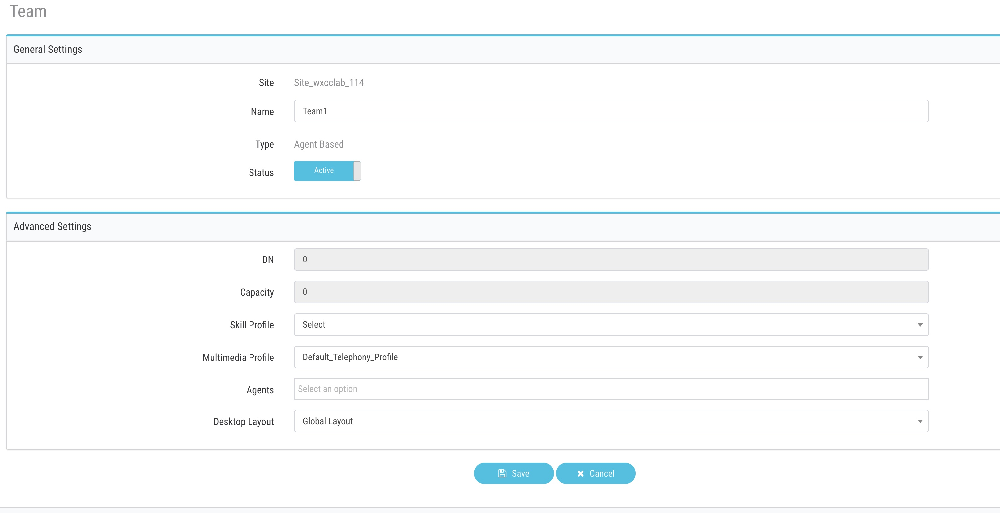
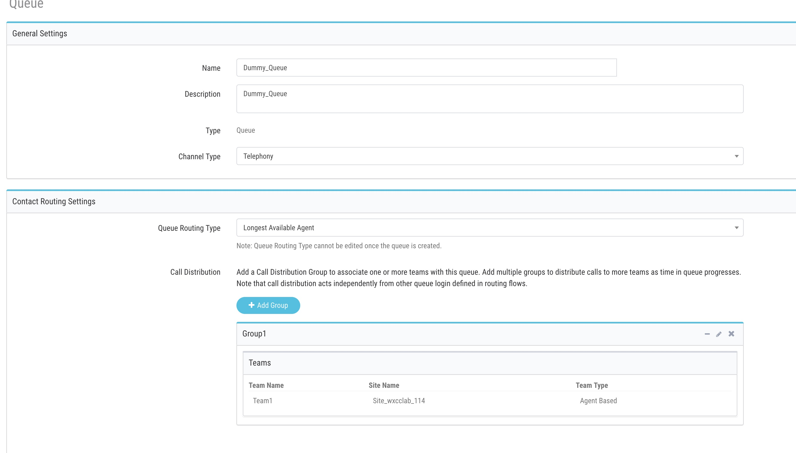
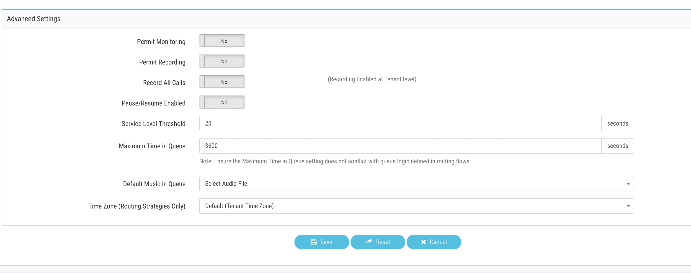

# Table of Contents

- [Table of Contents](#table-of-contents)
- [Introduction](#introduction)

  - [Recap](#Recap)
  - [Lab Objective](#lab-objective)
  - [Pre-requisites](#pre-requisites)
  - [Quick Links](#quick-links)

- [Lab Section](#lab-section)

  - [Queue&Team](#Create-And-Team)
  - [Agent Login](#AGent-login)
  - [Flow configuration)](Flow-configuration)

- [Lab Validation](Lab-Validation)

# Introduction

### Recap

In the first Lab, we Learned 0. Bring the contact into Webex Contact Center and hear welcome message

1. Queue the contact to Live Agent after hearing welcome prompt

### Lab Objective

In this section, we will go over the steps that are required to offer a Menu and an opt_Out options to the caller. In this Lab you will learn the following

1. Adding menu to Flow
2. Creating Local Variable and using that in flow
3. Offering Opt_Out option (Callback and Voicemail) to the caller after 10 seconds in the queue
4. Make call and opt for a callback and make sure caller receives the callback.

### Pre-requisites

- All previous labs are completed successfully

### Quick Links

> Control Hub: **[https://admin.webex.com](https://admin.webex.com){:target="\_blank"}**\
> Portal: **[https://portal.wxcc-us1.cisco.com/portal](https://portal.wxcc-us1.cisco.com/portal){:target="\_blank"}**\
> Agent Desktop: **[https://desktop.wxcc-us1.cisco.com](https://desktop.wxcc-us1.cisco.com){:target="\_blank"}**\

# Lab Section

## Create Queue and Team

### Team

1. From portal -->provisioning -->Create new Team, name is `Team1`
2. Make sure to select the same `Site` as `User` belongs to
3. Select default `Multimedia Profile`

### Create Queue

1. From portal -->provisioning -->Create new queue, name is `Dummy_Queue`
2. add call distribution group aka Teams, Team 1
3. make sure give service level threshold time (preferably 3600) and service level threshold

## Agent Login

> Follow the steps from Lab1 and login in Agent

Agent Desktop: \*\*[https://desktop.wxcc-us1.cisco.com](https://desktop.wxcc-us1.cisco.com)

> While login into agent desktop make sure to choose **Extension** and correct **Team**

> Set the Agent status to `Not Ready`

## Flow configuration

1. Copy the Lab1 flow by clicking on 3 dot
   

2. Remove Play message node
   

3. Drag and Drop Menu Node and connect NewPhoneContact node to MenuNode
   

4. i) Click on Menu node, rename it to `MainMenu` and

   ii) Select `1_main_main.wav` file

   iii) Add 3 custom menu link 1,2,3 and add respective Descriptions

   
   
   

 

5. Drag and drop `Queue contact` node and select `Dummy_Queue` created

6. To Set `QueueCounter` Variable

   i) Click anywhere on the Flow canvas

   ii)Click on `Add Flow Variable`

   iii) Create a `integer`variable named `QueueCounter` and set Default value to `0`

   
   

7. Set `QueueCounter` variable
   i) Drag and Drop `SetVarible` node

ii) In the variable select `QueueCounter` variable created

iii) In the set value type `{{QueueCounter+1}}`, Note: variable in the set node must always be typed inside `{{}} ` braces

 

8. Drag and Drop `PlayMusic` node and select `Music File` and set `offset` to `5`
   

9. Drag and Drop `Condition` node and set the condition to `{{QueueCounter<2}}` if `True` connect it to `SetQCounter`

  

10. Drag and Drop `PlayMessage` node and select `2_high_call_volume.wav` file and connect `False` output to `PlayMessage` node

  

11. Drag and Drop `Menu` node and select `3_callback_menu.wav` file and add 2 more custom links 1 and 2 for `callback` and `Voicemail`

    

12. Set call back

i) Drag and Drop `PlayMessage` node and select `4_callback_confirm.wav` file

ii) Drag and Drop `Callback` node and set `callback Dial Number` to `NewPhoneContact.ANI` and `Static Queue` to the queue created in lab 1

iii) connect `DisconnectContact` node to callback node

  

  

>

13. Set Voicemail

i) Drag and Drop `Blindtransfer` node and set `Number` to `+18005532447` which is Cisco TAC support number

ii) Repeat the same for `optout` menu as well

  

14. Connect `No-input Timeout` and `Unmatched Entry` from Main menu to itself

15. Connect `No-input Timeout` and `Unmatched Entry` from OptOut menu to `SetQCounter` node

16. validate & Publish the flow

17. Edit `Current` Routing Strategy and change the flow to `Lab2`

# Lab Validation

> Login to Agent Desktop and Keep the Agent in Not Ready State

i) To test the flow call the Dial Number configured and traverse Main Menu and press `1`
ii) On the call back menu press `1` to leave Callback

- Expected results

i) Caller should hear `MOH` for 10 seconds and then hear `high_call_volume`
and offered an option to call back

ii) System should call the Agent first and then Customer and call should get connected between Agent and Customer

Expected Result

Dial the Number from your mobile phone and make sure to traverse through different menu and leave `CallBack` and `Voicemail`

### Congratulations, you have completed Lab2 tasks!

---

<button onclick="mainPage()" style="
  border-radius: 5px;
  background-color: rgb(116,191,75);
  padding: 10px;">Home Page</button>

<button onclick="nextLab()" style="
  position: absolute;
  right: 200px;
  border-radius: 5px;
  background-color: rgb(116,191,75);
  padding: 10px;">Go to the Next Lab</button>

