# Table of Contents

- [Table of Contents](#table-of-contents)
- [Introduction](#introduction)
    - [Recap](#Recap)
    - [Lab Objective](#lab-objective)
    - [Pre-requisites](#pre-requisites)
    - [Quick Links](#quick-links)

- [Lab Section](#lab-section)
  - [Step 1. HTTP Node](#HTTP Node)
  - [Step 2. Agent Login](#AGent login)
  - [Step 3. Flow configuration  )](Flow configuration )


# Introduction

### Recap

 In the first 3 Lab, we Learned
 1. Map Dial number to Entry point and mapping flow Dial Number-->Entry Point --> Routing Point-->Flow , contact hear welcome message
 2. Connect contact to Agent Desktop
 3. provide Menu option and an Opt-Out options to customer and validate CallBack Functionality

### Lab Objective

In this section, we will go over the steps that are required to do External Data DIP. In this Lab you will learn the following
1. External Data Dip to 3rd party Web Services  
2. Parsing the JSON
3. Collect variable dynamically from WebServices and Display it on Agent Desktop


### Pre-requisites

- Basic IVR flow worked, caller can connect to WXCC and hear welcome music
- Caller Successfully connect to Agent Desktop
- Menu and Opt Out lab completed


### Quick Links

> Control Hub: **[https://admin.webex.com](https://admin.webex.com){:target="_blank"}**\
> Portal: **[https://portal.wxcc-us1.cisco.com/portal](https://portal.wxcc-us1.cisco.com/portal){:target="_blank"}**\
> Agent Desktop: **[https://desktop.wxcc-us1.cisco.com](https://desktop.wxcc-us1.cisco.com){:target="_blank"}**\


# Lab Section

## Step 1. HTTP Node

>The HTTP Request activity fetches information from an external data source such as a CRM using standard HTTP protocols.
>Basic Auth and OAuth 2.0 attributes are supported for authenticated endpoints

The request we will construct is :

HTTPS GET -> https://5f97898842706e0016957443.mockapi.io/crm/api/customers?pin=18716

Use the variable from the CollectDigits1.EnteredPIN variable to inject it in the pin lookup.
We will construct it as follows
HTTP Request
GET https://5f97898842706e0016957443.mockapi.io/crm/api/customers

Query Parameters:
pin with  

with value of the block (recheck your block variable name!)

The type would be application/json

The Parse settings would be :
customerName = $.[0].name
customerEmail = $.[0].email
customerPhone = $.[0].phone
Tech-Tip: Here are some practice exercises you can try by going to jsonpath.com

Go to https://5f97898842706e0016957443.mockapi.io/crm/api/customers
Copy out the JSON into https://jsonpath.com on the left pane.

Try out all of these to learn how JSON path works!

|Query For |	Parse statement |
|----------|------------------|
|All Customers|	$.*|
|First Customer|	$.[0] |
|Last Customer|	$.[-1:]|
|First two customers|	$.[0:2]|
|Last two customers |	$.[-2:]|
|Second from last	|$.[-2:-1]|
|All the names|	$..name |
|All the pins	| $..pin |
|All the customers who’s pin value is more than 70000 or 80000 |	$..[?(@.pin > 70000)] |
|All details of customer with account number|	$..[?(@.account == "87305901”)].*|
|Name of customer with account number | 	$.[?(@.account == "70579265")].name|


## Step 2. Agent Login


## Step 3. Flow configuration

1. Copy the Lab2 flow by clicking on 3 dot and open the copied the flow
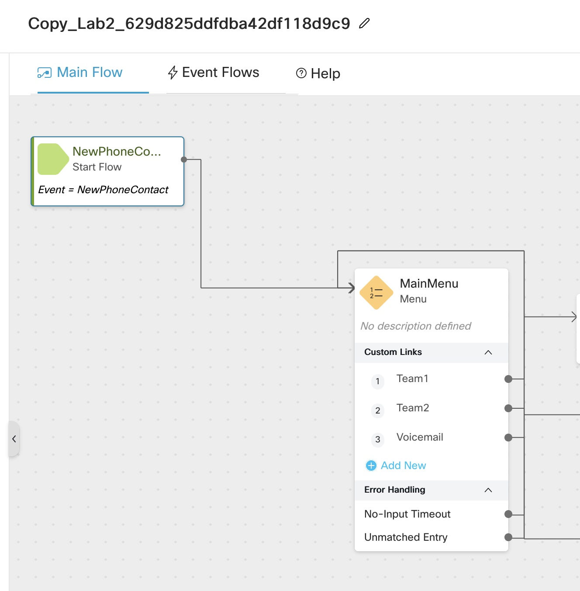

2. Add Play message node and select ```0_welcome_CL.wav``` file
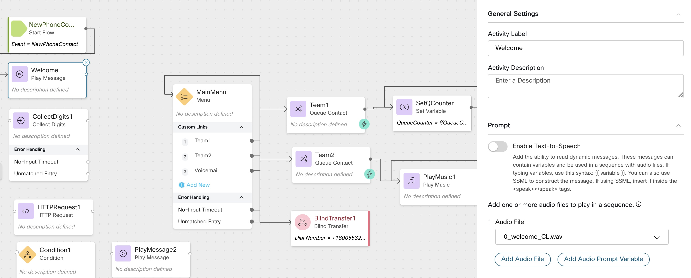

3. Drag and drop ```CollectDigits1``` node and select ```5_enter_pin.wav``` file, under Advanced setting change min and max Digits to ```5```

as a best practice always enable ```Make prompt interruptible```

Connect ```No-input timeout``` as well as ```unmatched Entry``` to itself

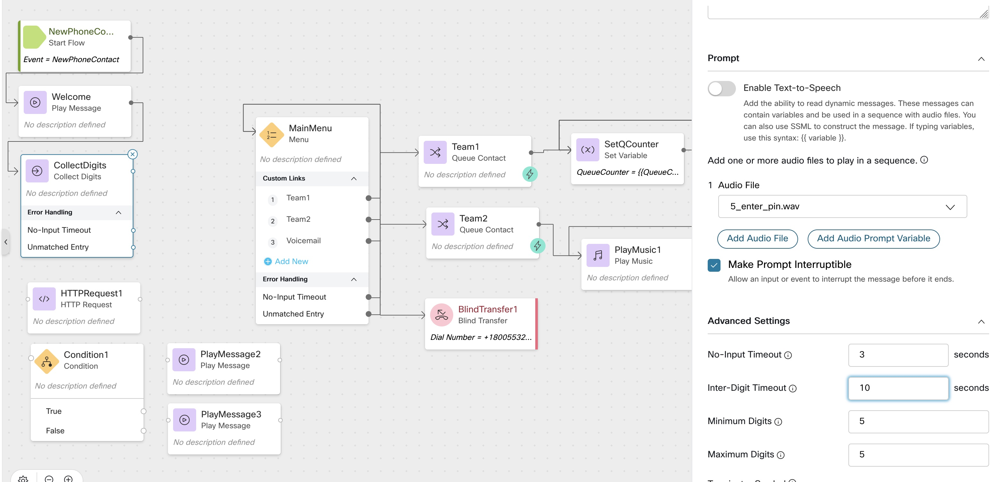

> Create 3 string Variable and mark all 3 are ```Agent Viewable```
Customer_Name
Customer_Email
Customer_Account


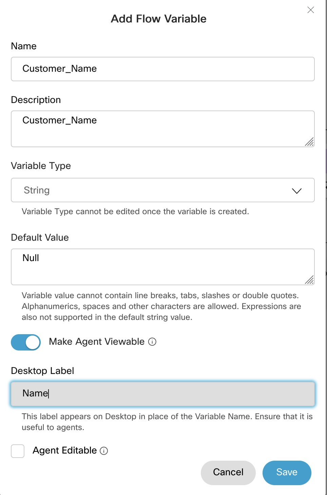
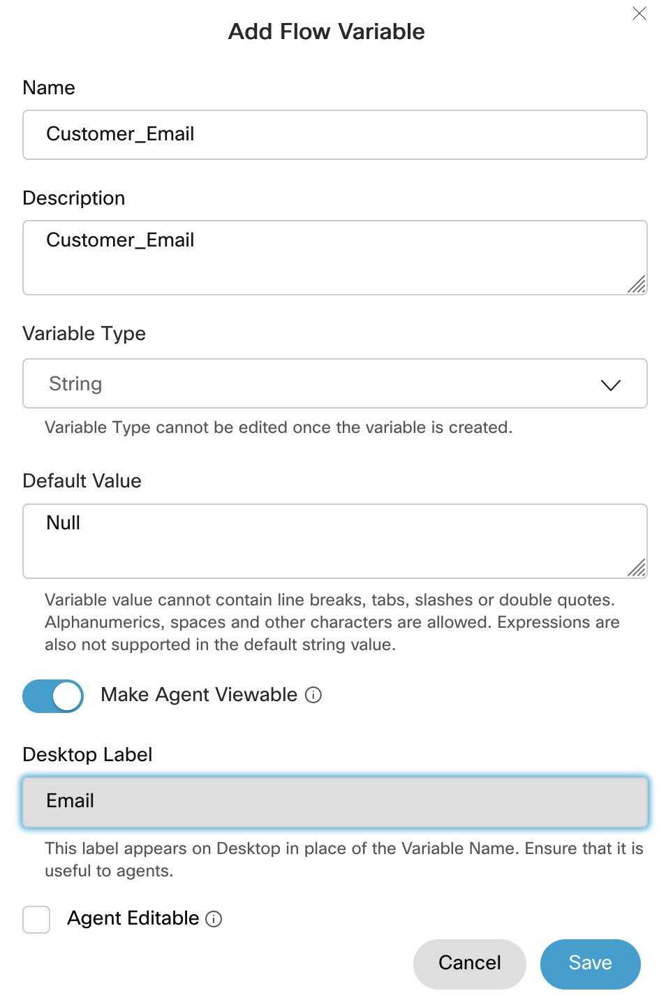
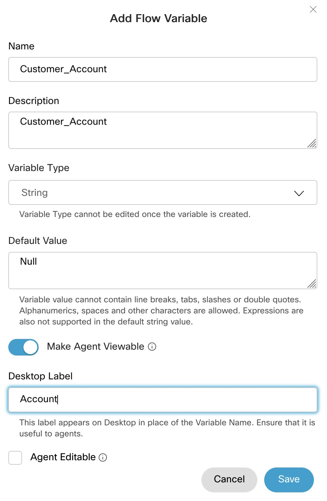

4. Drag and drop ```HTTP Request``` Rename it to  ```DataDip```

i) Disable, ```Use authenticated endpoints```

ii) In the Request URL enter  ```https://5f97898842706e0016957443.mockapi.io/crm/api/customers```

iii) Method select ```GET```
iv) Under Query Parameters Key==pin, value ==```{{CollectDigits.DigitsEntered}}```
v) Content Type == application/json

   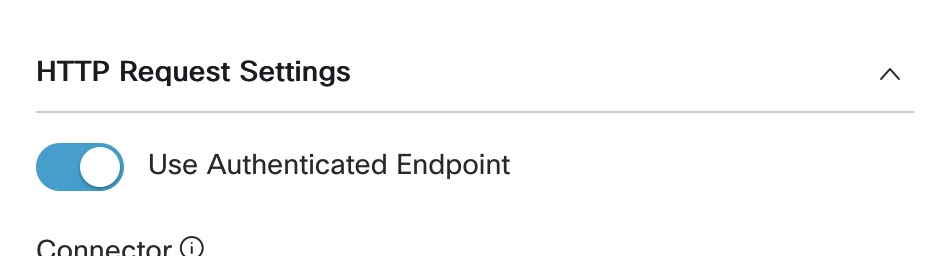
   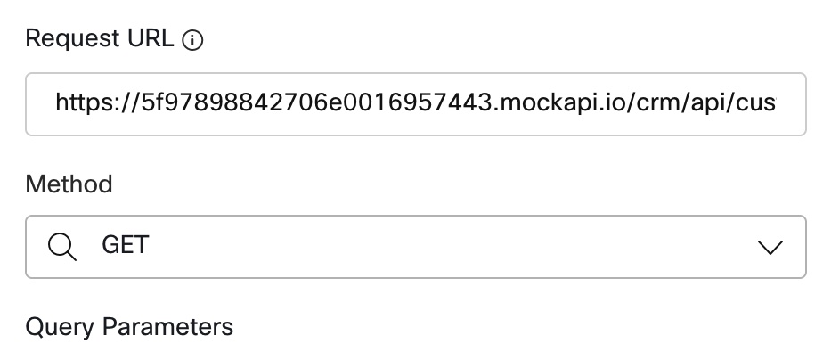


   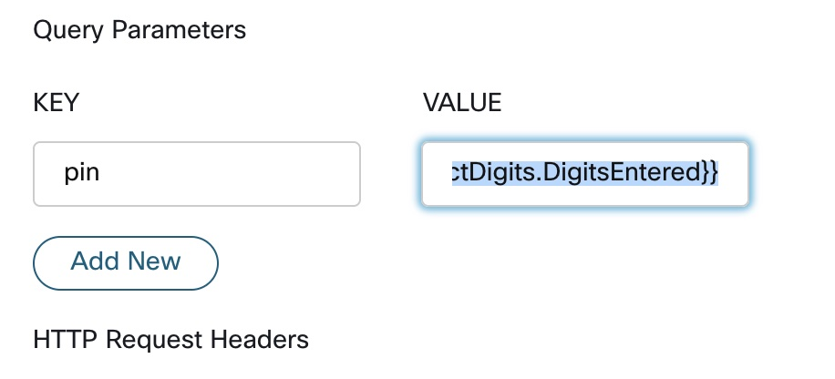
   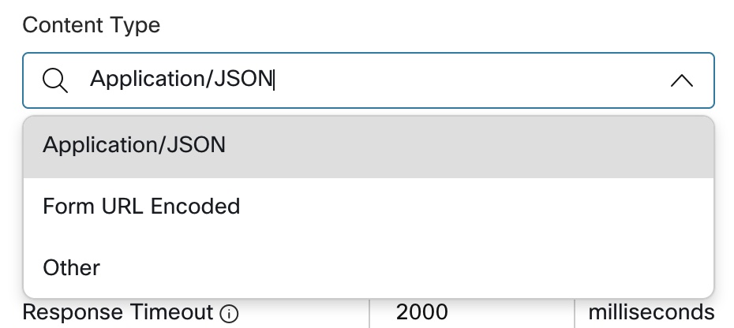


 

5. Parse the Json for  ```Name``` ```Email``` and ```Account```

>Use ```https://jsonpath.com/``` website to parse the value, take the json by entering the webservices in Firefox browser

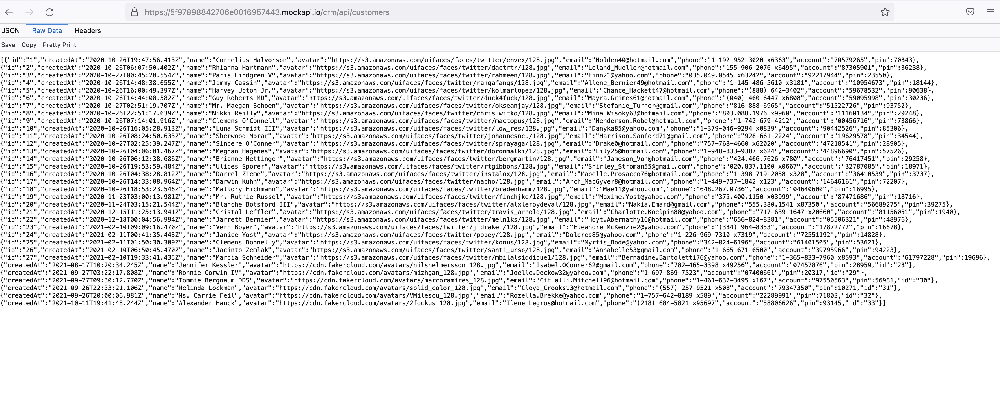


6. Drag and drop  ```condition``` Node and set the condition to

 `{{DataDip.httpStatusCode}}``


   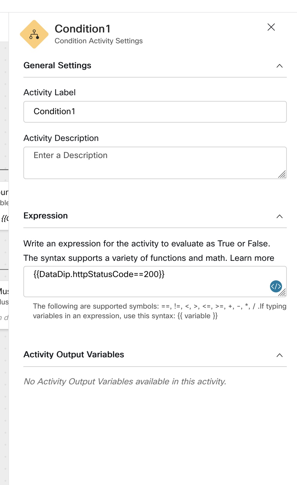


7. if the condition is true to connect to ```play message```


 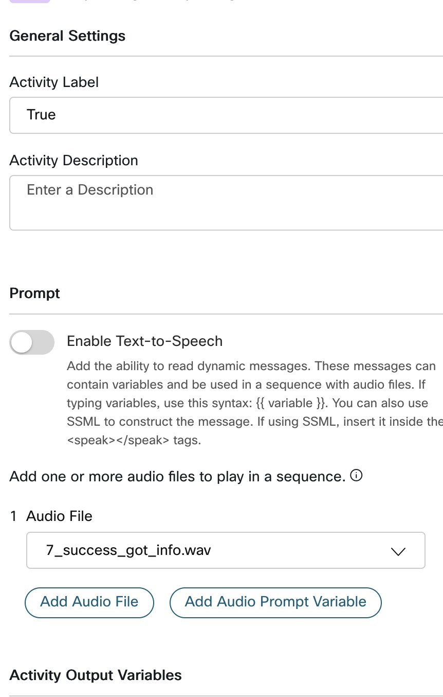
 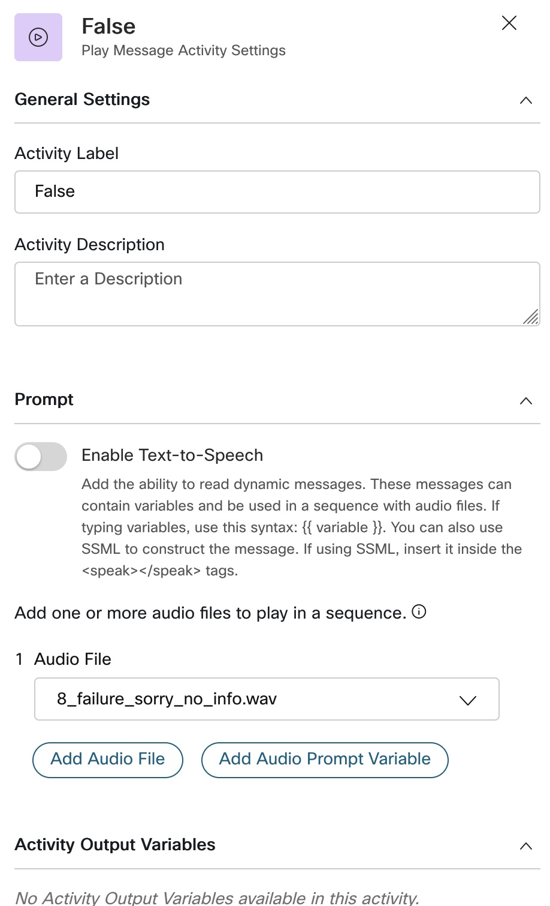


8. Validate and Publish the Flow

9. Edit ```Current``` Routing Strategy and  change the flow to ```Lab3```


### Dial the Number from your mobile phone and make sure to traverse through different menu and leave ```CallBack``` and ```Voicemail```


### Congratulations, you have completed Lab2 tasks!


---


<script>
function mainPage() {window.location.href = "https://wxcctechsummit.github.io/wxcclabguides/LTRCCT-3001/Home.html";}
function nextLab()
 {
 window.location.href = "https://wxcctechsummit.github.io/wxcclabguides/LTRCCT-3001/2_BasicChat.html";
 }
</script>

<div id="button-row">
<button onclick="mainPage()" style="
  border-radius: 5px;
  background-color: rgb(116,191,75);
  padding: 10px;">Home Page</button>

<button onclick="nextLab()" style="
  position: absolute;
  right: 200px;
  border-radius: 5px;
  background-color: rgb(116,191,75);
  padding: 10px;">Go to the Next Lab</button>

</div>
