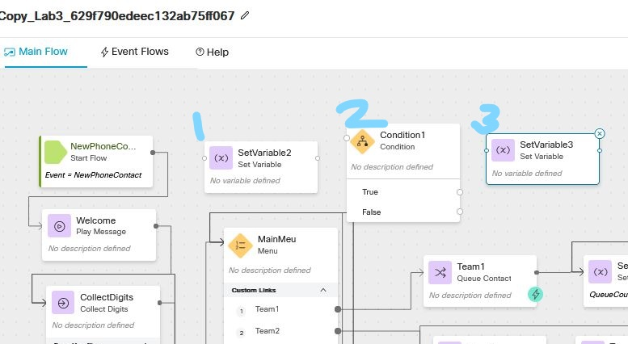

# Table of Contents

- [Table of Contents](#table-of-contents)
- [Introduction](#introduction)
    - [Recap](#Recap)
    - [Lab Objective](#lab-objective)
    - [Pre-requisites](#pre-requisites)
    - [Quick Links](#quick-links)

- [Lab Section](#lab-section)


# Introduction

### Recap

 In the first 3 Lab, we Learned

 In the first 5 Lab, we Learned
 0. Bring the contact into Webex Contact Center and hear  welcome message
 1. Queue the  contact to Live Agent  after hearing welcome prompt
 2. provide Menu option and an Opt-Out options to customer and validate CallBack Functionality
 3. HTTP based Data Dip to external WebServices to Pull Customer Information and POP that on Agent Desktop


### Lab Objective

In this section, we will go over the steps that are required to setup and configure Skills Based Routing. In this Lab you will learn the following
1. Defining Skills - Proficiency, Boolean, Text, Enum
2. Creating the Skill profile and assigning to user
3. Creating Skill based queue
4. Use Skill based queue in the Flow and set rules and Relaxations


### Pre-requisites

- All previous labs are completed successfully


### Use Cases
- Collect customer PIN, store customer name, email and Acct (done in previous lab)
- Parse customer email, consider Customer with gmail.com as premium agent
- Define 2 skills, Agent Proficiency and Premium Agent
- Create 2 Skill profiles
- Provide special routing for premium customer
- Agent Re-skilling changing out the profile, SP1 versus SP2


### Quick Links

> Control Hub: **[https://admin.webex.com](https://admin.webex.com){:target="_blank"}**\
> Portal: **[https://portal.wxcc-us1.cisco.com/portal](https://portal.wxcc-us1.cisco.com/portal){:target="_blank"}**\
> Agent Desktop: **[https://desktop.wxcc-us1.cisco.com](https://desktop.wxcc-us1.cisco.com){:target="_blank"}**\


# Lab Section

## Step 1. Create skills in the Admin portal

Login to the portal. Under the Provisioning menu go to Skills>Skills Definition.

To create a new skill click on the Add New Skill Definition button.


In the skill definition box you will name your skill, give it a description and type. There are 4 types of skills. Let's name this one Spanish and assign it as a proficiency skill. Click Save to save this skill.


For this lab you will be creating 2 Skill  ```Agent_ Proficiency``` of type ```proficiency``` and ```Premium_Agent``` of type ```Text```


>
## Step 2. Create Skill Profile

Once skills are created they must be added to a Profile and assigned a value. Go to the Portal under Provisioning>Skills>Skill Profile.

Click on the Add New skill profile button.


Lets give this a name called Customer Service. Next you must assign which skills will belong to this profile. Let's select Agent proficiency and assign skill value of 5. Then click Save.


 For this exercise, we have already created two skill profiles for this lab: Cisco_Live_SP1 and Cisco_Live_SP2


Edit/Open the SP1 profile. In this profile we have only assigned the Agent_Proficiency skill and gave it a value 5.


Skill Profile 2 contains both Agent_Proficiency and Premium_Agent skills.


## Step 3. Add Profile to the User

Next we must assign the new Skill Profile to the user. Open the Users tab from the Provisioning menu. Find your user name for this lab. Edit. If not done so already please assign Skill Profile ```Cisco_live_SP2``` to your user.


## Step 4. Create a SBR queue

Go to the Provisioning> Entry Points and Queues> Queues menu option. To create a new queue, click on Add New Queue.


Set the Queue routing type as Skill based rather than Longest Duration Agent. And then select the sub type LAA. From there you can assign a team to the distribution just as you have done before. Select the Cisco team. Then select Cancel. We will not save this as we have already created a SBR queue for this lab.

For this lab we will use the Queue_SBR.


## Step 5. Create a Flow

Open the Routing Strategy tab and go to the Flow tab. Make a copy of the Flow that was used in previous Lab3.


Once copied your new flow should open like this:


## Step 6. Create Flow Variables
Next, we will add a couple of Flow Variables to this flow to help us route calls.
Click anywhere in the flow canvas to open the Global flow properties menu. Click on Add Flow Variable.


Name it``` Cust_premium_Check```, set as Type ```String``` and the Default value as ```Unavailable```. Click Save.


Create a second Flow Variable. This name will be ```Cust_premium_set```, variable type will be String and value will be unavailable. Click Save.


## Step 7. Add new nodes
Drag and drop the ```Set Variable node``` and the ```Condition node``` and another ```Set Variable node``` onto the flow canvas. See image below for placement of the three new nodes.


For the Set Variable2 node we will use this to parse the email and then do a check on the customer email. Name the activity Label ParseEmail. Select the Cust_Prof_check as the variable name.  We will use Pebble templates to define the Value of this variable. Copy and paste the following string: ```{{Customer_Email | split("@") | last}}```into the expression field.
This split function allows us to use customer variable and split it to use the domain only of the email address we need to route the call.


Next we will test the expression we just created. Click on the blue round icon in the expression box. For customer email type in xyx@yahaoo.com. Click on test. The results box should only show the domain yahoo.com. Apply Changes.


Next we will finish out the condition node. Click on the condition node to open the settings window. Name the activity label as checkpremium. In the expression box type {{Cust_prof_check = = "gmail.com"}}
Click on the blue round button in the expression box to test the expression.
type in gmail.com. The results box should show True. Save changes.


Next we will connect the nodes. Set variable into the Condition, if true we will go to set variable node2 if false we will send to menu. See image.


Next,  we will add settings for SetVariable3 node. Label this node SetPremium, choose the Cust_Prof_set variable and set value to Yes.


Lastly, we will update the flow to connect the success node to the Parse email setvariable node we just created. In the last lab the success node linked directly to menu.


## Step 8. Add SBR queue to the flow

In the last lab the queue assigned to Menu 1 was set to a Dummy queue. We will now change this to the Queue_SBR. Click on the queue contact Team 1 node. in the drop down replace the dummy_queue with the SBR queue.


## Step 9. Set the skill requirements.

Set the first skill to Agent_Proficiency with condition >= value 4.

Lets add a second skill. Select the Add Skill Requirement, Premium Agent with condition IS and value set to the variable {{Cust_Premium_set}}


Next, we will enable Skill  relaxation, after waiting in queue 60 seconds


## Step 10. Save and publish the Flow.
Before we publish change the name of the flow to flow_lab4. Turn Validation on and Publish the flow.

## Step 11. Test flow.
Update RS with the new flow >Entrypoint_CL_Lab. Place a test call.

## Step 12. Agent reskilling
Supervisors are able to change Agent Skill profile for an agent and take effect without having to signout the agent. Let's demo this.

Go to your user and change the skill profile.
Place a test call.


### Congratulations, you have completed Lab4 tasks!


---


<script>
function mainPage() {window.location.href = "https://wxcctechsummit.github.io/wxcclabguides/LTRCCT-3001/Home.html";}
function nextLab()
 {
 window.location.href = "https://wxcctechsummit.github.io/wxcclabguides/LTRCCT-3001/2_BasicChat.html";
 }
</script>

<div id="button-row">
<button onclick="mainPage()" style="
  border-radius: 5px;
  background-color: rgb(116,191,75);
  padding: 10px;">Home Page</button>

<button onclick="nextLab()" style="
  position: absolute;
  right: 200px;
  border-radius: 5px;
  background-color: rgb(116,191,75);
  padding: 10px;">Go to the Next Lab</button>

</div>
