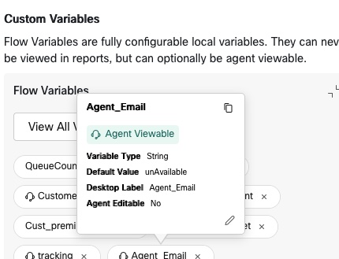
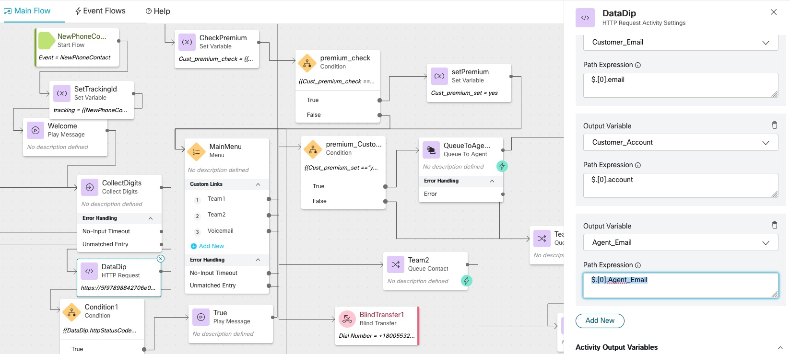
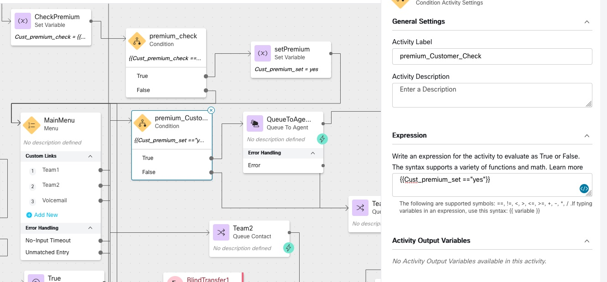
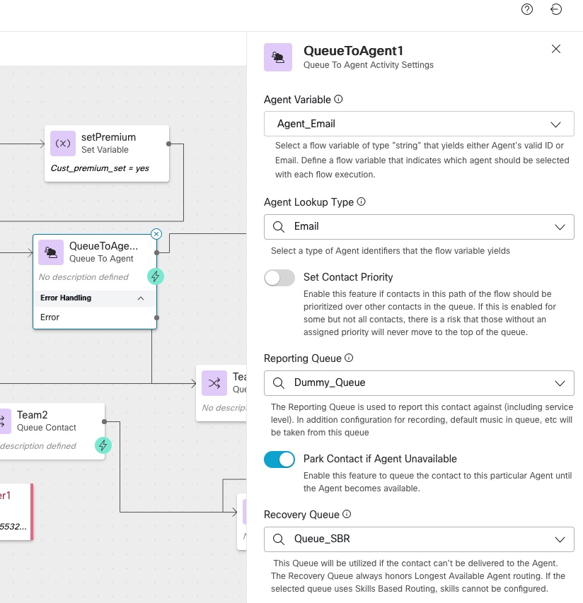
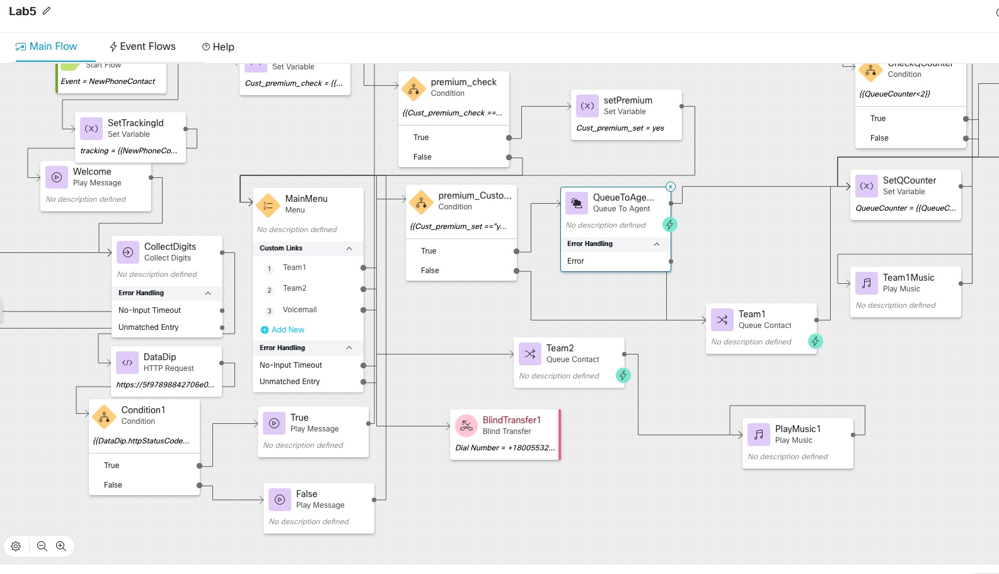
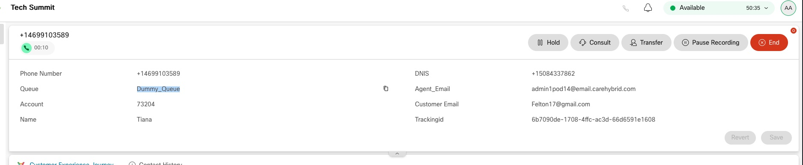

# Table of Contents

- [Table of Contents](#table-of-contents)
- [Introduction](#introduction)
    - [Recap](#Recap)
    - [Lab Objective](#lab-objective)
    - [Pre-requisites](#pre-requisites)
    - [Quick Links](#quick-links)

- [Lab Section](#lab-section)
  - [Step 1. Preffered Agent Routing](#PreferredAgentRouting)
  - [Step 2. Flow configuration  ](#FlowConfiguration)
  - [Step 3. Validation  )](Validation)


# Introduction

### Recap

 In the first 4 Lab, we Learned
 0. Bring the contact into Webex Contact Center and hear  welcome message
 1. Queue the  contact to Live Agent  after hearing welcome prompt
 2. provide Menu option and an Opt-Out options to customer and validate CallBack Functionality
 3. HTTP based Data Dip to external WebServices to Pull Customer Information and POP that on Agent Desktop
 4. Dip to external database and validate if customer is premium/ Platinum customer and connect the contact immediately to Agent using Advanced Skill Based Routing  
 5. When premium customer calls back, connect the contact back to preferred or last routed agent


### Lab Objective

In this section, we will go over the steps that are required to do External Data DIP to validate customer is premium or not, if yes, connect the contact to
 preferred Agent
1. External Data Dip to 3rd party Web Services  
2. Parsing the JSON to validate the customer is premium
3. Connect to premium customer to preferred Agent using QueuetoAgent node

> we are going to take this lab forward from Lab4, by copying the same Lab and adding a condition node to check if the customer is premium customer, if yes
customer will be routed immediately to last agent routed based using QueuetoAgent
Node


### Pre-requisites

- Basic IVR flow worked, caller can connect to WXCC and hear welcome music
- Caller Successfully connect to Agent Desktop
- Menu and Opt Out lab completed
-


### Quick Links

> Control Hub: **[https://admin.webex.com](https://admin.webex.com){:target="_blank"}**\
> Portal: **[https://portal.wxcc-us1.cisco.com/portal](https://portal.wxcc-us1.cisco.com/portal){:target="_blank"}**\
> Agent Desktop: **[https://desktop.wxcc-us1.cisco.com](https://desktop.wxcc-us1.cisco.com){:target="_blank"}**\


# Lab Section

## Step 1. PreferredAgentRouting

>PreferredAgentRouting feature using QueuetoAgent Node gives the ability for a flow designer to directly target an agent(Last Agent routed) instead of making the contact wait in a Queue.


## Step 2. FlowConfiguration

>Copy the Lab4 flow by clicking on 3 dot and open the copied the flow

1. Add a Flow Variable name ```Agent_Email``` and



Under ```HTTP Node``` Parse setting parse for Agent Email

Add the path expression as ```$.[0].Agent_Email```




2. Add a ```Condition ```  node after ```MainMenu``` node  and rename it to  ```premium_Customer_Check``` and set the condition
to ```{{Cust_premium_set =="yes"}}```



>
3. Drag and drop ```QueuetoAgent``` node and select

|  Form|	options |
|----------|------------------|
|Agent Variable |	Agent_Email|
|Agent Lookup Type|	Email|
|Reporting Queue|	Dummy_Queue|
|Recovery Queue|	Queue_SBR|




> After completely 3 steps mentioned above, the flow would look like below





## Step 3. Validation


### Dial the Number from your mobile phone

1. Enter the Pin number of Gmail customer
2. Upon hearing main menu option, press ```1``` to queue to Team 1

Expected Result

The call should get routed to Agent immediately with the queue name on Agetn Desktop as ```Dummy_Queue```





### Congratulations, you have completed Lab5 tasks!


---


<script>
function mainPage() {window.location.href = "https://wxcctechsummit.github.io/wxcclabguides/LTRCCT-3001/Home.html";}
function nextLab()
 {
 window.location.href = "https://wxcctechsummit.github.io/wxcclabguides/LTRCCT-3001/2_BasicChat.html";
 }
</script>

<div id="button-row">
<button onclick="mainPage()" style="
  border-radius: 5px;
  background-color: rgb(116,191,75);
  padding: 10px;">Home Page</button>

<button onclick="nextLab()" style="
  position: absolute;
  right: 200px;
  border-radius: 5px;
  background-color: rgb(116,191,75);
  padding: 10px;">Go to the Next Lab</button>

</div>
