# Table of Contents

- [Table of Contents](#table-of-contents)
- [Introduction](#introduction)

  - [Recap](#Recap)
  - [Lab Objective](#lab-objective)
  - [Pre-requisites](#pre-requisites)
  - [Quick Links](#quick-links)

- [Lab Section](#lab-section)
  - [Step 1. Setup Google TTS Connector](#Setup Google TTS Connector)
  - [Step 2. Setup DialogFlow Connector](#Setup DialogFlow Connector)
  - [Step 3. Flow configuration)](#Flow configuration)

# Introduction

### Recap

In the first 5 Lab, we Learned 0. Bring the contact into Webex Contact Center and hear welcome message

1. Queue the contact to Live Agent after hearing welcome prompt
2. provide Menu option and an Opt-Out options to customer and validate CallBack Functionality
3. HTTP based Data Dip to external WebServices to Pull Customer Information and POP that on Agent Desktop
4. Dip to external database and validate if customer is premium/ Platinum customer and connect the contact immediately to Agent using Advanced Skill Based Routing
5. When premium customer calls back, connect the contact back to preferred or last routed agent
6. Integrate Webex with Google Dialog Flow

### Lab Objective

In this section, we will go over the steps that are required to do Integrate Google DialogFlow with Webex Contact Center. In this Lab you will learn the following

1. This lab is designed to help you configure a Google DialogFlow Agent using CCAI (Contact Center AI) on Webex Contact Center and utilize TTS (Text-to-speech) capabilities.
2. At the end of this lab, you should have a fully functioning TripPlannr bot front-ending the Webex Contact Center and text to speech prompts.

# Lab Support

Proctors is your number 1 contact. If you need assistance just raise your hand.

All registered participants are also added to the support room where the engineering and Product Management team is added. As an alternative way, you can use that space for any questions related to the Flow Control.

### Pre-requisites

- Download Google DialogFlow secret json files which are available below

<a href="https://cisco.box.com/s/qfi5tkhttzlh8529ifvrspbmr9htwosw" target="_blank">Download the TTS Connector here - ciscolivetts.json</a>

<a href="https://cisco.box.com/s/cd97g0eussy41zp5wg85p7neqv5acdiy" target="_blank">Download the TTS Connector here - DialogFlowBot.json</a>

### Quick Links

> Control Hub: **[https://admin.webex.com](https://admin.webex.com){:target="\_blank"}**\
> Portal: **[https://portal.wxcc-us1.cisco.com/portal](https://portal.wxcc-us1.cisco.com/portal){:target="\_blank"}**\
> Agent Desktop: **[https://desktop.wxcc-us1.cisco.com](https://desktop.wxcc-us1.cisco.com){:target="\_blank"}**\

# Lab Section

## Step 1. Setup Google TTS Connector

> The Text-to-Speech capability is powered by Google's Text-to-Speech APIs. To enable this functionality, you must set up a Google Cloud account and configure the Text-to-Speech service.

> With Text-to-Speech, you can convert arbitrary strings, words, sentences, and variables into an actual human speech that is played dynamically to the caller. This is in place of playing a prerecorded audio.

1. Create a Service Account to download the private key, this step is already completed and JSON file is attached above, For complete instruction watch complete video [here](https://cisco.sharepoint.com/sites/WxCCPartnerEnablement/Shared%20Documents/Forms/AllItems.aspx?id=/sites/WxCCPartnerEnablement/Shared%20Documents/Enablement%20Videos/Google_DialogFlow_Deep_Dive_Part1_Fundamentals.mp4&parent=/sites/WxCCPartnerEnablement/Shared%20Documents/Enablement%20Videos)

2. Configure the Google Connector in Control Hub to enable the Text-to-Speech capability in Flow Designer

   i) Log into Control Hub, Contact center -->Connectors -->Google

   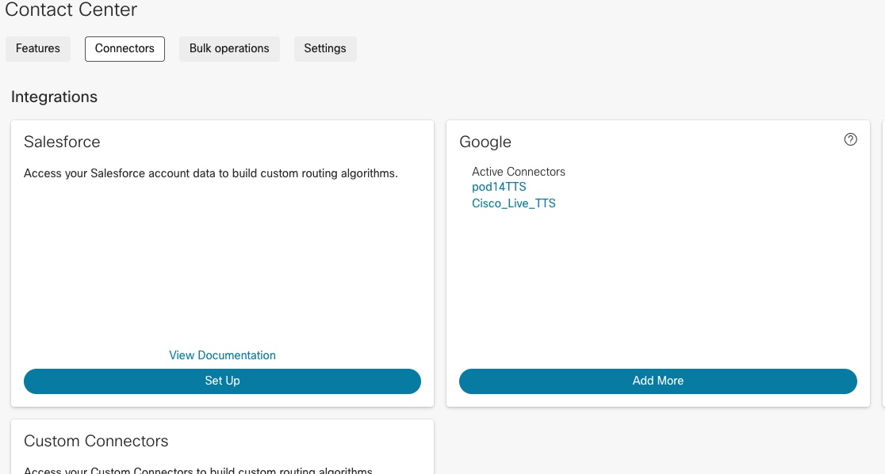

ii) Give a name and upload the `ciscolivetts.json` file

   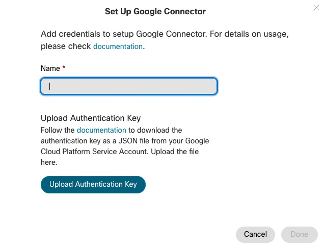

3.  The Text-to-Speech toggle allows you to create synthetic human speech as part of activities in your flow that can play messages to the caller, including `Menu`, `Play Message`, and `Collect Digits`.

    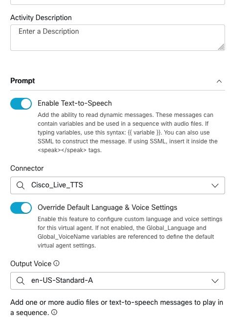

## Step 2. Setup DialogFlow Connector

1. Create a Service Account for DialogFlow and create TripPlaner Virtual agent in Dialog flow , both step are already completed and JSON file is attached above, For complete instruction on creating BOT on Google Dialog flow console watch video [here](https://cisco.sharepoint.com/sites/WxCCPartnerEnablement/Shared%20Documents/Forms/AllItems.aspx?id=/sites/WxCCPartnerEnablement/Shared%20Documents/Enablement%20Videos/Google_DialogFlow_Deep_Dive_Part1_Fundamentals.mp4&parent=/sites/WxCCPartnerEnablement/Shared%20Documents/Enablement%20Videos)

2. Configure the Google Dialog Flow Connector/ Virtual Agent in Control Hub

i) Log into Control Hub, Contact center -->Features -->New -->Virtual Agent

   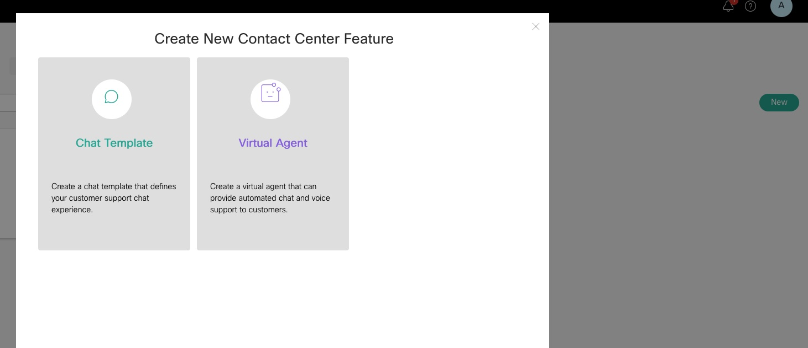

Toggle `Use For Voice` please node `Use for Chat` is disabled as new tenants are default configured with Webex Connect (Cisco New Digital Channel)

   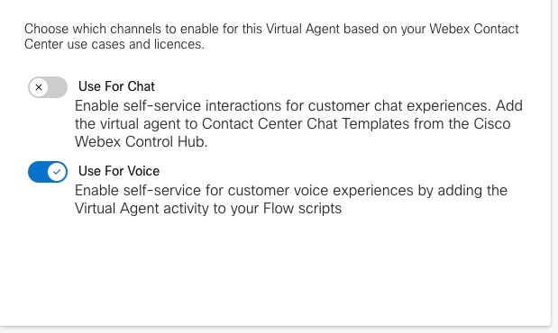

Press on `Yes, I have preconfigured DialogflowFlow Agent` as the Dialogflow is configured and available

  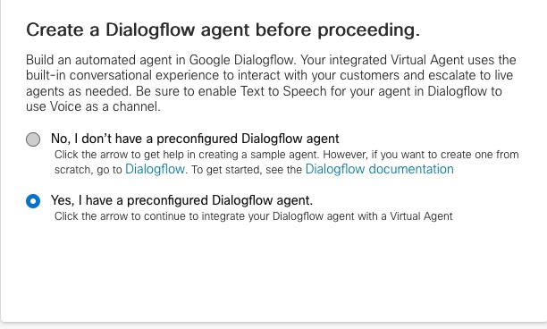

Press `next` here and move to next page, if the BOT is getting configured for the First time, Intents should be downloaded from here and uploaded to DialogFlow

  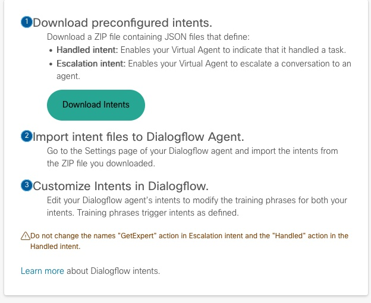

Give Virtual Agent some `Name`

  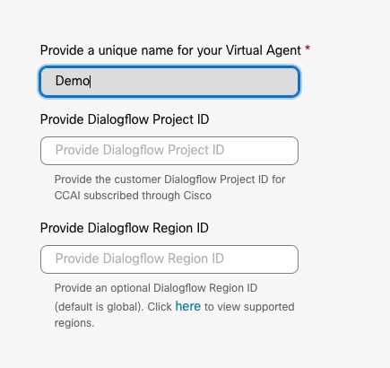

Upload the Authentication key, which is provided above and `Validate` the key

  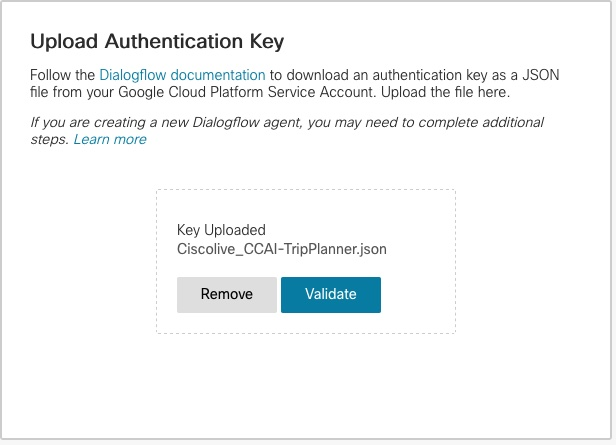

Optionally upload `Avatar` and press next and complete the setup

## Step 3. Flow configuration

1. Create a new flow and name is `Lab6`

2. Drag and drop `VirtualAgent` node and select `Cisco_Live_BOT` configured in control Hu, select Input Language to `en-US` and Output voice to `en-US-Standard-<>`

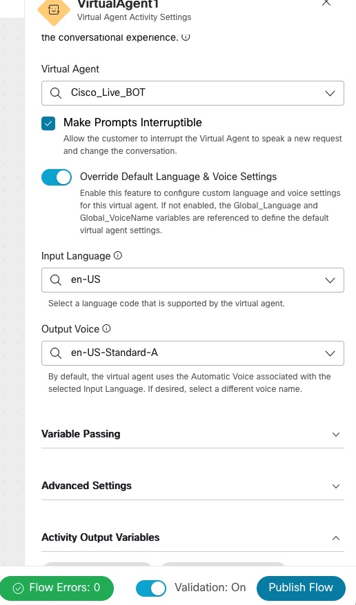

3. Drag and drop couple to `PlayMessage` node and connect it `Handled` and `Escalated` nodes

4. Click on play message node and `Enable Text-to-speech` and select the TTS connector configure in the control hub

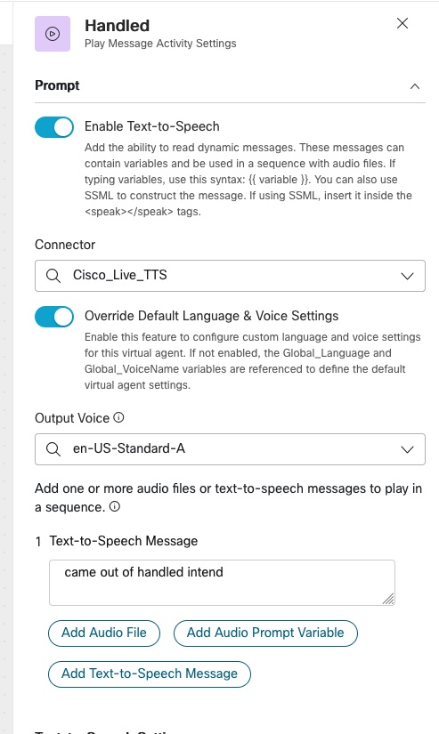

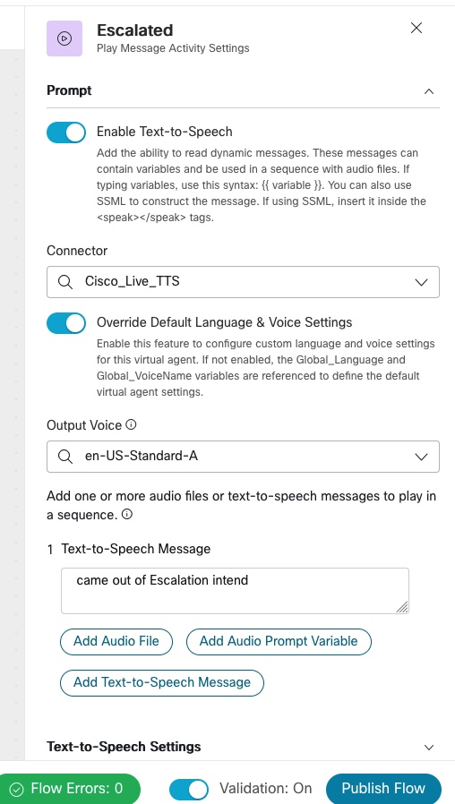

5. Drag and drop `Disconnect contact` Node and connect Handled and Error to `Disconnect contact` node

   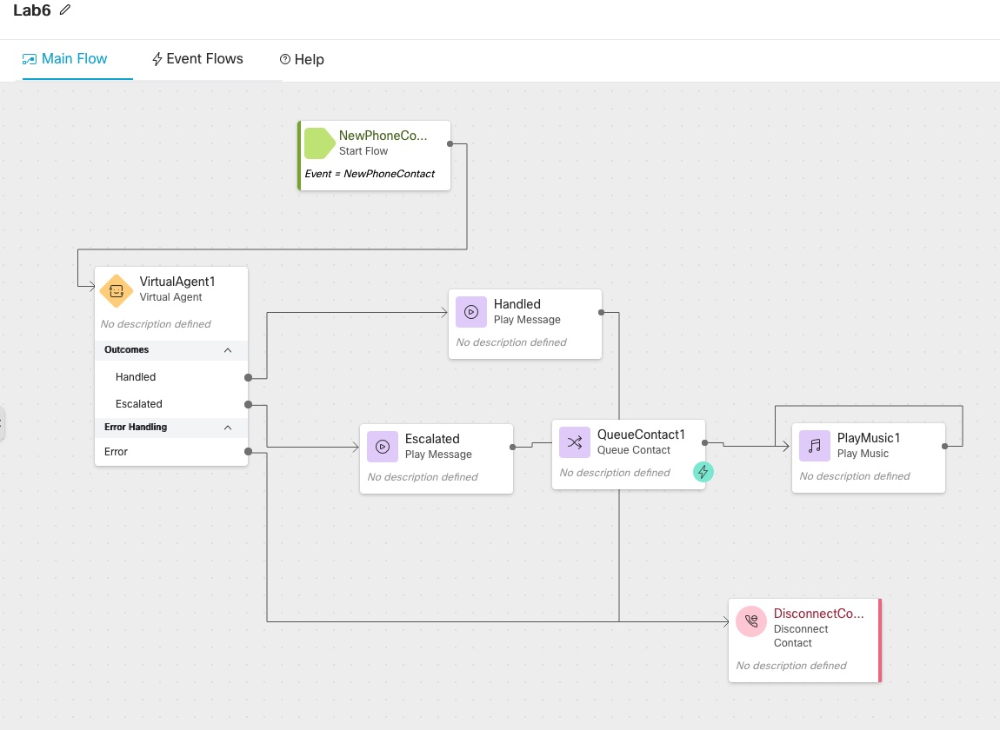

> Because of Logistic restrictions, BOT is already configured and Json file uploaded above

> Step by Step video is avaialble [here](https://cisco.sharepoint.com/sites/WxCCPartnerEnablement/Shared%20Documents/Forms/AllItems.aspx?id=/sites/WxCCPartnerEnablement/Shared%20Documents/Enablement%20Videos/Google_DialogFlow_Deep_Dive_Part1_Fundamentals.mp4&parent=/sites/WxCCPartnerEnablement/Shared%20Documents/Enablement%20Videos)

# Lab Validation

Google DialogFlow is configured with intents and entities required for simple TripPlaner Slot filling BOT

1. Call into the script, Google dialog Flow greet you will welcome message

say `Book a flight`

BOT would ask Date, from and To, provide the information, BOT should Book a flight

Finally say `Live Agent please` or `Human Agent please` BOT should come out through and Escalated intent and transfer call to Agent Desktop.

 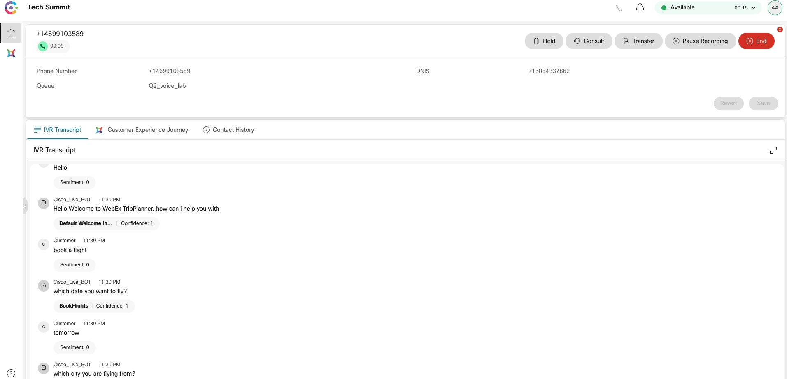

### Congratulations, you have completed Lab6 tasks!

---

<button onclick="mainPage()" style="
  border-radius: 5px;
  background-color: rgb(116,191,75);
  padding: 10px;">Home Page</button>

<button onclick="nextLab()" style="
  position: absolute;
  right: 200px;
  border-radius: 5px;
  background-color: rgb(116,191,75);
  padding: 10px;">Go to the Next Lab</button>

