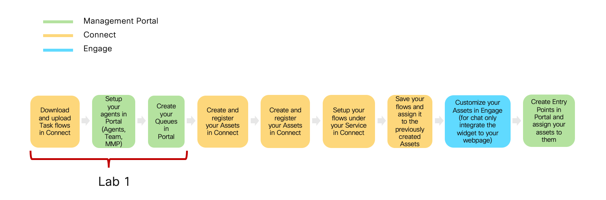

### Overview of the lab:

In this Lab, we will go through the tasks that are required to complete the general pre-configuration of a tenant. These tasks are to be undertaken by a customer administrator. By following each of the steps, you would have prepared your tenant to begin configuring different services offered by the platform. At the end of the lab, you should be able to log in to an agent interface.

# Table of Contents

- [Part 1: Control Hub User Management Admin Task](#part-1-control-hub-user-management-admin-task) 
  * [1. Add an agent and a supervisor users and configure the calling extension](#1-add-an-agent-and-a-supervisor-users-and-configure-the-calling-extension)
  * [2. Optionally, add the rest of the users](#2-optionally-add-the-rest-of-the-users)
- [Part 2: Admin Portal Multimedia Profile, Site and Team Configuration](#part-2-admin-portal-multimedia-profile-site-and-team-configuration)
  * [1. Create new MultiMedia Profile](#1-create-new-multimedia-profile)
  * [2. Create new Site](#2-create-new-site)
  * [3. Create new Team 1](#3-create-new-team-1)
  * [4. Create new Team 2](#4-create-new-team-2)
- [Part 3: Admin Portal User Configuration](#part-3-admin-portal-user-configuration)
  * [1. Synchronize Webex Contact Center Users](#1-synchronize-webex-contact-center-users)
  * [2. Manage settings for existing user](#2-manage-settings-for-existing-user)
- [Part 4: Access to the Agent Desktop](#part-4-access-to-the-agent-desktop)
  * [1. Activate Webex Calling](#1-activate-webex-calling)
  * [2. Download and Login in the Webex Calling app for PC or Mac](#2-download-and-login-in-the-webex-calling-app-for-pc-or-mac)
  * [3. Download and Login in the Webex Calling app for mobile](#3-download-and-login-in-the-webex-calling-app-for-mobile)
  * [4. Agent Desktop Login](#4-agent-desktop-login)
- [Part 5: BONUS Tenant Creation Walkthrough](#part-5-bonus-tenant-creation-walkthrough)
- [Part 6: Bonus Video Only Trial Tenant Setup](#part-6-bonus-trial-tenant-setup-video)

# Introduction

### Lab Objective

- This lab is designed to help you do the initial setup and configuration for your tenant. 
- The lab contains multiple exercises to make you familiar with the control hub, Managment portal UI, Connect and Engage Portals.

### Pre-requisites

- You have recived the access credentials with a full admin access.

### Quick Links

> Control Hub: **[https://admin.webex.com](https://admin.webex.com){:target="_blank"}**\
> Portal: **[https://portal.wxcc-us1.cisco.com/portal](https://portal.wxcc-us1.cisco.com/portal){:target="_blank"}**\
> Agent Desktop: **[https://desktop.wxcc-us1.cisco.com](https://desktop.wxcc-us1.cisco.com){:target="_blank"}**\
> Connect: https://cl1pod**X**.imiconnect.io/

# Lab Section

### Configuration Order

## Step 1: Download and upload CA flows in Connect 
> **Note** Every tenant must include CA flows. CA flows can be imported from the template folder in this [GitHub page](https://github.com/CiscoDevNet/webexcc-digital-channels){:target="_blank"}. CA flow can be added only once and will be automatically be used by all existing channel specific flows in the tenant when needed. Recommended to add these flow in a dedicated Service named “Agnostic Flows - DO NOT MODIFY”

> The agnostic flows consist of:\
> • Task Routed - Adding an agent participant to a conversation;\
> • Task Modified - Adding an agent to or removing an agent from an ongoing conversation (e.g., for chat transfer or conference);\
> • Task Close - Closing the conversation;

1) Download all flows from the [GitHub page](https://github.com/CiscoDevNet/webexcc-digital-channels){:target="_blank"}\ 
2) Navigate to **Webex Connect Flows** -> **v2.1**.\
3) Unzip All Files.\
4) Login to the **Webex Connect** portal with the admin account.\
5) Nabigate to **Services** and click on **CREATE NEW SERVICE**\

6) Set your name __Agnostic Flows DO NOT MODIFY__ in the Service Name. This will create a new service.
> **Note** You can choose a different Service name. It is just an exmple.

7) In the service click on **FLOWS** -> **CREATE FLOW**

8) In the **FLOW NAME** section set **Task Close Flow**

9) In the **METHOD** select **Upload a flow**. In **ATTACHMENT** click on **CHOOSE FILE** and select the **Task Close Flow.workflow** file

10) Now you can click on **CREATE** button

11) In the new menu click on **SAVE** and then **MAKE LIVE**. You should get the message that "Flow successfully made live"

12) Repeate steps 7 - 11 for **Task Routed flow** and **Task Modified Flow**

## Step 2: Node Authorization
Webex Connect is required to provide a valid access token for using various Webex Contact Center and imiengage APIs. The access token is generated using the authorization details configured within the ‘Node Runtime Authorization’ field that Webex Contact Center users are required to provide during flow configuration.

1) To authorize a pre-built integration go to Assets > Integrations. The integrations which are not yet authorized show the status as **Pending Authorization**.
2) In front of **Webex CC Engage** Click Actions → Manage.

3) On the Manage Integrations page, scroll down to the Node Authorizations section. This section lists all the authorizations mapped to this integration. 
4) Click Action → Add Authorization associated with the authorization, where Auth Type is oauth2 and Status is Authorization Pending.

5) Enter the Authorization Name and click Authorize. In that example we use **WebexCCAuth**

6) 

> **Note**: The status of the authorization will change to Authorized and all the nodes under this authorization are authorized and ready for use.

## Step 3: Setup agents in Portal (Agents, Team, MMP)

> This step shows how to access the admin portal and navigate the different configuration menus to create a Site, Team, and Multimedia Profile that will be assigned to the Contact Center user. 

### Users

The users have the following preconfiguration
| **User Role** | **User email**                       |
| ------------- | ------------------------------------ | 
| Agent         | cl1agent**\<ID\>**@email.carehybrid.com   | 
| Supervisor    | cl1sup**\<ID\>**@email.carehybrid.com     | 

### User Settings

| **Entity**          | **Name** |
| ------------------- | -------- |
| Multimedia Profiles | MMP   |
| Site                | Site  |
| Team1               | Team1 |
| Team2               | Team2 |

> **Note:** Your \<ID\> was provided to you personally.  \<ID\> is the unique number equal to your POD.

### 1. Create new MultiMedia Profile

- Login to Control Hub by accessing [https://admin.webex.com](https://admin.webex.com){:target="\_blank"}.

- Enter the admin email id and the password.

- Navigate to **_Contact Center_** Card.

- Click **_Settings_** in the upper right corner.

- Scroll down to the **_Advanced Configuration_** section.

- Click on **_Go to Webex Contact Center Management Portal_**.

- Ensure that browser pop up blockers are not blocking the **_Admin Portal_** pop up.

- Click on **_Provisioning_** and select **_Multimedia Profiles_**.

- Click on `+ New Multimedia Profile` to open Multimedia Profile configuration page.

- Input Name as `MMP_<ID>_TS`.

- In the Media Details section, select the blended multimedia profile and input `1` for **_Voice_**, `3` for **_Chat_**, `3` for **_Email_**, and click **_Save_**.

### 2. Create new Site

- Navigate to **_Provisioning_** and select **_Site_**.

- Click on `+ New Site` button and provide the Name as `Site_<ID>_TS`.

- Select `MMP_<ID>_TS` in the **_Multimedia Profile_** drop down and hit **_Save_**.

### 3. Create new Team 1

- Navigate to **_Provisioning_** and select **_Team_**.

- Click on `+ New Team`.

- Select `Site_<ID>_TS` from the **_Site_** drop-down.

- Input **_Name_** as `Team1_<ID>_TS`.

- Use the default **_Type_** `Agent Based`.

- Select `MMP_<ID>_TS` in the **_Multimedia Profile_** drop-down.

- Left as a default value **_Global Layout_** in the **_Desktop Layout_** drop-down and hit **_Save_**.

### 4. Create new Team 2

- Please follow the same steps as above to add an extra Team as `Team2_<ID>_TS`. Later we will use this team to assign a custom Desktop Layout.

[To top of this lab](#table-of-contents)

## Part 3: Admin Portal User Configuration

> The following video outlines how to configure the users in Admin Portal that were added first in Control Hub. This is a very critical task from the Contact Center perspective. We also would take a look at how to associate customer-created Site, Team, and Multi-Media Profile with those users. After this, we should be able to login as an agent.

<iframe width="1024" height="576" src="https://www.youtube-nocookie.com/embed/r_A-BPhoTaA?rel=0" title="WxCC Lab #1 Part 3: Admin Portal User Configuration" frameborder="0" allow="accelerometer; autoplay; clipboard-write; encrypted-media; gyroscope; picture-in-picture" allowfullscreen></iframe>

### 1. Synchronize Webex Contact Center Users

- Login to Control Hub by accessing [https://admin.webex.com](https://admin.webex.com){:target="\_blank"}.

- Enter the admin email id and the password.

- Navigate to **_Contact Center_** card.

- Click on **_Settings_** and then `Synchronize Users`.

### 2. Manage settings for existing user

- Go back to the **_Webex Contact Center Management Portal_**.

- Click on **_Provisioning_** and select **_Users_**.

- Click on `...` for the first user, to launch the **_Edit_** view for a particular User configuration.

- Click on **_Contact Center Enabled_** toggle to move it to **_On_**.

- In the **_Agent Settings_** section, select `Site_<ID>_TS` in the **_Site_** drop-down.

- Click the **_Teams_** area and select `Team1_<ID>_TS` and `Team2_<ID>_TS`.

- Select `MMP_<ID>_TS` in the **_Multimedia Profile_** drop-down and hit **_Save_**.

- Make sure that the user are now shown with the **_Contact Center Enabled_** flag as `Yes` and **_Status_** as `Active`.

[To top of this lab](#table-of-contents)

## Part 4: Access to the Agent Desktop
>The following video explains the process to access the Agent Desktop. Following the steps, you will log in with your credentials and indicate the number where you want to receive the calls. 

<iframe width="1024" height="576" src="https://www.youtube-nocookie.com/embed/2bmoiAfxpTU?rel=0" title="WxCC Lab #2 Part 4: Access to the Agent Desktop" frameborder="0" allow="accelerometer; autoplay; clipboard-write; encrypted-media; gyroscope; picture-in-picture" allowfullscreen></iframe>

### 1. Activate Webex Calling

- Login the **[Control Hub](https://admin.webex.com/){:target="_blank"}** with your admin credentials.

- Navigate to **_Users_**.

- Select the **Agent** user `agent1_<ID>@mailinator.com` created in the previus lab.

- In the User settings, make sure that the following **_Services_** are listed:
   -  **_Messaging_** as **Advanced Messaging**.
   -  **_Calling_** as **Webex Calling (Professional)**.
   -  **_Contact Center_**.

- Scroll down to **_Calling Behaviour_** and select **_Webex Calling app_**. Click **_Save_**.

- Repeat the same steps for **Supervisor** user `supervisor1_<ID>@mailinator.com`. Make sure that **_Webex Calling app_** has been activated.

### 2. Download and Login in the Webex Calling app for PC or Mac

> **Note:** You need two Webex Calling app for placing a call to Entry Point and accepting on the agent side. Alternatively, if you have a US number, you can use it as an agent's extension. This tenant does not allow numbers outside of the United States. In this lab, we will use the Webex Calling app for PC or Mac for **agent** account.

- Login to **[https://settings.webex.com/](https://settings.webex.com/){:target="_blank"}** by using account `agent1_<ID>@mailinator.com`.

- Click on **_Webex Calling_** this will cross launch CUP in a new browser tab.

- Go to **_My Apps_**.

- Click `Download` the Webex Calling Client **Desktop Software**.

- Install the application on your PC/Mac.

- Open Webex Calling and сlick **Sign In**. Specify the agent credentials for `agent1_<ID>@mailinator.com`.

- Depending on your operation system, navigate to the Webex Callin Menu **_Edit Server Address_** and make sure you have selected **North America** region.

### 3. Download and Login in the Webex Calling app for mobile

> **Note:** You need two Webex Calling app for placing a call to Entry Point and accepting on the agent side. In this lab, we will use the Webex Calling app for mobile for **supervisor** account.

- Open the Application Manager (**Play Store** or **App Store**) on your mobile phone.

- Search for **_webex calling_**.

- **Download** and **Open** the app. Click `Get Started`.

- Login in the app by selecting **_Region_** as **North America**.

- Set **_Email address_** and **_Password_** as the supervisor account `supervisor1_<ID>@mailinator.com`.

> **Note:** Make sure that you give access to the phone's microphone for the calling app.

### 4. Agent Desktop Login
> **Note**: To log in to the agent desktop, use either a separate web browser or a new incognito web page. This will prevent any browser caching issues with admin and agent credentials.

- Navigate to **[https://desktop.wxcc-us1.cisco.com/](https://desktop.wxcc-us1.cisco.com/){:target="_blank"}** in a new browser or in incognito mode.

- Enter the agent’s **email ID** `agent1_<ID>@mailinator.com` which you created in the previous lab.

- Enter the **Password** for the appropriate Username.

- In the **_Station Login_** pane, select **"Extension"** and input the configured number for that user. 

> **Note:** Please use Webex Callin Extension for this lab. Optionally, if you have a US number, you can use it from the agent's desktop. This tenant does not allow numbers outside of the United States.

- Select the `Team1_<ID>_TS`, with default desktop layout.

- Click **_Submit_**. Make sure that you are successfully logged in to the Agent Desktop. Now you can continue with the next section.

[To top of this lab](#table-of-contents)

## Part 5: **BONUS** Tenant Creation Walkthrough
This is a supportive video that does not require any actions since your tenant is already provisioned. The video demonstrates the initial provisioning task for New Webex Contact Center. The initial walkthrough assumes that a new partner is creating both Webex Control Hub and Webex Contact Center Gold Tenant. This process you will use in the feature for setting up your GOLD tenant using Webex Calling. 

<iframe width="1024" height="576" src="https://www.youtube-nocookie.com/embed/SYY4yOogBC0?rel=0" title="WxCC Lab #1 Part 5: Tenant Creation Walkthrough - BONUS Video" frameborder="0" allow="accelerometer; autoplay; clipboard-write; encrypted-media; gyroscope; picture-in-picture" allowfullscreen></iframe>

## Part 6 **BONUS** Trial Tenant Setup Video

> The bonus video shows how to set up a Trial Tenant. The steps are similar but since this is a trial tenant it is not necessary to go through the ordering process. Trial tenants are a great option for partners who are willing to start with the configuration before billing started. 
> **Please note, by default the trial feature is not available in the Partner's CH. It can be activated only after approval. Please contact your PSM/CSM**.

<iframe width="1024" height="576" src="https://www.youtube-nocookie.com/embed/m9QamZh4LwI?rel=0" title="WxCC Lab #1 Part 6: Trial Tenant Setup - BONUS Video" frameborder="0" allow="accelerometer; autoplay; clipboard-write; encrypted-media; gyroscope; picture-in-picture" allowfullscreen></iframe>

---

### Congratulations, you have compleated Lab1 tasks! 
### We would like to keep track of your progress and make sure that we are giving you effective support. Please take approximately one minute to complete the short survey.

<button onclick="mainPage()" style="
  border-radius: 5px;
  background-color: rgb(116,191,75);
  padding: 10px;">Go back to Main Page</button>

<button onclick="nextLab()" style="
  position: absolute;
  right: 200px;
  border-radius: 5px;
  background-color: rgb(116,191,75);
  padding: 10px;">Take Survey and Go to Lab 2</button>

