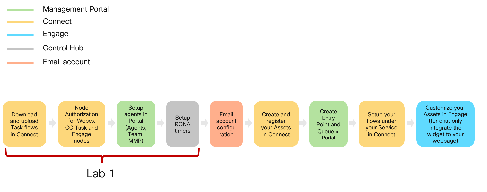
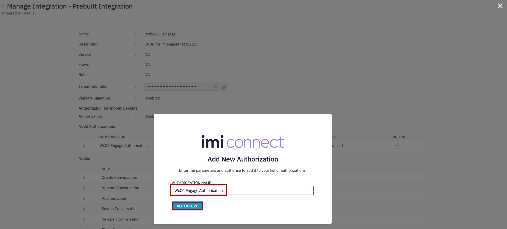
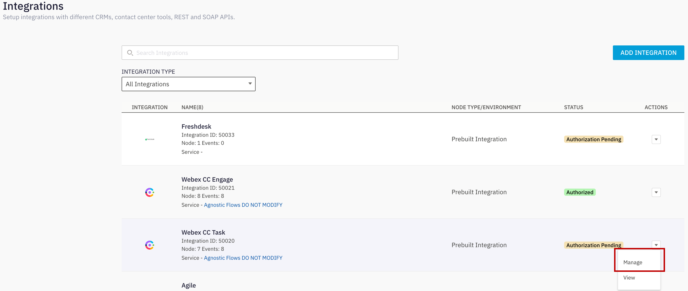
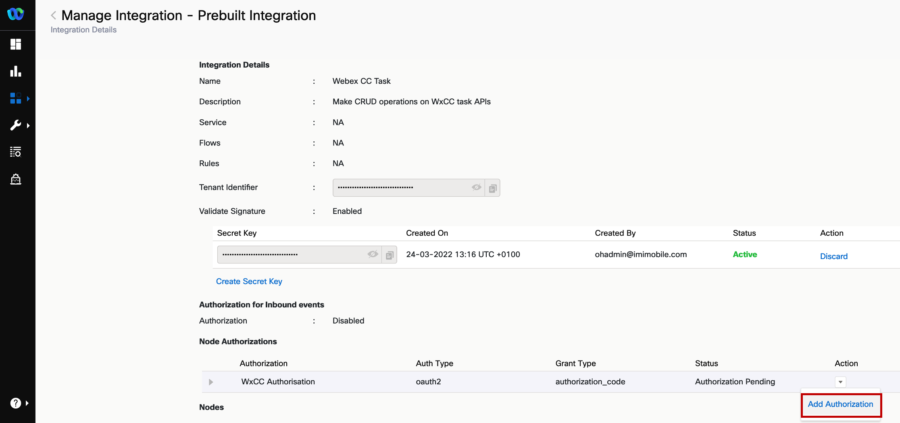
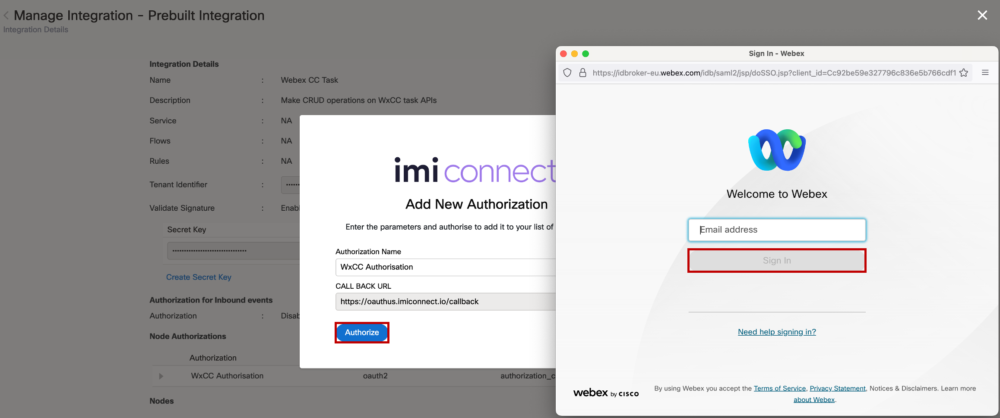
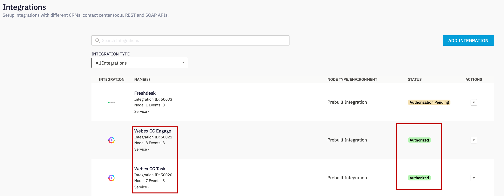
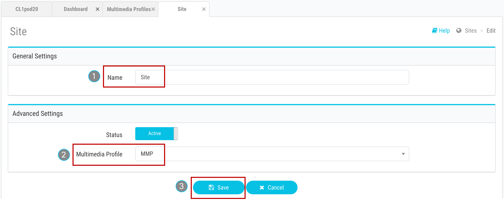
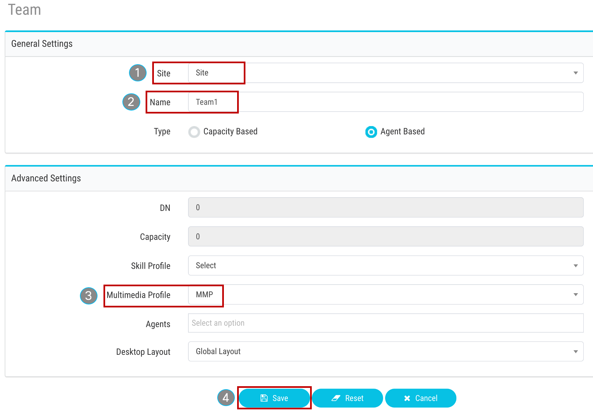
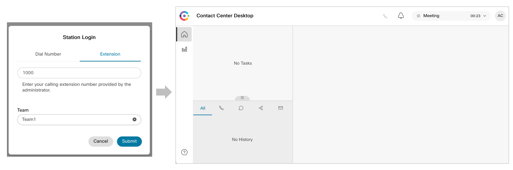

# Table of Contents

- [Step 1. Node Authorization for Webex CC Task and Engage nodes](#step-1-node-authorization-for-webex-cc-task-and-engage-nodes)
- [Step 2. Download and upload CA flows in Connect](#step-2-download-and-upload-ca-flows-in-connect) 
- [Step 3. Setup agents in Portal (Agents, Team, MMP)](#step-3-setup-agents-in-portal-agents-team-mmp)
- [Step 4. Setup RONA timers](#step-4-setup-rona-timers)
- [Verification: Access to the Agent Desktop](#verification-access-to-the-agent-desktop)

# Introduction

### Lab Objective

In this Lab, we will go through the tasks that are required to complete the general pre-configuration of a tenant. These tasks are to be undertaken by an administrator. By following each of the steps, you would have prepared your tenant to begin configuring different services offered by the platform. The lab contains multiple exercises to make you familiar with the Control Hub, Managment portal UI and Webex Connect. At the end of the lab, you should be able to log in to an agent interface.

### Pre-requisites

- You have recived the access credentials with a full admin access 
- You have recived the access to the agent and supervisor account.

### Quick Links

> Control Hub: **[https://admin.webex.com](https://admin.webex.com){:target="_blank"}**\
> Portal: **[https://portal.wxcc-us1.cisco.com/portal](https://portal.wxcc-us1.cisco.com/portal){:target="_blank"}**\
> Agent Desktop: **[https://desktop.wxcc-us1.cisco.com](https://desktop.wxcc-us1.cisco.com){:target="_blank"}**\
> Connect: https://cl1pod**\<ID\>**.imiconnect.io/ (where **\<ID\>** is your POD number)

# Lab Section

### Configuration Order

## Step 1. Node Authorization for Webex CC Task and Engage nodes

> Webex Connect is required to provide a valid access token for using various Webex Contact Center and imiengage APIs. The access token is generated using the authorization details configured within the ‘Node Runtime Authorization’ field that Webex Contact Center users are required to provide during flow configuration.

- To authorize a pre-built integration go to **Assets** -> **Integrations**. The integrations which are not yet authorized show the status as **Authorization Pending**.

- In front of **Webex CC Engage** Click **Actions** -> **Manage**.

- On the Manage Integrations page, scroll down to the Node Authorizations section. This section lists all the authorizations mapped to this integration.

- Click **Action** → **Add Authorization** associated with the **WxCC Engage Authorisation**, where Auth Type is oauth2 and Status is Authorization Pending.

- Enter the Authorization Name and click **Authorize**. In that example we use **WxCC Engage Authorisation**\

- Click on the back button for being redirected back to **Integrations** page and in front of **Webex CC Task** Click **Actions** → **Manage**.

- On the Manage Integrations page, scroll down to the Node Authorizations section. This section lists all the authorizations mapped to this integration.

- Click **Action** → **Add Authorization** associated with the **WxCC Authorisation**, where Auth Type is oauth2 and Status is Authorization Pending.

- Enter the **Authorization Name** (for example: **WxCC Authorisation**) and click **Authorize**. As the result the pop-up appears where you need to enter your Cisco admin email address (cl1admin**\<ID\>**@email.carehybrid.com) and click **Sign in**.

- Click on the back button for being redirected back to **Integrations** page.

- Verify that the status of the authorizations is changed to Authorized.

## Step 2. Download and upload CA flows in Connect 
> Every tenant must include CA flows. CA flows can be imported from the template folder in this [GitHub page](https://github.com/CiscoDevNet/webexcc-digital-channels){:target="_blank"}. CA flow can be added only once and will be automatically be used by all existing channel specific flows in the tenant when needed. Recommended to add these flow in a dedicated Service named “Agnostic Flows - DO NOT MODIFY”

> The agnostic flows consist of:\
> • Task Routed - Adding an agent participant to a conversation;\
> • Task Modified - Adding an agent to or removing an agent from an ongoing conversation (e.g., for chat transfer or conference);\
> • Task Close - Closing the conversation;

1) Download all flows from the [GitHub page](https://github.com/CiscoDevNet/webexcc-digital-channels){:target="_blank"}.

2) Navigate to **Webex Connect Flows** -> **v2.1**.

3) Unzip All Files.

4) Login to the **Webex Connect** portal with the admin account.

5) Nabigate to **Services** and click on **CREATE NEW SERVICE**

6) Set your name __Agnostic Flows DO NOT MODIFY__ in the Service Name and press on **CREATE** button. This will create a new service.
> **Note** You can choose a different Service name. It is just an exmple.

7) In the service click on **FLOWS** -> **CREATE FLOW**

8) In the **FLOW NAME** section set **Task Close Flow**

9) In the **METHOD** select **Upload a flow**. In **ATTACHMENT** click on **CHOOSE FILE** and select the **Task Close Flow.workflow** file

10) Now you can click on **CREATE** button

11) In the new menu click on **SAVE** and then **MAKE LIVE**. On pop up window click on **MAKE LIVE** again.

12) **!!!** Click on back button in the flow and repeate steps 7 - 11 for **Task Routed flow** and **Task Modified Flow**

## Step 3. Setup agents in Portal (Agents, Team, MMP)

> This step shows how to access the admin portal and navigate the different configuration menus to create a Site, Team, and Multimedia Profile that will be assigned to the Contact Center user. 

### Users

The users have the following preconfiguration

| **User Role** | **User email**                       |
| ------------- | ------------------------------------ | 
| Agent         | cl1agent**\<ID\>**@email.carehybrid.com   | 
| Supervisor    | cl1sup**\<ID\>**@email.carehybrid.com     | 

> **Note:** Your \<ID\> was provided to you personally.  \<ID\> is the unique number equal to your POD.

### User Settings

| **Entity**          | **Name** |
| ------------------- | -------- |
| Multimedia Profiles | MMP   |
| Site                | Site  |
| Team1               | Team1 |
| Team2               | Team2 |

### 1. Create new MultiMedia Profile

- Login to Managment Portal by accessing [https://portal.wxcc-us1.cisco.com/portal](https://portal.wxcc-us1.cisco.com/portal){:target="\_blank"}.

- Enter the admin email address (cl1admin\<ID\>@email.carehybrid.com) and click **Sign in**

- Click on **_Provisioning_** and select **_Multimedia Profiles_**.

- Click on `+ New Multimedia Profile` to open Multimedia Profile configuration page.

- Input Name as `MMP`.

- In the Media Details section, select the blended multimedia profile and input `1` for **_Voice_**, `3` for **_Chat_**, `3` for **_Email_**, , `3` for **_Social Channel_** and click on **_Save_** button.

### 2. Create new Site

- Navigate to **_Provisioning_** and select **_Site_**.

- Click on `+ New Site` button and provide the Name as `Site`.

- Select `MMP` in the **_Multimedia Profile_** drop down and hit **_Save_**.

### 3. Create new Teams

- Navigate to **_Provisioning_** and select **_Team_**.

- Click on `+ New Team`.

- Select `Site` from the **_Site_** drop-down.

- Input **_Name_** as `Team1`.

- Use the default **_Type_** `Agent Based`.

- Select `MMP` in the **_Multimedia Profile_** drop-down.

- Left as a default value **_Global Layout_** in the **_Desktop Layout_** drop-down and hit **_Save_**.

- Please follow the same steps as above to add an extra Team as `Team2`. 

[To top of this lab](#table-of-contents)

### 4. User Configuration

- Click on **_Provisioning_** and select **_Users_**.

- Click on `...` for the **Agent** user, to launch the **_Edit_** view for a particular User configuration.

- Make sure that the **_User Profile_** is set as **_Premium Agent User Profile_** 

- Click on **_Contact Center Enabled_** toggle to move it to **_On_**.

- In the **_Agent Settings_** section, select `Site` in the **_Site_** drop-down.

- Click the **_Teams_** area and select `Team1` and `Team2`.

- Select `Agent Profile` in the **_Agent Profile_** drop-down list.

- Select `MMP` in the **_Multimedia Profile_** drop-down and hit **_Save_**.

- Make sure that the user are now shown with the **_Contact Center Enabled_** flag as `Yes` and **_Status_** as `Active`.

- Please follow the same steps for **Supervisor** user. 

[To top of this lab](#table-of-contents)

## Step 4. Setup RONA timers

In the process...

## Verification: Access to the Agent Desktop
> **Note**: To log in to the agent desktop, use either a separate web browser or a new incognito web page. This will prevent any browser caching issues with admin and agent credentials.

- Navigate to **[https://desktop.wxcc-us1.cisco.com/](https://desktop.wxcc-us1.cisco.com/){:target="_blank"}** in a new browser or in incognito mode.

- Enter the agent’s **email ID** `cl1agent**\<ID\>**@email.carehybrid.com`.

- Enter the **Password** for the appropriate Username.

- In the **_Station Login_** pane, select **"Extension"** and put any number, for instance 1000. 

> **Note:** The Webex Calling service is not activated at this tenant we need to set an extension only once during login.

- Select the `Team1` and click **_Submit_**. Make sure that you are successfully logged in to the Agent Desktop. Now you can continue with the next section.

[To top of this lab](#table-of-contents)

---

### Congratulations, you have compleated Lab1 tasks! 

<button onclick="mainPage()" style="
  border-radius: 5px;
  background-color: rgb(116,191,75);
  padding: 10px;">Home Page</button>

<button onclick="nextLab()" style="
  position: absolute;
  right: 200px;
  border-radius: 5px;
  background-color: rgb(116,191,75);
  padding: 10px;">Go to the Next Lab</button>

