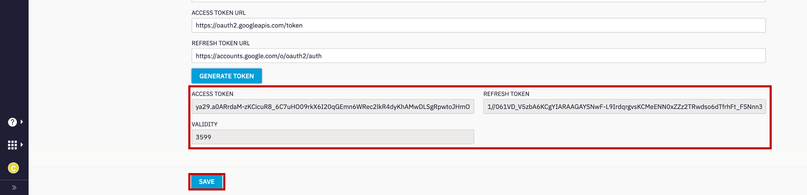

# Table of Contents
- [Step 1. Gmail account configuration](#step-1-gmail-account-configuration)
- [Step 2. Create Email Asset and Register to WebeXCC](#step-2-create-email-asset-and-register-to-webexcc)
- [Step 3. Email Entry Point and Queue creation](#step-3-email-entry-point-and-queue-creation)
- [Step 4. Create/Upload Email flow](#step-4-createupload-email-flow)
- [Verification: Send an Email and accept the task](#verification-send-an-email-and-accept-the-task)

# Introduction

### Lab Objective

In this Lab, we will go through the tasks that are required to complete the basic email configuration. You will be able to initiate an email to the Contact Center and be able to accept/respond to the email by logging in as an agent.  

In this lab you will be configuring **Gmail** Account settings, Email Assets, Entry Point and corresponding workflows. All those steps are require for connecting the Email account with our application.  

### Pre-requisite

1. You recived an admin credentials to configure in Managment Portal and Webex Connect.
2. You recived an an Email account credentials.
3. You have successfully compleated the previus Lab1 **Preconfiguration**.

### Quick Links

> Control Hub: **[https://admin.webex.com](https://admin.webex.com){:target="_blank"}**\
> Portal: **[https://portal.wxcc-us1.cisco.com/portal](https://portal.wxcc-us1.cisco.com/portal){:target="_blank"}**\
> Agent Desktop: **[https://desktop.wxcc-us1.cisco.com](https://desktop.wxcc-us1.cisco.com){:target="_blank"}**\
> Gmail: **[https://mail.google.com](https://mail.google.com){:target="_blank"}**\
> Workflows: **[GitHub page](https://github.com/CiscoDevNet/webexcc-digital-channels){:target="_blank"}**\
> Webex Connect: https://cl1pod**\<ID\>**.imiconnect.io/ (where **\<ID\>** is your POD number)

# Lab Section

### Configuration Order

 
 

## Step 1. Gmail account configuration
Starting from May 30 the **Less Secure Apps** feature was disabled on all Google accounts. As long as this setting was enabled, it was possible to send emails via Gmail SMTP. In this lab, we will be using new OAuth 2.0 authentication for outbound email functionality.

>**Note**: For this lab, we have created a Gmail account. Optionally, use your own account for polling and handling the emails. It can be a Gmail account or Office 365 account or any account which has email forwarding. The instructions below are applicable only for the Gmail accounts.

### 1. Gmail forwarding activation (for incoming emails)

| **User email**                       |
| ------------------------------------ | 
| cl1webex**\<ID\>**@gmail.com   | 

> **Note:** Your \<ID\> was provided to you personally.  \<ID\> is the unique number equal to your POD.

- Login to the Gmail account with the credentials above [https://mail.google.com](https://mail.google.com){:target="_blank"}. The password is the same as for Webex admin account. During first login select **Turn off smart features** 

- Enable POP3/IMAP setting by clicking on settings icon on top right corner and selecting **See all settings**.

 
 

- Now Click on **Forwarding and POP/IMAP**, enable the `POP Download` and `IMAP access` then click **Save Changes**.

 
 

### 2. Create a project at Google API Console 
We need to activate API if we want to use Gmail accont for outbound emails. 

- Login to [Google Developers Console](https://console.developers.google.com/){:target="_blank"} with the credentials above. The password is the same as for Webex CC admin account.

- You will have to agree with the Terms of Service and pick their Country of residence. Then click **Select a project** and create a **NEW PROJECT**.

 
 

- Keep the default project's name and press **Create** at the bottom. Make sure that now you have selected this project. 

 
 

### 3. Enable Gmail API (for outgoing emails)

- Enter `Gmail API` in the search bar and click on it once found.

 
 

- You need to enable the API for your project by clickin **ENABLE** button.

 
 

### 4. Configure OAuth Consent Screen and Scopes

- Once the API is enabled, you’ll be taken to a nice dashboard that says, `"To use this API, you may need credentials"`.

 
 

- To create an OAuth client ID, you must first configure your consent screen. Under the APIs and Services section, click on **OAuth Consent Screen**, set the user type as `External` and click **CREATE** button.

 
 

-  It will bring you to a page with many fields. Just enter the **App name** as `WebexApp`, choose your **User support email** and enter the same email in the **Developer contact information**. In the end press **SAVE AND CONTINUE**.

 
 

- On the next screen, you need to provide Auth 2.0 Scopes for Google APIs. Click the **Add Or Remove Scopes** button and add https://www.googleapis.com/auth/gmail.send to the list of scopes since we only want to send emails from Gmail and not read any user data. Click **SAVE AND CONTINUE**.

 
 

- On the test user page, click **ADD USERS** and enter your gmail address. Click **Save and Continue**.

 
 

### 5. Credentials and authentication with OAuth 2.0

Now create a new client ID that will be used to identify your application to Google’s OAuth servers.

- In the APIs & Services section, click on **Credentials** and then pick **OAuth client ID** from the drop-down list of the **CREATE CREDENTIALS** button. 

 
 

- Select `Web application` in the **Application type**

- You can leave the default name. The name of your OAuth 2.0 client is only used to identify the client in the Google Cloud console and will not be shown to application users. 

- In the **Authorized redirect URIs** section click **ADD URL** button and set `https://cl1pod\<ID\>.imiconnect.io/callback` where \<ID\> is your tenant number. Click **CREATE** button in the end.

 
 

- Download a JSON file with your credentials – you’ll need it later.

 
 

## Step 2. Create Email Asset and Register to WebeXCC

### 1. Create Email Assest

- As an admin, login to Webex Connect UI using the provided URL https://cl1pod**\<ID\>**.imiconnect.io/ (where **\<ID\>** is your POD number).

- Select **Assets** -> **Apps** -> **CONFIGURE NEW APP** -> **Email**.

 
 

- Set the settings according to the table below:

| **Entity**          | **Name** |
| ------------------- | -------- |
| Asset Name | EmailAsset   |
| Email ID   | cl1webex**\<ID\>**@gmail.com  |
| Authentication Type | OAuth 2.0   |
| SMTP Server  | smtp.gmail.com |
| Username     | cl1webex**\<ID\>**@gmail.com |
| Port     | 465 |
| Security     | SSL |
| Client ID | \<client_id from JSON file\>   |
| client Secret | \<client_secret from JSON file\>    |
| Authorization URL | https://accounts.google.com/o/oauth2/auth |
| Scope | https://mail.google.com/ https://www.googleapis.com/auth/gmail.send |
| Access Token URL | https://oauth2.googleapis.com/token |
| Refresh Token URL | https://accounts.google.com/o/oauth2/auth |

> where \<ID\> is your POD ID

 
 

- Click **GENERATE TOKEN** and follow the step on the screenshot:

 
 

- Verify that the **ACCESS TOKEN** and **REFRESH TOKEN** are generated and click **SAVE**.

 
 

- Click on **REGISTER TO WEBEX CC** and Select the service **My First Service**. In the end click **REGISTER**.

 
 

### 2. Add forwarding Address

- Copy the forwarding address from the created asset in previous step and in Gmail account. 
 

 
 

- Go back to the Gmail account and click on settings icon on top right corner -> Select **See all settings**.

 
 

- Click on **Forwarding and POP/IMAP** -> click on **Add a forwarding address** -> Paste the copied forwarding address from the created asset. Then click on **Next**. In a new pop up tab click **Proceed** and then click **OK** when it prompts.

 
 

- Go back to Webex Connect and click on **Tools** -> **Export Logs**. 

- Under Inbound logs, Select the App that was created -> Select Channel Event as `Incoming Email` -> Select the period as `Today`. Wait until status is changed to **Ready for download** and click **Download** icon. 

 
 

- Once a log file is downloaded, open the log file, under the **Subject** column, copy the confirmation code. 

 
 

- Go back to the Gmail account, paste the code in the email account verification section and click verify.

 
 

- Select **Forward a copy of incoming mail to** the verified address and click **Save Changes**.

 
 

## Step 3. Email Entry Point and Queue creation

### 1. Create Entry Point in Managment Portal 

- Click on **_Provisioning_** and select **_Entry Points/Queues_** > **_Entry Point_**.

- Click on `New Entry Point`.

- Input **_Name_** as `Email_EP`.

- Select `Email` in the **_Channel Type_** section.

- Leave the **_Asset Name_** as appered value `EmailASSET`.

- Set **_Service Level Threshold_** as `2` hours.

- The **_Time Zone_** can stay as default value.

- Click on **Save** after comparing your values with the screenshot below.

 
 

### 2. Create 2 Queues in Managment Portal 

- Click on **_Provisioning_** and select **_Entry Points/Queues_** > **_Queue_**.

- Click on `New Queue`.

- Input **_Name_** as `Email_Q`.

- Select `Email` in the **_Channel Type_** section.

- Leave the **_Queue Routing Type_** as default value `Longest Available Agent`.

- In the the **_Chat Distribution_** click on **Add Group** and select `Team1`.

- Set **_Service Level Threshold_** as `2` hours.

- Set **_Maximum Time in Queue_** as `3` hours.

- The **_Time Zone_** can stay as default value.

- Click on **Save** after comparing your values with the screenshot below.

 
 

- Create a second queue by repeating the same steps as above.

- Input **_Name_** as `Email_Q2`.

- Select `Email` in the **_Channel Type_** section.

- In the the **_Chat Distribution_** click on **Add Group** and select `Team2`.

 
 

## Step 4. Create/Upload Email flow

- Download the email flow from the [GitHub page](https://github.com/CiscoDevNet/webexcc-digital-channels){:target="_blank"}.

- Navigate to **Webex Connect Flows** -> **v2.1** -> **Email Inbound Flow.workflow.zip**, select the zip file and click download.

- Unzip the downloaded file.

- Go to Webex Connect, click on **Services** and select the service in which the Asset is created in step 2. It should be **My First Service**

- In the service click on **FLOWS** -> **CREATE FLOW** .

- Enter the **FLOW NAME** as **Email Inbound Flow**, select the **TYPE** as **Work Flow** and under **METHOD** select **Upload a flow**.

- Drag and drop the **Email Inbound Flow.workflow** flow that is downloaded in zip file, click **CREATE** and then click **SAVE**.

 
 

- In the created workflow find the **Queue Task**, click twice, select the **QUEUE NAME** as **Email_Q** and click on **SAVE**.

 
 

- Click on **Settings** on top right corner and click on **Custom variables**. Here in **bizemailid** row, update the email address of the account that is added. Click on **SAVE**.

 
 

- Finally click on Make Live on top right corner -> Select the Application/Asset that we have created and click Make Live.

 
 

[To top of this lab](#table-of-contents)

## Verification: Send an Email and accept the task

- Go to personal email account and send an email to the support email address that was initially configured in the Email Asset.

- Go to the Agent Desktop and make the agent Available. 

 
 

- The Email will be offered to the agent. Click **Accept** to handle the email. Send the reply and verify that it is delivered.

 
 

- Click "Reply" or Reply All" to reply to the email and enter the body of the email and hit send button.

- Add wrap up and close the task.

[Back to top](#table-of-contents)
---

### Congratulations, you have completed this section! 

<button onclick="mainPage()" style="
  border-radius: 5px;
  background-color: rgb(116,191,75);
  padding: 10px;">Main Page</button>

<button onclick="nextLab()" style="
  position: absolute;
  right: 200px;
  border-radius: 5px;
  background-color: rgb(116,191,75);
  padding: 10px;">Next Lab</button>

