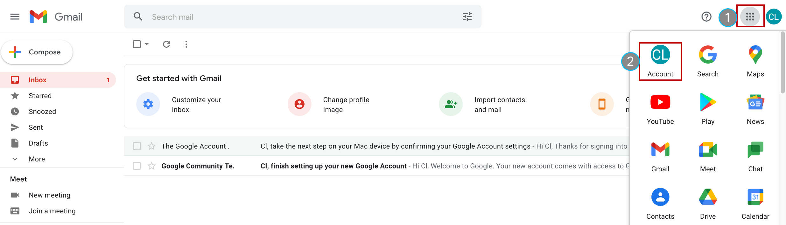
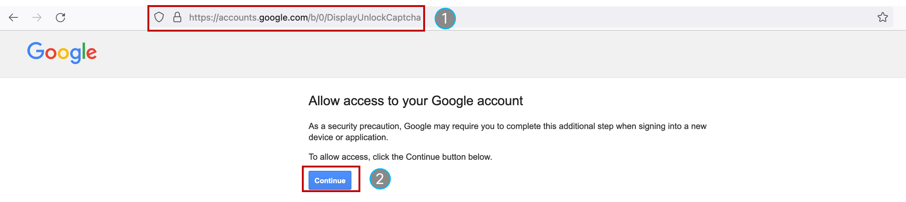
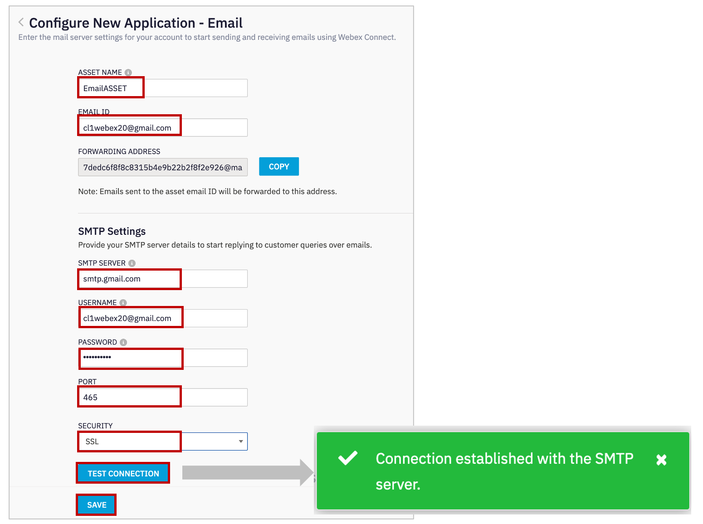
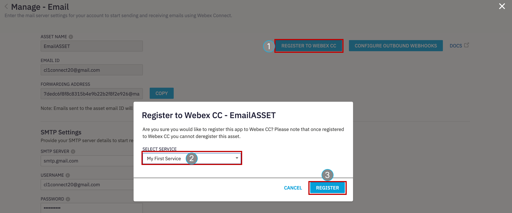
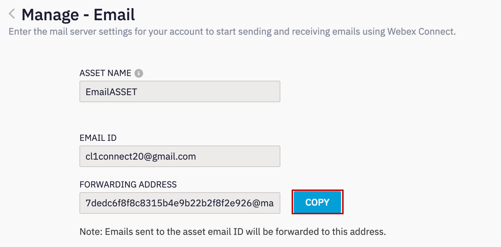
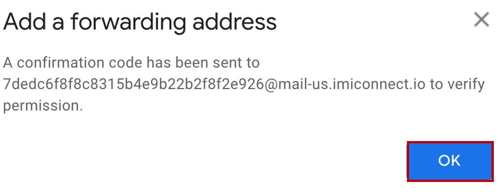
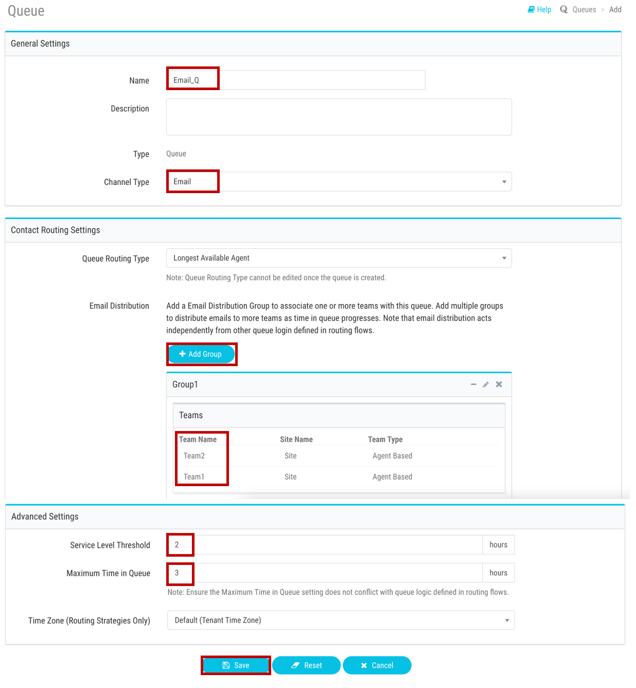
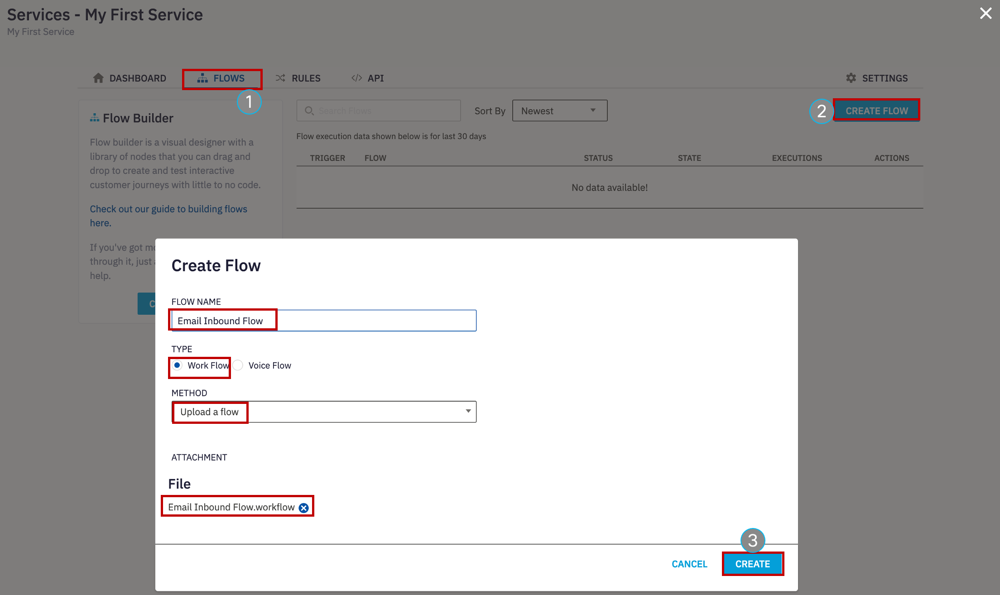

# Table of Contents
- [Step 1. Gmail account configuration](#step-1-gmail-account-configuration)
- [Step 2. Create Email Asset and Register to WebeXCC](#step-2-create-email-asset-and-register-to-webexcc)
- [Step 3. Email Entry Point and Queue creation](#step-3-email-entry-point-and-queue-creation)
- [Step 4. Create/Upload Email flow](#step-4-createupload-email-flow)
- [Verification: Send an Email and accept the task](#verification-send-an-email-and-accept-the-task)

# Introduction

### Lab Objective

In this Lab, we will go through the tasks that are required to complete the basic email configuration. You will be able to initiate an email to the Contact Center and be able to accept/respond to the email by logging in as an agent.  

In this lab you will be configuring **Gmail** Account settings, Email Assets, Entry Point and corresponding workflows. All those steps are require for connecting the Email account with our application.  

### Pre-requisite

1. You recived an admin credentials to configure in Managment Portal and Webex Connect.
2. You recived an an Email account credentials.
3. You have successfully compleated the previus Lab **Preconfiguration**

# Lab Section

### Configuration Order

## Step 1. Gmail account configuration

>**Note**: For this lab, we created a Gmail account. Optionally, use your own account for polling and handling the emails. It can be a Gmail account or Office 365 account or any account which has email forwarding.

### 1. Google Account Setting – Enable POP3/IMAP setting

| **User email**                       |
| ------------------------------------ | 
| cl1webex**\<ID\>**@gmail.com   | 

> **Note:** Your \<ID\> was provided to you personally.  \<ID\> is the unique number equal to your POD.

- Login to the Gmail account with the credentials above[https://mail.google.com](https://mail.google.com){:target="_blank"}. The password is the same as for Webex admin account.

- Enable POP3/IMAP setting by clicking on settings icon on top right corner and selecting **See all settings**.

- Now Click on **Forwarding and POP/IMAP**, enable the `POP Download` and `IMAP access` then click **Save Changes**.

### 2. Google Account Setting – Security setting (allow less secure app access)

- Click on **Google Apps** icon on top right corner -> Select **Account**

- Select **Security** option and turn `ON` the **Less secure app access**. 

- Do not close the gmail tab in the browser.

### 3. Disable captcha for the account

- Use the following link to disable captcha for the account https://accounts.google.com/b/0/DisplayUnlockCaptcha and click Continue.

## Step 2. Create Email Asset and Register to WebeXCC

### 1. Create Email Assest

- As an admin, login to Webex Connect UI using the provided URL https://cl1pod**\<ID\>**.imiconnect.io/ (where **\<ID\>** is your POD number).

- Select **Assets** -> **Apps** -> **CONFIGURE NEW APP** -> **Email**.

- Set the settings according to the table below

| **Entity**          | **Name** |
| ------------------- | -------- |
| Asset Name | EmailAsset   |
| Email ID   | cl1webex**\<ID\>**@gmail.com  |
| SMTP Server  | smtp.gmail.com |
| Username     | cl1webex**\<ID\>**@gmail.com |
| Port     | 465 |
| Security     | SSL |

> where \<ID\> is your POD ID

- Click **TEST CONNECTION** and if test is successfully completed, click on **SAVE**.

- Click on **REGISTER TO WEBEX CC** -> Select the appropriate service (the default **My First Service**) and click **REGISTER**.

### 2. Add forwarding Address

- Copy the forwarding address from the created asset in previous step and in Gmail account. 
 
 

- Go back to the Gmail account and click on settings icon on top right corner -> Select **See all settings**.

- Click on **Forwarding and POP/IMAP** -> click on add a forwarding address -> Paste the copied forwarding address from the created asset. Then click on **Next**.

- A new pop up tab opens and click **Proceed** and then click **OK** when it prompts.

- Go back to Webex Connect and click on **Tools** -> **Export Logs**. 

- Under Inbound logs, Select the App that was created -> Select Channel Event as `Incoming Email` -> Select the period as `Today` and click **Download**. 

- Once a log file is downloaded, open the log file, under the **Subject** column, copy the confirmation code. 

- Go back to the Gmail account, paste the code in the email account verification section and click verify.

- Select **Forward a copy of incoming mail to** the verified address and click **Save Changes**.

## Step 3. Email Entry Point and Queue creation

### 1. Create Entry Point in Managment Portal 

- Click on **_Provisioning_** and select **_Entry Points/Queues_** > **_Entry Point_**.

- Click on `New Entry Point`.

- Input **_Name_** as `Email_EP`.

- Select `Email` in the **_Channel Type_** section.

- Leave the **_Asset Name_** as appered value `EmailASSET`.

- Set **_Service Level Threshold_** as `2` hours.

- The **_Time Zone_** can stay as default value.

- Click on **Save** after comparing your values with the screenshot below.

### 2. Create Queue in Managment Portal 

- Click on **_Provisioning_** and select **_Entry Points/Queues_** > **_Queue_**.

- Click on `New Queue`.

- Input **_Name_** as `Email_Q`.

- Select `Email` in the **_Channel Type_** section.

- Leave the **_Queue Routing Type_** as default value `Longest Available Agent`.

- In the the **_Chat Distribution_** click on **Add Group** and select `Team1` and `Team2`.

- Set **_Service Level Threshold_** as `2` hours.

- Set **_Maximum Time in Queue_** as `3` hours.

- The **_Time Zone_** can stay as default value.

- Click on **Save** after comparing your values with the screenshot below.

## Step 4. Create/Upload Email flow

- Download the email flow from the [GitHub page](https://github.com/CiscoDevNet/webexcc-digital-channels){:target="_blank"}.

- Navigate to **Webex Connect Flows** -> **v2.1** -> **Email Inbound Flow.workflow.zip**, select the zip file and click download.

- Unzip the downloaded file.

- Go to Webex Connect, click on **Services** and select the service in which the Asset is created in step 2. It should be **My First Service**

- In the service click on **FLOWS** -> **CREATE FLOW** 

- Enter the **FLOW NAME** as **Email Inbound Flow**, select the **TYPE** as **Work Flow** and under **METHOD** select **Upload a flow**.

- Drag and drop the **Email Inbound Flow.workflow** flow that is downloaded in zip file, click **CREATE** and then click **SAVE**.

- In the created workflow find the **Queue Task**, click twice, select the **QUEUE NAME** as **Email_Q** and click on **SAVE**.

- Click on **Settings** on top right corner and click on **Custom variables**. Here in **bizemailid** row, update the email address of the account that is added. Click on **SAVE**.

- Finally click on Make Live on top right corner -> Select the Application/Asset that we have created and click Make Live.

[To top of this lab](#table-of-contents)

## Verification: Send an Email and accept the task

- Go to personal email account and send an email to the support email address that was initially configured in the Email Asset.

- Go to the Agent Desktop and make the agent Available. 

- The Email will be offered to the agent. Click "Accept" to handle the email.

- Click "Reply" or Reply All" to reply to the email and enter the body of the email and hit send button.

- Add wrap up and close the task.

[Back to top](#table-of-contents)
---

### Congratulations, you have completed this section! 

<button onclick="mainPage()" style="
  border-radius: 5px;
  background-color: rgb(116,191,75);
  padding: 10px;">Main Page</button>

<button onclick="nextLab()" style="
  position: absolute;
  right: 200px;
  border-radius: 5px;
  background-color: rgb(116,191,75);
  padding: 10px;">Next Lab</button>

