# Table of Contents
- [Table of Contents](#table-of-contents)
- [Introduction](#introduction)
    - [Lab Objective](#lab-objective)
    - [Pre-requisite](#pre-requisite)
    - [Quick Links](#quick-links)
- [Lab Section](#lab-section)
  - [Step 1. Live Chat Asset creation & register to Webex CC](#step-1-live-chat-asset-creation--register-to-webex-cc)
  - [Step 2. Chat Template creation for website integration](#step-2-chat-template-creation-for-website-integration)
  - [Step 3. Chat Entry Point and Queue creation](#step-3-chat-entry-point-and-queue-creation)
    - [1. Create Entry Point in Management Portal](#1-create-entry-point-in-management-portal)
    - [2. Create Queue in Management Portal](#2-create-queue-in-management-portal)
    - [3. Skill and Skill profile](#3-skill-and-skill-profile)
  - [Step 4. Website Settings](#step-4-website-settings)
    - [1. Configure Live Chat widget](#1-configure-live-chat-widget)
    - [2. Verify that live chat widget loads](#2-verify-that-live-chat-widget-loads)
  - [Step 5. Quick response template creation](#step-5-quick-response-template-creation)
  - [Step 6. Create/Upload Live Chat flow](#step-6-createupload-live-chat-flow)
    - [1. Initial flow loading](#1-initial-flow-loading)
    - [2. Start node and Custom Variables](#2-start-node-and-custom-variables)
    - [3. Select Live Chat form](#3-select-live-chat-form)
    - [4. Edit Queue Task node](#4-edit-queue-task-node)
  - [Step 7. Verification - start live chat and accept the request](#step-7-verification---start-live-chat-and-accept-the-request)
  - [Step 8. Search and view conversation transcripts](#step-8-search-and-view-conversation-transcripts)
  - [Step 9. Challenge Lab - Enhance flow](#step-9-challenge-lab---enhance-flow)
    - [1. Add Branch to handle Dropdown form field](#1-add-branch-to-handle-dropdown-form-field)
  - [Back to top](#back-to-top)
    - [Congratulations, you have completed this section!](#congratulations-you-have-completed-this-section)

# Introduction

### Lab Objective

In this Lab, we will go through the tasks that are required to complete the basic Live chat integration. You will be able to initiate a Chat contact to the Contact Center from a sample website and be able to accept/respond to the contact by logging in as an agent.

In this lab you will be configuring Service, Chat Assets, Entry Point, Queue, Chat Template, Website Settings, and corresponding workflows.

### Pre-requisite

1. You received an admin credentials to configure in Management Portal and Webex Connect.
2. You have successfully completed the previous Lab **Preconfiguration**

### Quick Links

> Control Hub: **[https://admin.webex.com](https://admin.webex.com){:target="_blank"}**\
> Portal: **[https://portal.wxcc-us1.cisco.com/portal](https://portal.wxcc-us1.cisco.com/portal){:target="_blank"}**\
> Agent Desktop: **[https://desktop.wxcc-us1.cisco.com](https://desktop.wxcc-us1.cisco.com){:target="_blank"}**\
> Workflows: **[GitHub page](https://github.com/CiscoDevNet/webexcc-digital-channels){:target="_blank"}**\
> Connect: https://cl1pod**\<ID\>**.imiconnect.io/ (where **\<ID\>** is your POD number)

# Lab Section

## Step 1. Live Chat Asset creation & register to Webex CC

- Login to your respective Webex Connect UI using the provided URL https://cl1pod**X**.imiconnect.io/ (where **X** is your POD number).

- Navigate to `Assets` > `Apps` > `Configure New App` > `Mobile / Web`

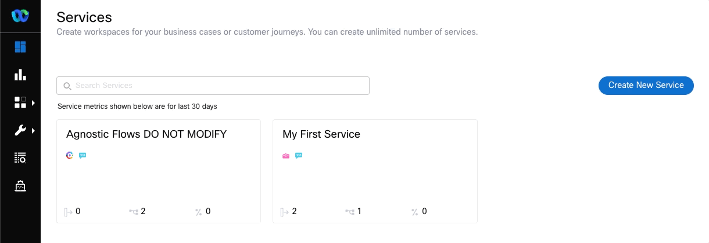
 
 

- Provide a `Name`

- Toggle/Enable `Live Chat / In-AppMessaging` to "ON" and choose `PRIMARY TRANSPORT PROTOCOL` as  MQTT" & `SECONDARY TRANSPORT PROTOCOL` as Web Socket" and enable `Use Secured Port` and `SAVE`.

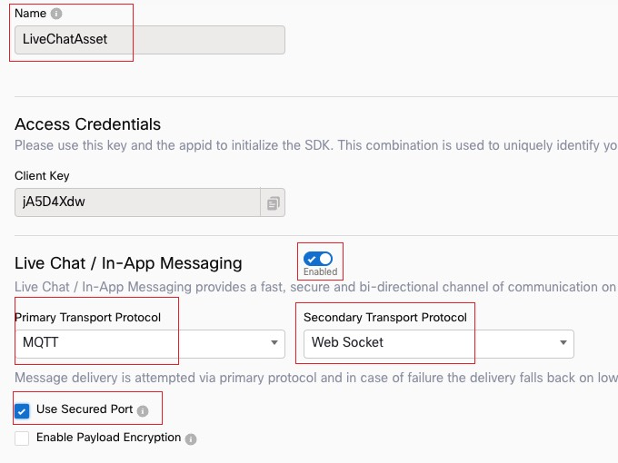
 
 

- Select `REGISTER TO WEBEX CC` and choose the Service you have created and REGISTER

 
 

- In the resulting window, select a service under which this asset would be managed

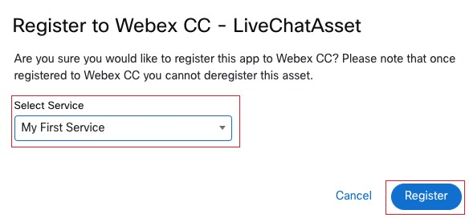
 
 

- Verify that the `Register to Webex CC` option is now disabled and there is a message indicating the time when the asset was registered along with the service to which it is assigned.

 
 

- Click the back arrow next to go back to the list of Apps. Then take note of the Application ID (App ID). We will need this later so please copy this ID somewhere handy like a text file or take note of it.

 
 

[To top of this lab](#table-of-contents)

## Step 2. Chat Template creation for website integration

- Chat template creation allows you to configure a pre-defined chat form that will presented to the customer. Data points can be collected from the customer in a chat-like interface.

- From Webex Connect interface, go to `TOOLS` > `Templates` then click on `Add New Template`

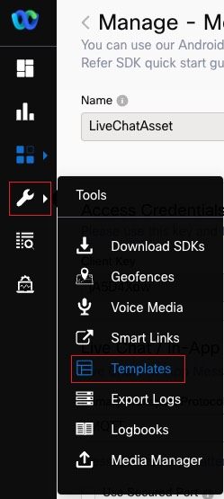
 
 

- Provide a Name and choose Channel as `Live Chat / In-APP Messaging`

- Message Type as `Form`

- Provide the Title as `Welcome to Webex CC Live Chat` or some other message.

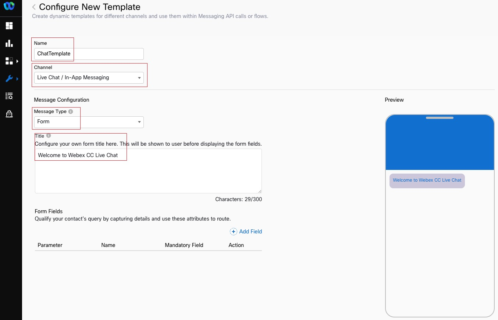
 
 

- We will be adding form fields now. Firstly the Name. Click on `Add field` and then fill in the details as per the screenshot

 
 

-Continue by adding the `Email` and `Reason` fields in the same manner with the info in this table.

| Type     | Name        | Label                    | Mandatory Field |
| -------- | ----------- | ------------------------ | --------------- |
| Name     | Name        | Name                     | true            |
| Email    | Email       | Email                    | true            |
| Dropdown | Reason      | Reason for Contacting Us | true            |
| Text     | Description | Description              | false           |

Here is a screenshot of the Dropdown configuration with 2 options, one for **Sales** and one for **Support**. We will use this later to perform Skills Based Routing so chats are routed to most skilled agents.

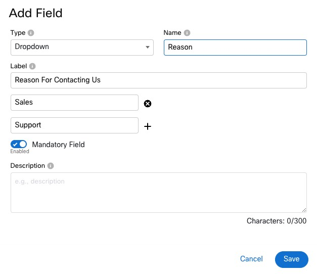
 
 

- Finally click `SAVE`

 
 

[To top of this lab](#table-of-contents)

## Step 3. Chat Entry Point and Queue creation

### 1. Create Entry Point in Management Portal

- Click on **_Provisioning_** and select **_Entry Points/Queues_** > **_Entry Point_**.

- Click on `New Entry Point`.

- Input **_Name_** as `Chat_EP`.

- Select `Chat` in the **_Channel Type_** section.

- Leave the **_Asset Name_** as the configured value earlier.

- Set **_Service Level Threshold_** as `300` seconds.

- The **_Time Zone_** can stay as default value.

- Click on **Save** after comparing your values with the screenshot below.

 
 

### 2. Create Queue in Management Portal

- Click on **_Provisioning_** and select **_Entry Points/Queues_** > **_Queue_**.

- Click on `New Queue`.

- Input **_Name_** as `Chat_Q_SBR`.

- Select `Chat` in the **_Channel Type_** section.

- Select **_Queue Routing Type_** as `Skills Based`.

- Set **_Agent Selection_** as `Best Available Agent`

- In the the **_Chat Distribution_** click on **Add Group** and select `Team1`.

- Set **_Service Level Threshold_** as `90` seconds.

- Set **_Maximum Time in Queue_** as `600` seconds.

- The **_Time Zone_** can stay as default value.

- Click on **Save** after comparing your values with the screenshot below.

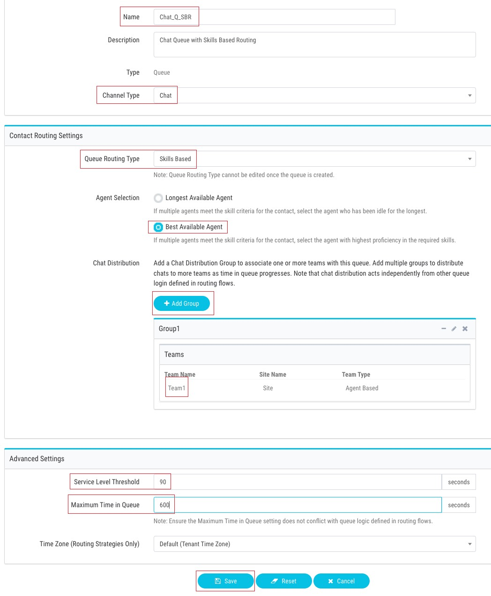
 
 

### 3. Skill and Skill profile

- We are now going to configure skills and skill profiles for the skills based Queue Click on **_Provisioning_** and select **_Skills_** > **_Skill Definition_**.

- Click on `New Skill Definition`

- Set **_Name_** as `Sales`

- Set **_Service Level Threshold_** as `60` seconds.

- Set **_Type_** as Boolean.

- Click on **Save**

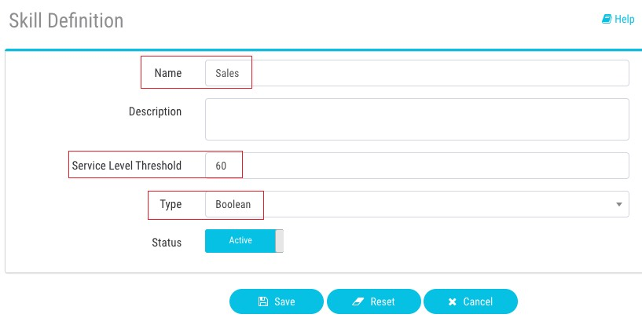
 
 

- Create another Skill definition of same type `Boolean` with **_Name_** as `Support`

 
 

- Next we'll create 2 Skill profiles, one for Sales and one for Support. Click on **_Provisioning_** and select **_Skills_** > **_Skill Profile_**.

- Click on `New Skill Profile`

- Set **_Name_** as `Sales`

- Select the `Sales` Skill and set the **_Skill Value_** to `True`

- Select the `Support` Skill and set the **_Skill Value_** to `False`

- Click on **Save**

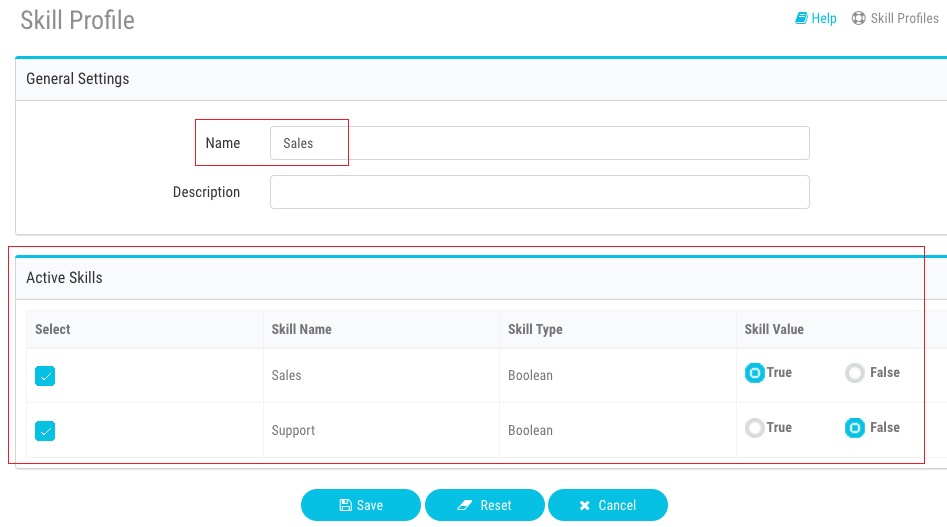
 
 

- Create another Skill Profile with Name `Support` with Sales skill value to False and Support skill value to True

 
 

- Finally we'll assign the Sales Skill profile to our agent. Click on **_Provisioning_** and select **_Users_**

- Edit the Agent user created earlier by clicking on the 3 dotted menu

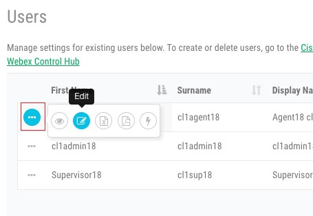
 
 

- In the agent settigns, Select `Skill Profile` as `Sales` and click **Save**

 
 

[To top of this lab](#table-of-contents)

## Step 4. Website Settings

### 1. Configure Live Chat widget
- From Management Portal, access the menu and cross launch **New Digital Channels Admin Portal**  by choosing `New Digital Channels`

 
 

- Go to `Assets` > search and edit the chat asset which we created earlier in **Step 1**

 
 

- Scroll down and choose `Save Changes`

 
 

- Scroll to top of the page and choose `Websites` and then click `Add Website`

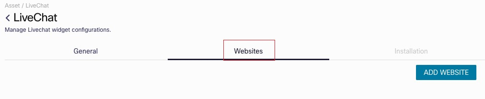
 
 

- Enter the respective fields as per Screenshots below. Note we are going to insert the chat bubble into an online HTML editor for testing www.w3schools.com. The `Domain` field should contain the domain where you will insert the chat bubble.

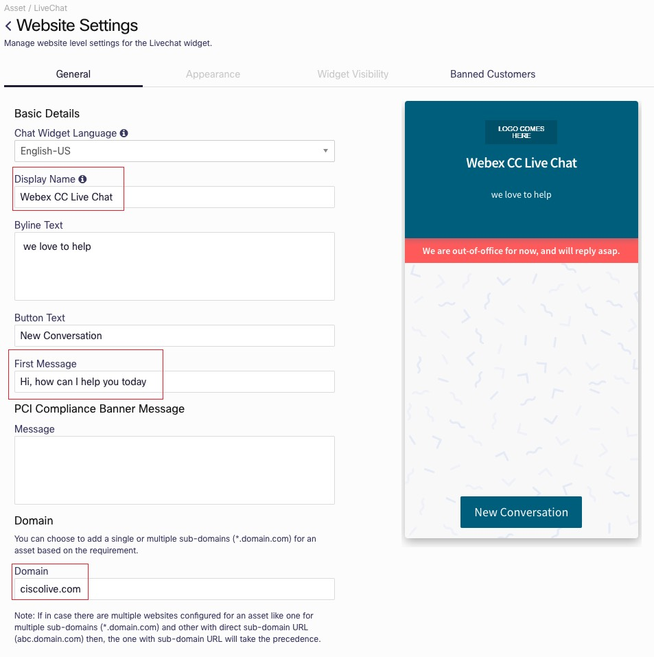
 
 

- Take a moment to explore the rest of the customization options for the chat bubble and then click `SAVE CHANGES`

- Scroll up, select the `Appearance` tab and change the settings (Widget Color, Logo, Emojis, attachments etc.;) as per your requirement and `SAVE CHANGES`

- Select the `Widget Visibility` tab and click on `Show without restriction` and `SAVE CHANGES`

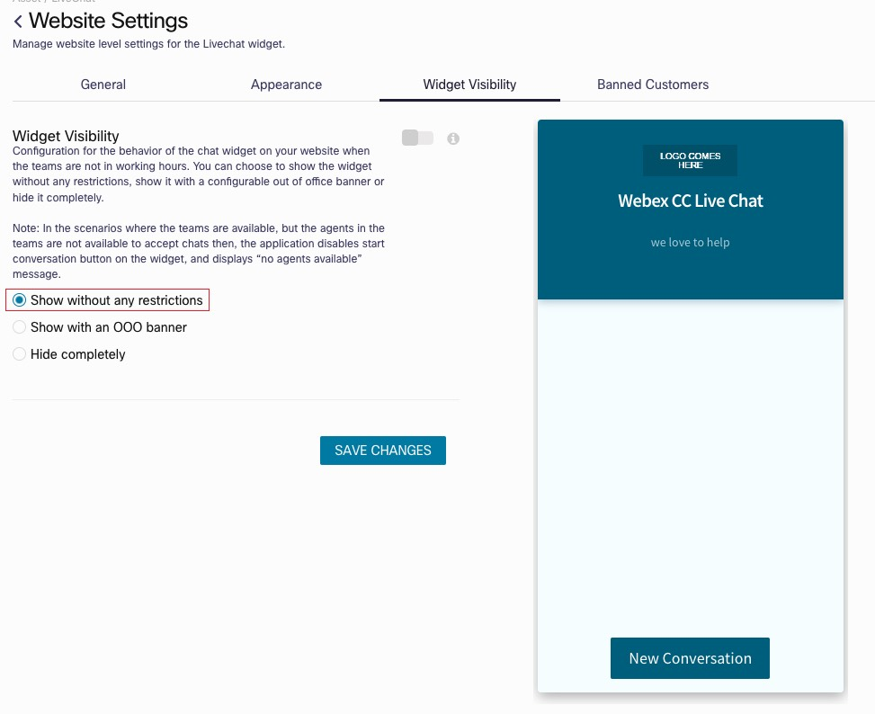
 
 

- Explore and `Banned Customers` tab so you are familiar with the settings but we are not going to change the default settings for those at this point

### 2. Verify that live chat widget loads

- There's still a few bits to configure but we can now verify that the live chat widget loads.
- Go to Webex Connect Engage portal, select Installation tab and Copy the chat script code.

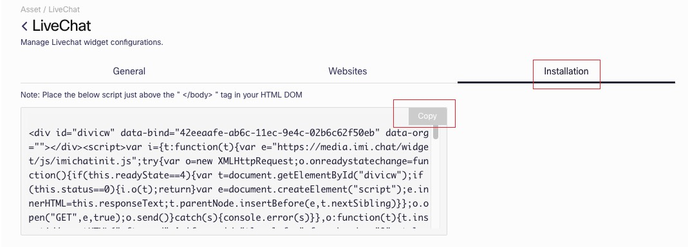
 
 

- Open a new tab in your browser and navigate to [W3Schools Online HTML Editor](https://www.w3schools.com/tryit/tryit.asp?filename=tryhtml_hello){:target="_blank"}.

- Paste de chat bubble code just above the `</body>` tag

 
 

- Click the Run button and the chat bubble should appear on the right side of the HTML online editor. Verify your settings if that does not happen and contact the lab proctor.

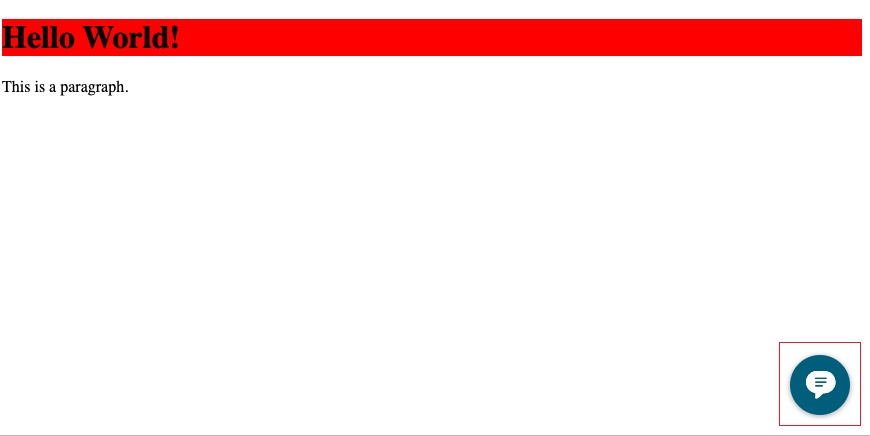
 
 

- Click on the chat bubble icon and it should show the previously configured livechat widget.

[To top of this lab](#table-of-contents)

## Step 5. Quick response template creation

- This section applies to all channels, not just Live chat. You can preset quick responses that agents can use when they respond to customer queries. You can set up the responses in Templates, and group them in a Template Group to organize the content and make the templates easier to find. We'll configure some so you can test them in all the successive lab exercises

- Go to `Assets` > `Templates` and click the + icon besides Template Groups table header.

 
 

- In the Group Name field, enter the template group name and click `Add`

 
 

- You can choose to create a common template for all channels or create channel-specific templates. We will create a common template but also feel free to create other channel specific templates. Channel specific templates will only be shown to the agent when they receive a contact from that channel. Click `Add Template` button at the top right

 
 

- Enter the template name in the `Template ID` field.

- Click on the `Is Start Template` checkbox to mark this as a template available at the start of the conversation as an opening statement.

- Enter the template text in the `Template Text` field. You can use variables by typing `@@` and also custom fields between chevron brackets `<>`. Variables will be autopopulated based on the active task and custom fields will be editable even if the template is locked. You can use the example on the screenshot or some other text.

 
 

- To share the template with other teams, choose the team from the Shared Across field. We only have one team created which is the Default Team but you can create templates that are only show to specific teams.

- Click `SAVE CHANGES`

- Add another common template that has the checkboxes `Is End Template` and `Is Follow-up Template` checked like in the following screenshots

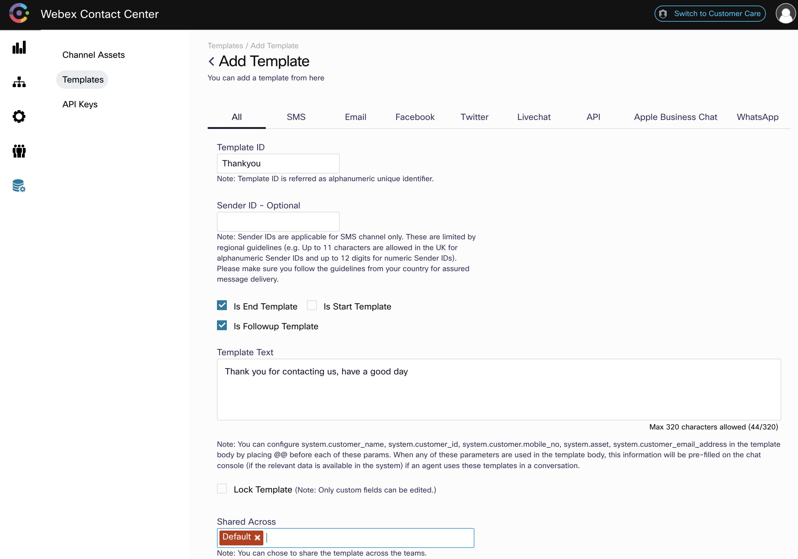
 
 

 
 

## Step 6. Create/Upload Live Chat flow

### 1. Initial flow loading
- Download the default inbound chat flow from the [GitHub page](https://github.com/CiscoDevNet/webexcc-digital-channels){:target="_blank"}.

- Navigate to **Webex Connect Flows** -> **v2.1** -> **Live Chat Inbound Flow.workflow.zip**, select the zip file and click download.

- Unzip the downloaded file.

- Go to Webex Connect, click on **Services** and select the service in which the Asset is created in step 2. It should be **My First Service**

- In the service click on **FLOWS** -> **CREATE FLOW** .

 
 

- Enter the **FLOW NAME** as **Live Chat Inbound Flow**, select the **TYPE** as **Work Flow** and under **METHOD** select **Upload a flow**.

- Drag and drop the **Live Chat Inbound Flow.workflow** flow file that you unzipped, click **CREATE** and then click **SAVE**.

 
 

### 2. Start node and Custom Variables

- A page will load with the imported workflow. We must make some changes to the default inbound flow based on our setup.

- First Click `Save` in the `Configure APP Event` page that loaded, this defines what will trigger the flow and the default settings are already good.

 
 

- Click on the gear button on the top right to load the flow settings dialog

 
 

- Select the Custom Variables tab and set the following variable defaults:

*appid*: Set it to the value you copied in Step1

*domain*: Set it to `www.w3schools.com`

*liveChatDomain*: Set it to `www.w3schools.com`

 
 

- In your production setup domain should be set to your website's domain

### 3. Select Live Chat form

- We must select the right Live Chat Template as configured earlier so that the right Form is presented to the customer. Click on the `Pre-chat form` node and select `Form Template` as configured earlier and `Save`

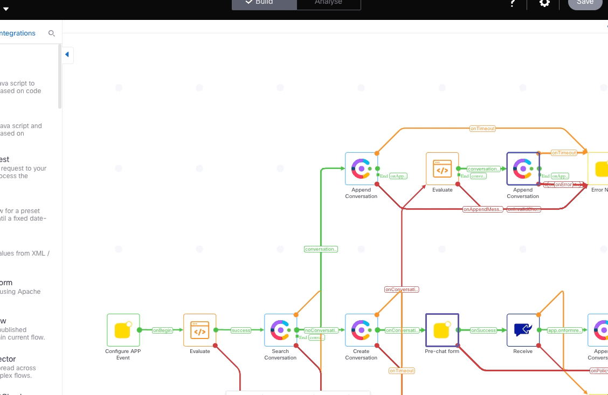
 
 

3. The same must be done in the Receive node, double click on it and select the Form from the dropdown menu and `Save`

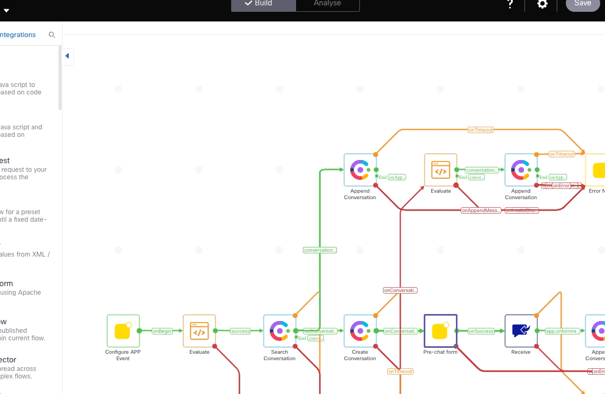
 
 

### 4. Edit Queue Task node

- In the created workflow find the **Queue Task**, click twice, select the **QUEUE NAME** as **Chat_Q_SBR** and add Skill requirement for Sales to be True and click on **SAVE**.

 
 

- Finally click on Make Live on top right corner -> Select the Application/Asset that we have created and click `Make Live`.

 
 

- Wait for 2 minutes and verify that the flow is published successfully.

 
 

[To top of this lab](#table-of-contents)

## Step 7. Verification - start live chat and accept the request

- Open a new tab and login to the Agent Desktop and make the agent Available (if you haven't done already in Lab2).

 
 

- Go back to the tab where you opened [W3Schools Online HTML Editor](https://www.w3schools.com/tryit/tryit.asp?filename=tryhtml_hello){:target="_blank"} and pasted the live chat widget code.

- Click `Start Conversation`

 
 

- Fill in the form with customer options

 
 

- The Live Chat will be offered to the agent. Click **Accept** to handle the SMS.

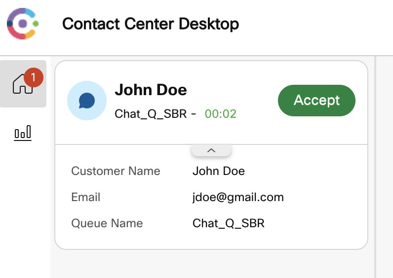
 
 

- The form submission will be presented to the customer

 
 

- Type a response and hit send button.

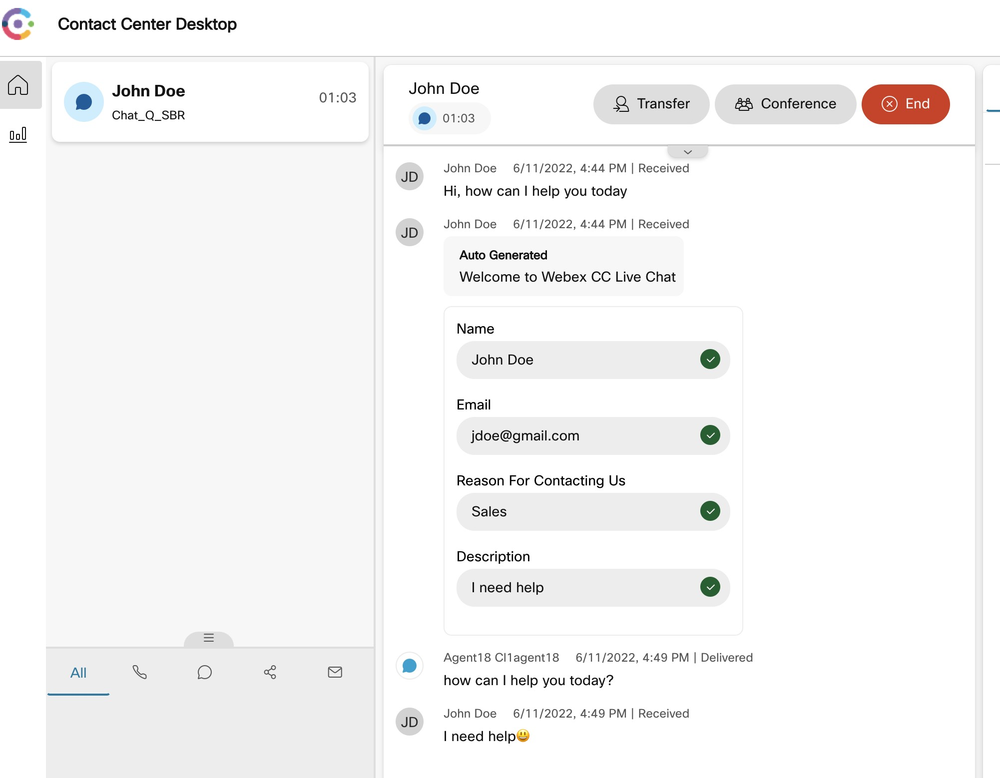
 
 

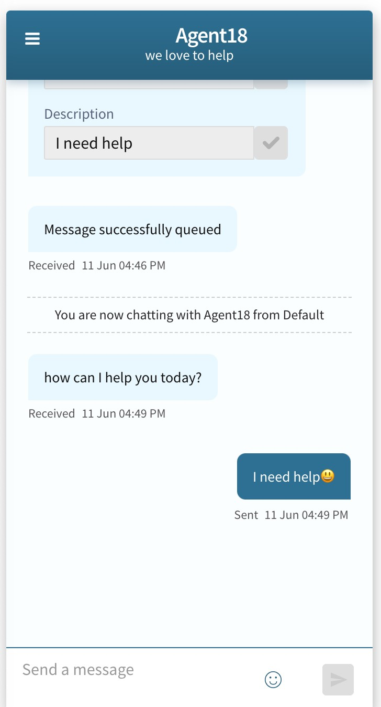
 
 

- Make sure you test the Predefined Quick Response templates we created earlier in Step 5

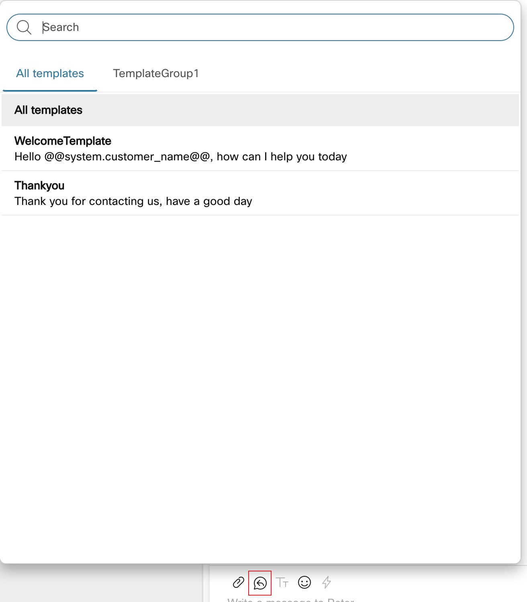

- End the contact

 
 

- Add wrap up and close the task.

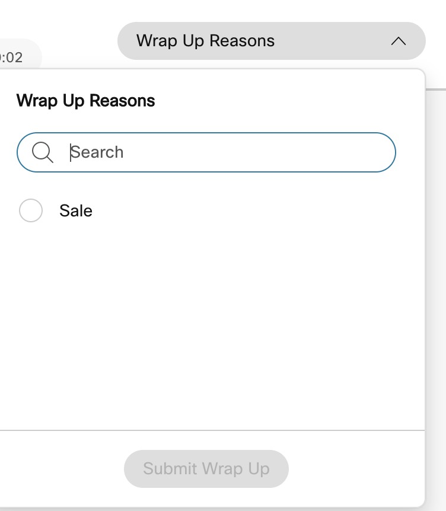
 
 

## Step 8. Search and view conversation transcripts

- You can search and view conversation transcripts from the New Digital Channels Engage interface. Go to the already openned tab or from Management Portal, access the menu and cross launch **New Digital Channels Admin Portal**  by choosing `New Digital Channels`. Then click on Switch to Customer Care button at the top right.

 
 

- Click on the Search button at the top left

 
 

- You can search for transcripts using many fields depending on the channel. In this case use the Name field and search using the Customer Name used while testing in Step 7. Once the conversation transcript shows up, click on the button in the last column.

 
 

- Conversation transcript will load and you have the option to print as PDF

 
 

- On the customer end, they can also access the transcript by emailing it to their personal email account. Once conversation ended, click on the chat bubble hamburger icon and then select `Email transcript` option

 
 

- Enter email address to send the transcript to

 
 

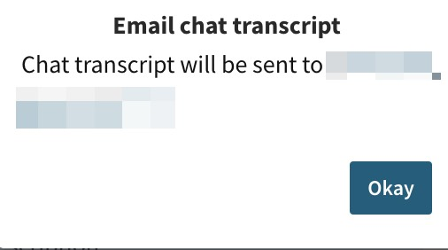
 
 

- Conversation transcript will be received in the following format:

 
 

## Step 9. Challenge Lab - Enhance flow

### 1. Add Branch to handle Dropdown form field

- Add a Branch node before the Queue Task node that differentiates between Sales and Support from the form's dropdown menu and queue's with a different Skill requirement

[Back to top](#table-of-contents)
---

### Congratulations, you have completed this section!

<button onclick="mainPage()" style="
  border-radius: 5px;
  background-color: rgb(116,191,75);
  padding: 10px;">Home Page</button>

<button onclick="nextLab()" style="
  position: absolute;
  right: 200px;
  border-radius: 5px;
  background-color: rgb(116,191,75);
  padding: 10px;">Go to the Next Lab</button>

