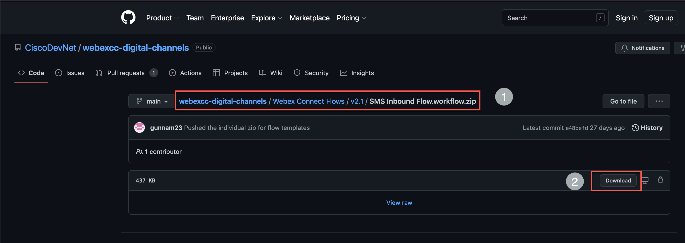
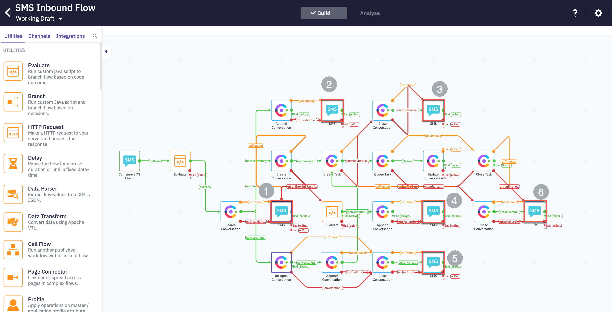
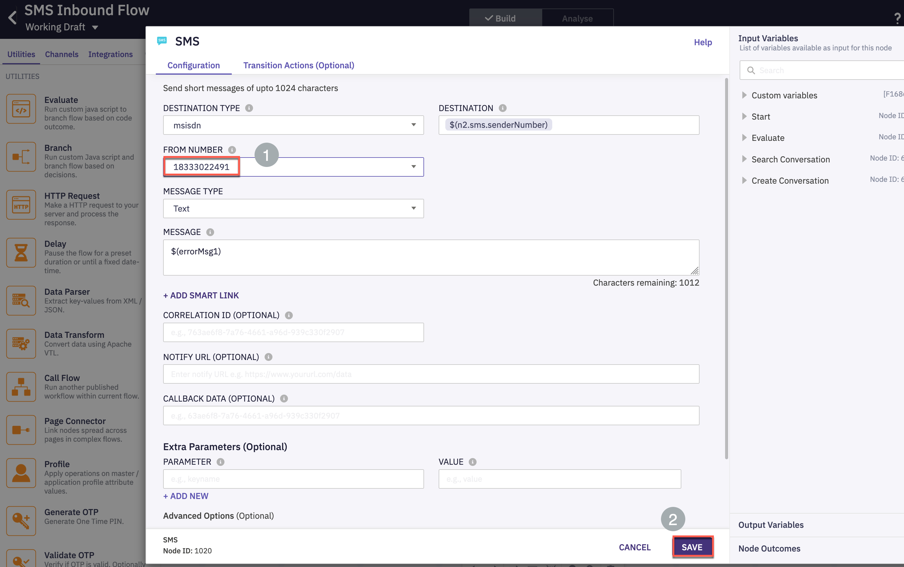
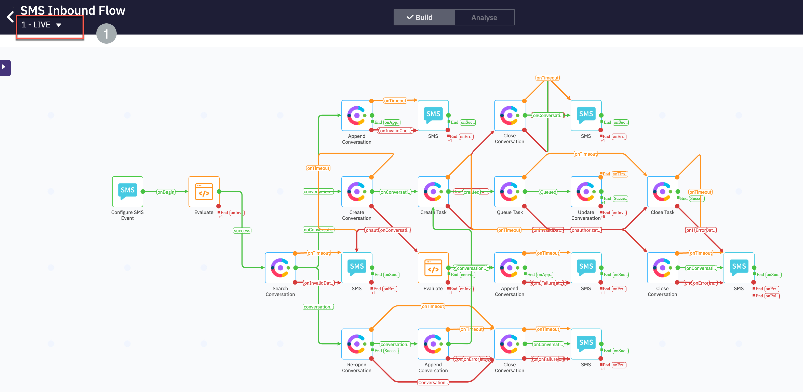
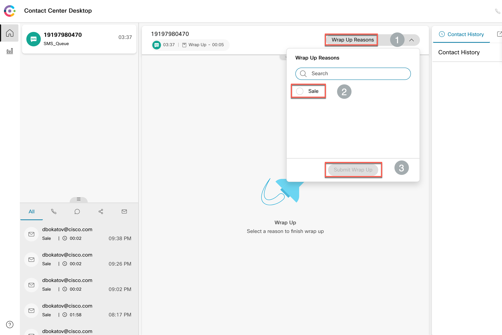

# Table of Contents
- [Table of Contents](#table-of-contents)
- [Introduction](#introduction)
    - [Lab Objective](#lab-objective)
    - [Pre-requisite](#pre-requisite)
    - [Quick Links](#quick-links)
- [Lab Section](#lab-section)
  - [Step 1. Chat Asset creation & register to Webex CC](#step-1-chat-asset-creation--register-to-webex-cc)
  - [Step 3. Chat Template creation for website integration](#step-3-chat-template-creation-for-website-integration)
  - [Step 3. Chat Entry Point and Queue creation](#step-3-chat-entry-point-and-queue-creation)
    - [1. Create Entry Point in Management Portal](#1-create-entry-point-in-management-portal)
    - [2. Create Queue in Management Portal](#2-create-queue-in-management-portal)
  - [Step 4. Website Settings](#step-4-website-settings)
  - [Step 5. Create/Upload Live Chat flow](#step-5-createupload-live-chat-flow)
  - [Verification - send SMS and accept the request](#verification---send-sms-and-accept-the-request)
  - [Back to top](#back-to-top)
    - [Congratulations, you have completed this section!](#congratulations-you-have-completed-this-section)

# Introduction

### Lab Objective

In this Lab, we will go through the tasks that are required to complete the basic Chat integration. You will be able to initiate a Chat contact to the Contact Center from a sample website and be able to accept/respond to the contact by logging in as an agent.  

In this lab you you will be configuring Service, Chat Assets, Entry Point, Queue, Chat Template, Website Settings, and corresponding workflows.

### Pre-requisite

1. You recived an admin credentials to configure in Managment Portal and Webex Connect.
2. You have successfully completed the previous Lab **Preconfiguration**

### Quick Links

> Control Hub: **[https://admin.webex.com](https://admin.webex.com){:target="_blank"}**\
> Portal: **[https://portal.wxcc-us1.cisco.com/portal](https://portal.wxcc-us1.cisco.com/portal){:target="_blank"}**\
> Agent Desktop: **[https://desktop.wxcc-us1.cisco.com](https://desktop.wxcc-us1.cisco.com){:target="_blank"}**\
> Workflows: **[GitHub page](https://github.com/CiscoDevNet/webexcc-digital-channels){:target="_blank"}**\
> Connect: https://cl1pod**\<ID\>**.imiconnect.io/ (where **\<ID\>** is your POD number)

# Lab Section

## Step 1. Chat Asset creation & register to Webex CC

- Login to your respective Webex Connect UI using the provided URL https://cl1pod**X**.imiconnect.io/ (where **X** is your POD number).

- Navigate to `Assets` > `Apps` > `Configure New App` > `Mobile / Web`

- Provide a `Name`

- Toggle/Enable `Live Chat / In-AppMessaging` to "ON" and choose `PRIMARY TRANSPORT PROTOCOL` as  MQTT" & `SECONDARY TRANSPORT PROTOCOL` as Web Socket" and enable `Use Secured Port` and `SAVE`.

- Select `REGISTER TO WEBEX CC` and choose the Service you have created and REGISTER

- In the resulting window, select a service under which this asset would be managed

- Verify that the `Register to Webex CC` option is now disabled and there is a message indicating the time when the asset was registered along with the service to which it is assigned. 

## Step 3. Chat Template creation for website integration

- Chat template creation allows you to configure a pre-defined chat form that will presented to the customer. Data points can be collected from the customer in a chat-like interface.

- From Webex Connect interface, go to `TOOLS` > `Templates` then click on `Add New Template`

- Provide a Name and choose Channel as `Live Chat / In-APP Messaging`

- Message Type as `Form`

- Provide the Title as `Welcome to Webex CC Live Chat` or some other message.
  

- We will be adding form fields now. Firstly the Name. Click on `Add field` and then fill in the details as per the screenshot

-Continue by adding the `Email` and `Reason` fields in the same manner with the info in this table.

|Type|Name|Label|Mandatory Field|
|Name|Name|Name||true|
|Email|Email|Email|true|
|Dropdown|Reason|Reason for Contacting Us|true|
|Text|Description|Description|false|

Here is a screenshot of the Dropdown configuration with 2 options, one for Sales and one for Support. We will use this later to perform Skills Based Routing so chats are routed to most skilled agents.

- Finally click `SAVE`

## Step 3. Chat Entry Point and Queue creation

### 1. Create Entry Point in Management Portal 

- Click on **_Provisioning_** and select **_Entry Points/Queues_** > **_Entry Point_**.

- Click on `New Entry Point`.

- Input **_Name_** as `Chat_EP`.

- Select `Chat` in the **_Channel Type_** section.

- Leave the **_Asset Name_** as the configured value earlier.

- Set **_Service Level Threshold_** as `300` seconds.

- The **_Time Zone_** can stay as default value.

- Click on **Save** after comparing your values with the screenshot below.

 
 

### 2. Create Queue in Management Portal 

- Click on **_Provisioning_** and select **_Entry Points/Queues_** > **_Queue_**.

- Click on `New Queue`.

- Input **_Name_** as `Chat_Q_SBR`.

- Select `Chat` in the **_Channel Type_** section.

- Select **_Queue Routing Type_** as `Skills Based`.

- Set **_Agent Selection_** as `Best Available Agent`

- In the the **_Chat Distribution_** click on **Add Group** and select `Team1`.

- Set **_Service Level Threshold_** as `90` seconds.

- Set **_Maximum Time in Queue_** as `600` seconds.

- The **_Time Zone_** can stay as default value.

- Click on **Save** after comparing your values with the screenshot below.

 
 

## Step 4. Website Settings

- From Management Portal, access the menu and cross launch **New Digital Channels Admin Portal**  by choosing `New Digital Channels`

- Goto `Assets` > search and edit the chat asset which we created earlier in **Step 1**

- Scroll down and choose `Save Changes`

- Scroll to top of the page and choose `Websites` and then click `Add Website`

- Enter the respective fields as per Screenshots below. Note we are going to insert the chat bubble into ciscolive.com website by _side loading_ it. The `Domain` field should contain the domain where you will insert the chat bubble.

- Take a moment to explore the rest of the customization options for the chat bubble and then click `SAVE CHANGES`

- Scroll up, select the `Appearance` tab and change the settings (Widget Color, Logo, Emojis, attachments etc.;) as per your requirement and `SAVE CHANGES`

- Explore the `Widget Visibility` and `Banned Customers` tabs so you are familiar with the settings but we are not going to change the default settings for those at this point

- Go-back to edit the channel livechat asset, select Installation tab and Copy the chat script code.

- Open a new tab in your browser and navigate to [CiscoLive.com](https://ciscolive.com){:target="_blank"}.
 
**add info on how to add website**

## Step 5. Create/Upload Live Chat flow

- Download the default inbound chat flow from the [GitHub page](https://github.com/CiscoDevNet/webexcc-digital-channels){:target="_blank"}.

- Navigate to **Webex Connect Flows** -> **v2.1** -> **Live Chat Inbound Flow.workflow.zip**, select the zip file and click download.

- Unzip the downloaded file.

- Go to Webex Connect, click on **Services** and select the service in which the Asset is created in step 2. It should be **My First Service**

- In the service click on **FLOWS** -> **CREATE FLOW** .

- Enter the **FLOW NAME** as **Live Chat Inbound Flow**, select the **TYPE** as **Work Flow** and under **METHOD** select **Upload a flow**.

- Drag and drop the **Live Chat Inbound Flow.workflow** flow file that you unzipped, click **CREATE** and then click **SAVE**.

 
 

- A page will load with the imported workflow. We must make some changes to the default inbound flow based on our setup.

1. First Click Save in the `Configure APP Event` page that loaded, this defines what will trigger the flow nad is already configured.
  

2. Secondly we must select the right Chat Template as configured earlier so that the right Form is presented to the customer. Click on the `Pre-chat form` node and select `Form Template` as configured earlier and `Save`

3. We must do the same in the Receive node, double click on it and select the Form from the dropdown menu and `Save`

4. 
- In the created workflow find the **Queue Task**, click twice, select the **QUEUE NAME** as **Email_Q** and click on **SAVE**.

 
 

- Click on **Settings** on top right corner and click on **Custom variables**. Here in **bizemailid** row, update the email address of the account that is added. Click on **SAVE**.

 
 

- Finally click on Make Live on top right corner -> Select the Application/Asset that we have created and click Make Live.

 
 

- Download the SMS flow from the [GitHub page](https://github.com/CiscoDevNet/webexcc-digital-channels){:target="_blank"}.

- Navigate to **Webex Connect Flows** -> **v2.1** -> **SMS Inbound Flow.workflow.zip**, select the zip file and click download.

- Unzip the downloaded file.

- Go to Webex Connect, click on **Services** and select the service in which the Asset is created in step 2. It should be **My First Service**

- In the service click on **FLOWS** -> **CREATE FLOW** 

- Enter the **FLOW NAME** as **SMS Inbound Flow**, select the **TYPE** as **Work Flow** and under **METHOD** select **Upload a flow**.

- Drag and drop the **Email Inbound Flow.workflow** flow that is downloaded in zip file, click **CREATE** and then click **SAVE**.

- Once the flow is saved, the 'Configure SMS Event' node will open. Select the SMS number assigned to your tenant in the **_INCOMING NUMBER_** section 

- Input **_*_** as `Keyword` and click on **Verify**
  
- Once the **Success** message is displayed, click on **Save**

- In the created workflow find the **Queue Task**, click twice, select the **QUEUE NAME** as **Email_Q** and click on **SAVE**.

- Find and open all the **SMS** nodes and select the SMS number assigned to your tenant in the **_FROM NUMBER_** section 

- Finally click on Make Live on top right corner and click Make Live.

- Wait for 2 minutes and verify that the flow is published successfully. 

[To top of this lab](#table-of-contents)

## Verification - send SMS and accept the request

- Login to the Agent Desktop and make the agent Available. 
  

- From your mobile number send a SMS to the number that is assigned to your Webex Connect tenant and the one used in the flow configuration earlier.

- The SMS will be offered to the agent. Click "Accept" to handle the SMS.

- Type a response and hit send button.
  

- End the contact
  

- Add wrap up and close the task. 
  

[Back to top](#table-of-contents)
---

### Congratulations, you have completed this section! 

<button onclick="mainPage()" style="
  border-radius: 5px;
  background-color: rgb(116,191,75);
  padding: 10px;">Home Page</button>

<button onclick="nextLab()" style="
  position: absolute;
  right: 200px;
  border-radius: 5px;
  background-color: rgb(116,191,75);
  padding: 10px;">Go to the Next Lab</button>

