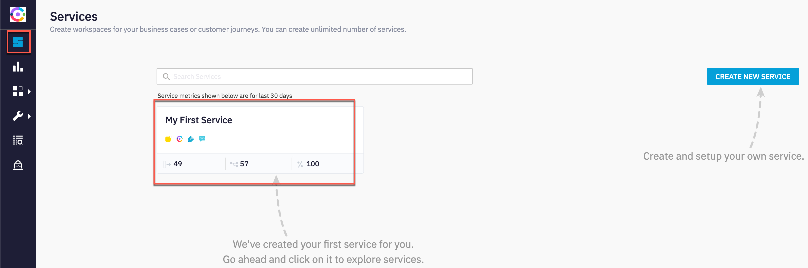
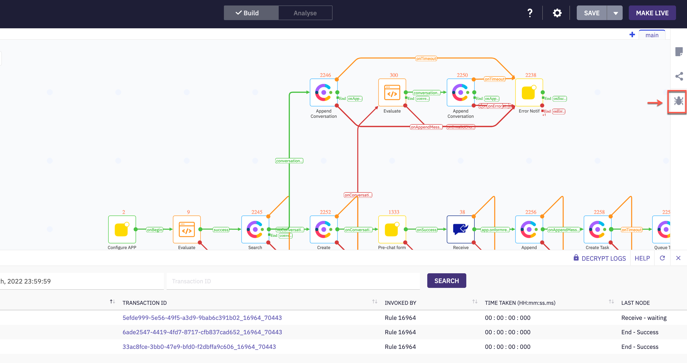
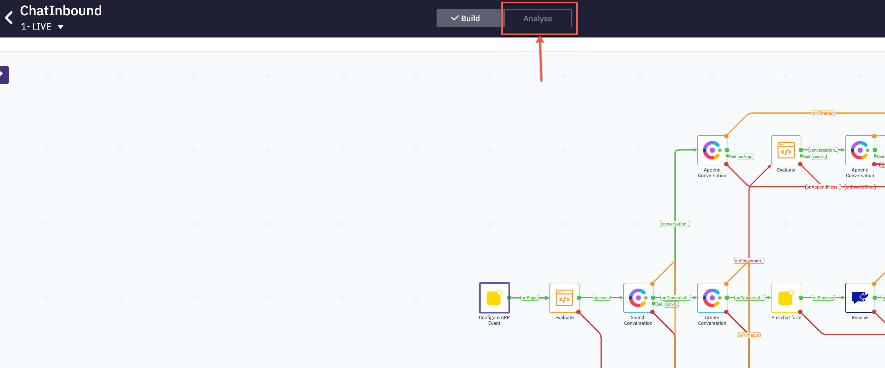
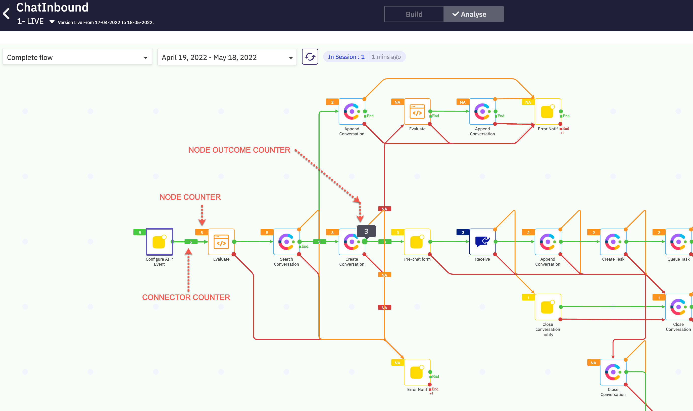
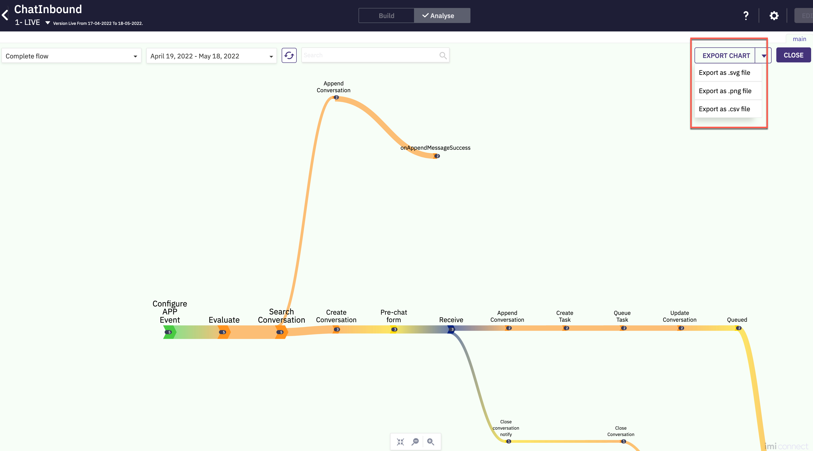

# Table of Contents

- [Table of Contents](#table-of-contents)
- [Introduction](#introduction)
  - [Lab Objective](#lab-objective)
  - [Pre-requisite](#pre-requisite)
- [Overview Of Flow Debugging](#overview-of-flow-debugging)
  - [1. Verify decryption access for Webex Connect Owner](#1-verify-decryption-access-for-webex-connect-owner)
  - [2. Enabling Debug logs](#2-enabling-debug-logs)
  - [3. Accessing the logs](#3-accessing-the-logs)
  - [4. Flow Analytics](#4-flow-analytics)
  - [5. Share Flow Settings](#5-share-flow-settings)
  - [Back to top](#back-to-top)
    - [Congratulations, you have completed this section!](#congratulations-you-have-completed-this-section)

# Introduction

## Lab Objective

In this lab, we will go through the concepts and basics of flow debugging options in Webex Connect.  

## Pre-requisite

1. Admin credentials to login to Webex Connect

# Overview Of Flow Debugging

## 1. Verify decryption access for Webex Connect Owner

>**Note**: Each Webex Connect tenant will have one owner added when the tenant is created. This owner will have decryption access by default. For any additional users added to the Connect tenant, please ensure that decryption access is enabled.

- Login to Webex Connect and navigate to Settings > Team mates 

 
 

- Verify that decryption access is enabled for the owner of the Webex Connect tenant 

## 2. Enabling Debug logs

>**Note**: By default only standard logs will be enabled. To enable debug logs, the below steps have to be completed

- Login to Webex Connect and navigate to your respective service and select the flow you would like to debug 

- Under actions click on 'arrow' mark and select manage. This will bring up flow workspace.

 
 

 
 

- In order to enable debug logs to see the complete HTTP request and response, Click on settings icon from top right and enable the toggle 'descriptive logs'

 
 

## 3. Accessing the logs

- On the right pane click on debug which will bring up a window at the bottom of the screen

 
 

- Each row here represents logging for one task, click on 'decrypt logs' on the right side to see debug logging.

 
 

- Click on the trasactionID, you can see nodes that were executed as part of the flow along with node ID's.

- For example, click on create conversation, you can see the HTTP request and response cycle on the right.

 
 

- Each node will have either a success or error outcome. When debugging, we can review the individual interaction and based on the outcome of the node, further debugging steps can be taken. 

 
 

## 4. Flow Analytics 

- The Analyse mode of Webex Connect Flow Builder provides you the ability to analyze the performance of your published flows at every node. 
  
- The Analyse mode provides an aggregate view of the execution counters at every node, enabling you to analyze the flow traffic and make necessary changes as per the customer interaction patterns.

- Once the flow you wish to analyse is opened, switch to the Analyse mode 

 
 

- In this mode, you can view the execution counters and duration metrics for each node within the flow.

- The Analyse mode also provides an insight into the successful transactions and drop-outs caused due to errors or failures at each node – both incoming and outgoing.
  - **Node counter** is the aggregate of execution counters for each of the nodes.
  - **Connector counter** indicates the number of transactions that have passed from the previous node to the following node.
  - **Node outcome counter** indicates the count of each outcomes of a node 

 
 

- To view the execution time details, toggle 'Execution Time' button at the bottom of the flow builder in the Analyze mode.

 
 

- Click View Chart directly to see the Sankey chart for the complete flow. 

 
 

- A Sankey chart provides a visual illustration of data and transaction flow from one node to another. The width of each node on the chart is proportional to the quantity of that node.

 
 

- You can export the chart to SVG, PNG or CSV format to be shared with Cisco TAC or others for debugging or trend analysis. 

## 5. Share Flow Settings 

- You can generate a shareable link for flow and share the flow with other users. 
  
- Anyone with the link can view the flow. Users who view the flow can see it in a view-only mode.

- You can decide if you want to include/exclude the Analyse mode in the flow that you share. When you include the Analyse mode, all the execution counters along with the Sankey charts become part of the shared flow. 

- Open the flow and on the right side click 'Share Flow' option to configure a password and share the flow in view only mode 

 
 

[Back to top](#table-of-contents)
---

### Congratulations, you have completed this section! 

<button onclick="mainPage()" style="
  border-radius: 5px;
  background-color: rgb(116,191,75);
  padding: 10px;">Home Page</button>

<button onclick="nextLab()" style="
  position: absolute;
  right: 200px;
  border-radius: 5px;
  background-color: rgb(116,191,75);
  padding: 10px;">Go to the Next Lab</button>

