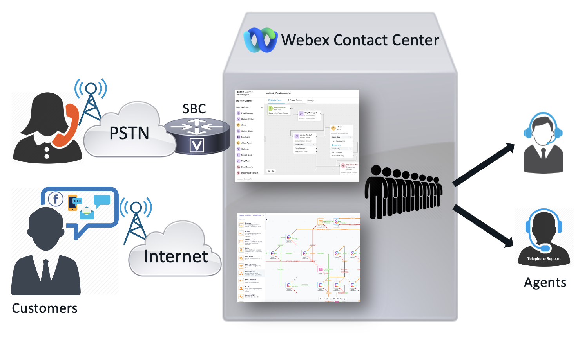

## Introduction
The recently introduced New Digital Channels capability in Webex Contact Centre provides a no-code bot-building capability and allows to build complex conversational flows. This session is targeted at contact centre engineers, architects and application builders interested to build bots using the new Bot Builder which is a cloud-based bot platform available out of the box with the Webex Contact Centre platform. During this session, participants will understand,

- Question/Answer bot: Knowledge-driven bots whose knowledge base consists of a Q&A corpus
- Task bot: Enable multi-turn conversations where a bot can obtain relevant data from users to perform the task at hand
- Google DialogFlow (CCAI) integration
- Integration of one of the bots with a supported digital channel type

## Lab Topology

## Access URLs

| Component     | URL                     | Login                                                       |
| --------------- | ----------------------------------------- | -------------------------------------------------------------           |
| Webex CC Control Hub | [https://admin.webex.com](https://admin.webex.com){:target="_blank"} | cl2admin**X**@email.carehybrid.com |
| Management Portal | [https://portal.wxcc-us1.cisco.com/portal](https://portal.wxcc-us1.cisco.com/portal){:target="_blank"} | cl2admin**X**@email.carehybrid.com |
| Webex Connect | https://cl2pod**X**.imiconnect.io/ | cl2admin**X**@email.carehybrid.com |
| Agent Desktop | [https://desktop.wxcc-us1.cisco.com](https://desktop.wxcc-us1.cisco.com){:target="_blank"} | cl2agent**X**@email.carehybrid.com |

> **NOTE:**  
> **X** – is your unique POD ID listed on the card. \
> The lab POD is the same as the production tenant which is located in the US Data Center. These labs are for instructional purposes only but the configuration can be reused for the real deployment.
> The telephony service is not activated. This pod is used only for digital channels.

## Before starting the labs

1. Please confirm that you can login to WxCC Admin portal by using the links above (Agent desktop login will not work until end of the next Lab1)

2. You have to use the admin account (with Administrator privileges) for the access to the Control Hub and Administration portal. 
    
3. Please follow the labs in the same order as they are provided. Some of the labs would have dependencies.

### Users

The users have the following pre-configuration

| **User Role** | **User email**                       |
| ------------- | ------------------------------------ | 
| Agent         | cl2agent**X**@email.carehybrid.com   | 
| Supervisor    | cl2sup**X**@email.carehybrid.com     | 

### User Settings

| **Entity**          | **Name** |
| ------------------- | -------- |
| Multimedia Profiles | MMP   |
| Site                | Site  |
| Team1               | Team1 |
| Team2               | Team2 |

## Lab Support

1. Proctors is your number 1 contact. If you need assistance just raise your hand.

2. All registered participants are also added to the support room where the engineering and Product Management team is added. As an alternative way, you can use that space for any questions related to the digital channels.

<button onclick="mainPage()" style="
  border-radius: 5px;
  background-color: rgb(116,191,75);
  padding: 10px;">Main Page</button>

<button onclick="nextLab()" style="
  position: absolute;
  right: 200px;
  border-radius: 5px;
  background-color: rgb(116,191,75);
  padding: 10px;">Next Lab</button>

