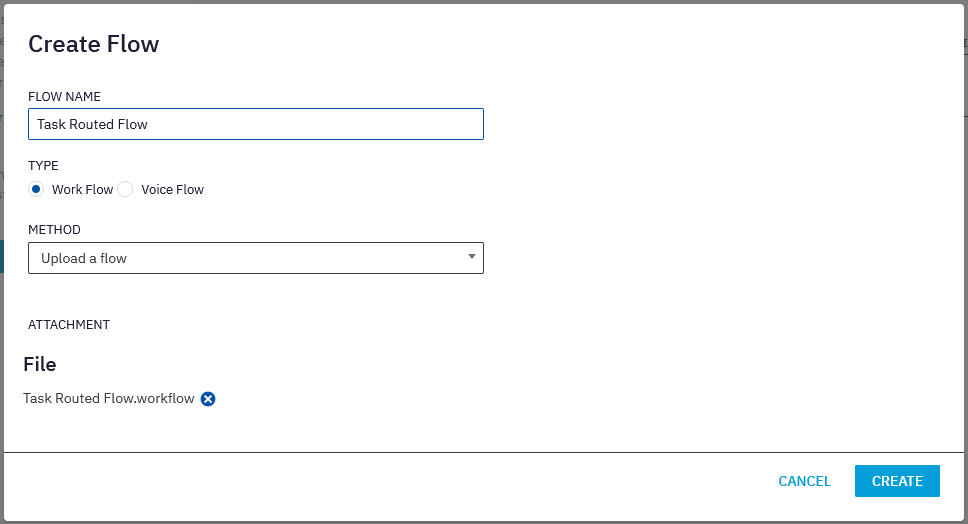

# Table of Contents

- [Table of Contents](#table-of-contents)
- [Introduction](#introduction)
- [Creating a Service](#creating-a-service)
- [Creating an App](#creating-an-app)

# Introduction

In this lab exercise we are going to configure a basic in Live Chat applet and deploy it on a website that you can access directly from the internet.  We will be downloading Workflow templates from GitHub, creating a free website on glitch.me, work with Webex Copnnect Flows and much more.

## Creating a Service

- Navigate to https://cl2podXX.imiconnect.io/ (where the XX is your lab ID)
- Click the **Create New Service** button
- Create a name for your service
- Navigate to [Workflow GitHub](https://github.com/CiscoDevNet/webexcc-digital-channels/tree/main/Webex%20Connect%20Flows)
- Download: [Live Chat Inbound](https://github.com/CiscoDevNet/webexcc-digital-channels/blob/main/Webex%20Connect%20Flows/v2.1/Live%20Chat%20Inbound%20Flow.workflow.zip)
- Unzip workflow file
- Click View My Flows 
- For each workflow file: 
> 

> 1. Click Create Flow
> 2. Use the workflow file name for the Flow Name 
> 3. Type: Workflow 
> 4. Metod: Upload a flow 
> 5. Attach the unzipped workflow file 
> 6. Click Create
----

## Creating an App
- 

[To top of this lab](#table-of-contents)

---

### Congratulations, you have completed Lab2 tasks! 

<button onclick="mainPage()" style="
  border-radius: 5px;
  background-color: rgb(116,191,75);
  padding: 10px;">Go to the Previous Lab</button>

<button onclick="nextLab()" style="
  position: absolute;
  right: 200px;
  border-radius: 5px;
  background-color: rgb(116,191,75);
  padding: 10px;">Go to the Next Lab</button>

