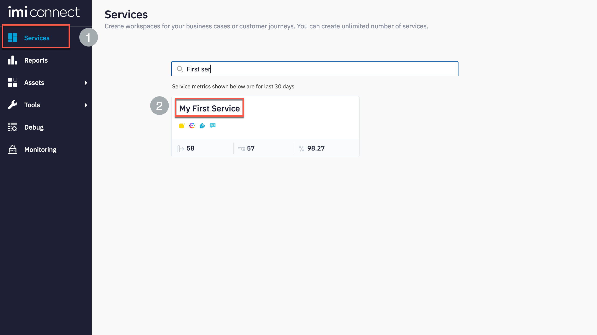
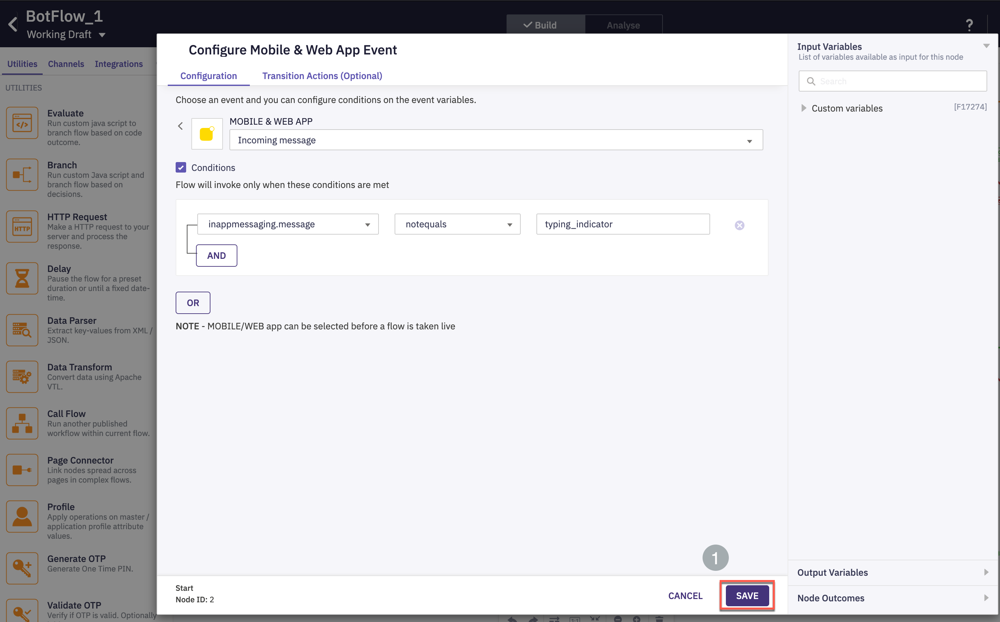
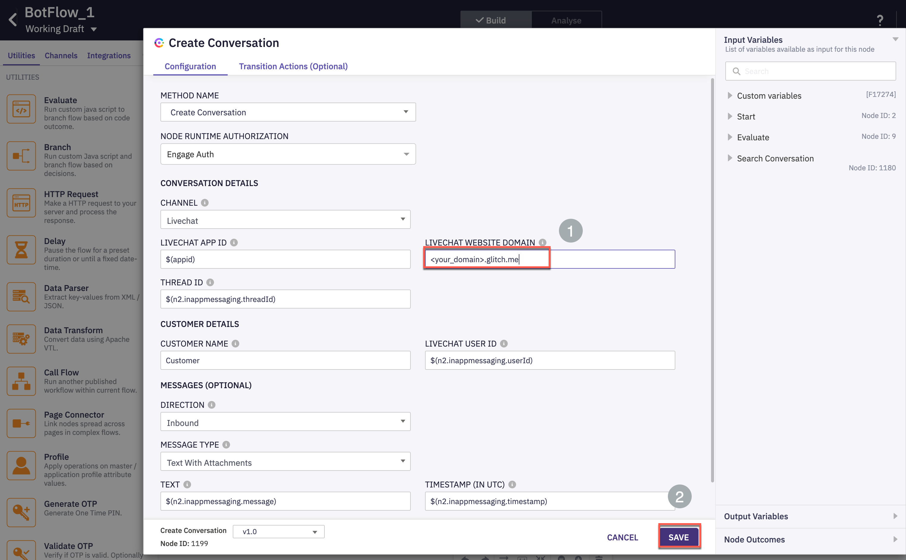
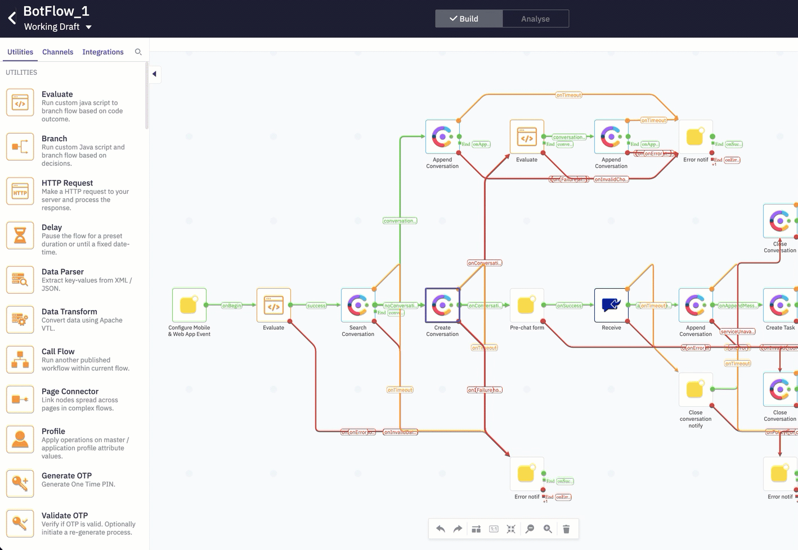
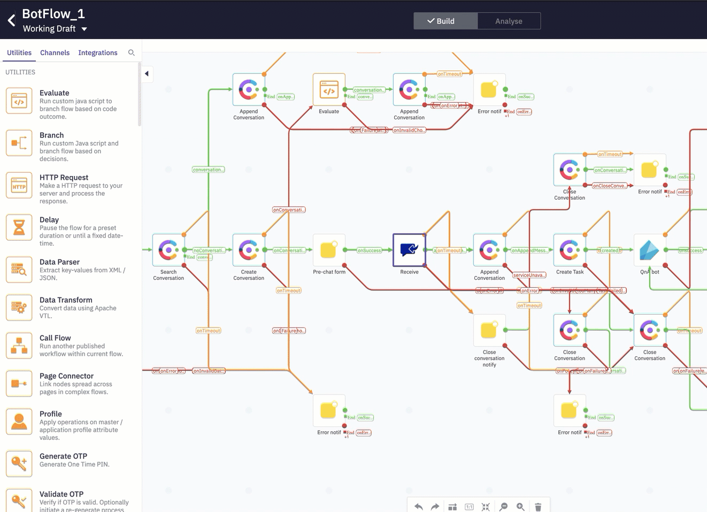
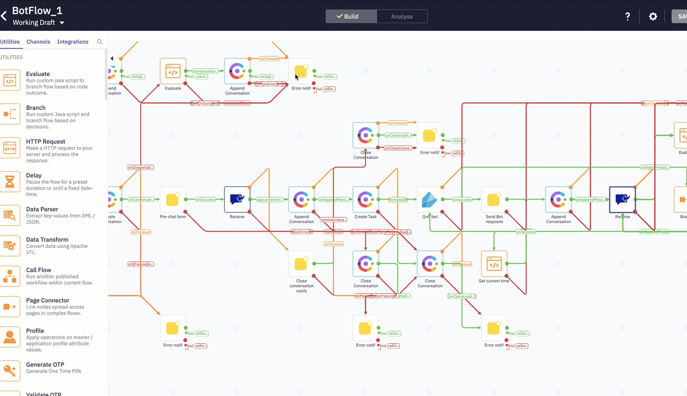
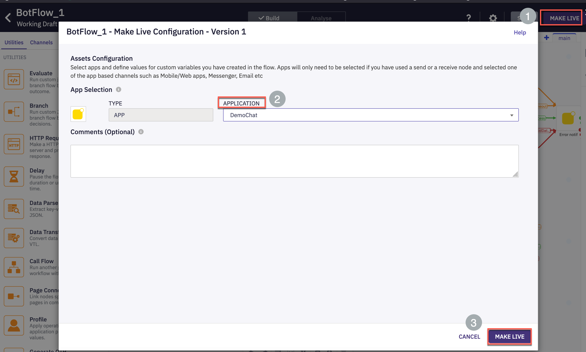

# Table of Contents
- [Table of Contents](#table-of-contents)
- [Introduction](#introduction)
    - [Lab Objective](#lab-objective)
    - [Pre-requisites](#pre-requisites)
    - [Quick Links](#quick-links)
- [Lab Section](#lab-section)
  - [Step 1. Navigate to Webex Connect and Identify chat appID](#step-1-navigate-to-webex-connect-and-identify-chat-appid)
  - [Step 2.  Import bot flow](#step-2--import-bot-flow)
  - [Step 3: Update chat widget details in the flow](#step-3-update-chat-widget-details-in-the-flow)
  - [Step 3: Update bot details in the flow](#step-3-update-bot-details-in-the-flow)
  - [Step 4: Select the Queue and Publish the flow](#step-4-select-the-queue-and-publish-the-flow)
  - [Step 5: Bot flow verification](#step-5-bot-flow-verification)
  - [Back to top](#back-to-top)
    - [Congratulations, you have completed this section!](#congratulations-you-have-completed-this-section)

# Introduction

### Lab Objective

In this Lab, we will go through the tasks that are required to complete the QnA bot flow configuration. At the end of this lab, a chat session can be initiated and either self serviced or can be escalated to an agent. 

### Pre-requisites

- You have received the access credentials with a full admin access 
- Lab 2 should be completed successfully and chat routing to agent is working
- The previous sections in Lab 3 should be completed successfully

### Quick Links

> Control Hub: **[https://admin.webex.com](https://admin.webex.com){:target="_blank"}**\
> Portal: **[https://portal.wxcc-us1.cisco.com/portal](https://portal.wxcc-us1.cisco.com/portal){:target="_blank"}**\
> Agent Desktop: **[https://desktop.wxcc-us1.cisco.com](https://desktop.wxcc-us1.cisco.com){:target="_blank"}**\
> Connect: https://cl2pod**X**.imiconnect.io/ (where **X** is your POD number)

# Lab Section

## Step 1. Navigate to Webex Connect and Identify chat appID 

- Login to Webex Connect > Assets > Identify the appID of the chat asset created in step-2

## Step 2.  Import bot flow

- Download the template bot flow from this link: [QnA  pre-configured flow](QnA_Preconfigured_Flow.workflow)  

- Navigate to Services > Click the service in which the chat configurations were created

- Navigate to Flows > Create Flow

- Input desired  **Flow Name**, select **Method** as 'Upload a flow' and choose the flow downloaded in the first step of this section

- Click **Create**

- In the trigger event node, click **Save**

## Step 3: Update chat widget details in the flow

- Navigate to settings in the top right and update the appID (value identified in Step-1) and click Save

- Double click **Create Conversation** node and update the **LiveChat Website Domain** . This is the domain where chat code was deployed (Lab-2) and click **Save**

- Open the **pre-chat form** and select the template created in Lab-2

- Open the **Receive** node and select the template created in Lab-2

- Open the second **Receive** node and click **Save**

## Step 3: Update bot details in the flow 

- Open the **QnABot** node and select the QnA bot created in the previous section

## Step 4: Select the Queue and Publish the flow 

- Open the **Queue task** node and select the chat queue created in Lab-2

- On the top right click **Make Live** > Select the chat application and click **Save** . The flow will be published in less than 2 minutes

## Step 5: Bot flow verification 

- Launch the website where chat code is deployed (this should have been completed as part of lab-2. Click the chat widget and then **New Conversation** . Input chat form details and Enter. 

- Test the bot with the sample questions configured while creating the bot in earlier section of this lab and verify that the response received from bot matches one of the configured response variants. 

 

- To escalate this conversation to an agent, enter **Agent** or **Escalate to agent**

- The conversation would be offered to an available agent. Login to agent desktop and Click **Accept**

- Once the chat contact is accepted by the agent, verify that bot conversation history is persisted and presented to agent. 

[Back to top](#table-of-contents)
---

### Congratulations, you have completed this section! 

<button onclick="mainPage()" style="
  border-radius: 5px;
  background-color: rgb(116,191,75);
  padding: 10px;">Home Page</button>

<button onclick="nextLab()" style="
  position: absolute;
  right: 200px;
  border-radius: 5px;
  background-color: rgb(116,191,75);
  padding: 10px;">Go to the Next Lab</button>

