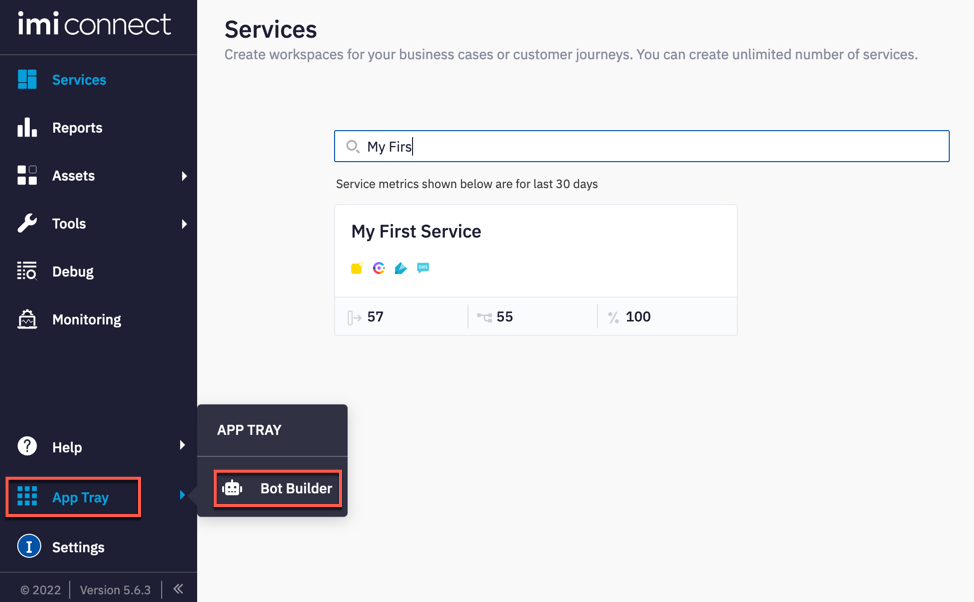
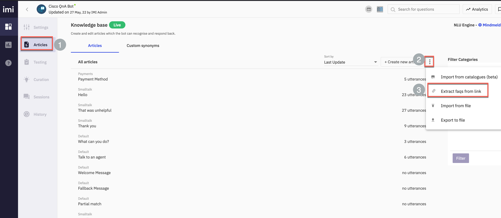
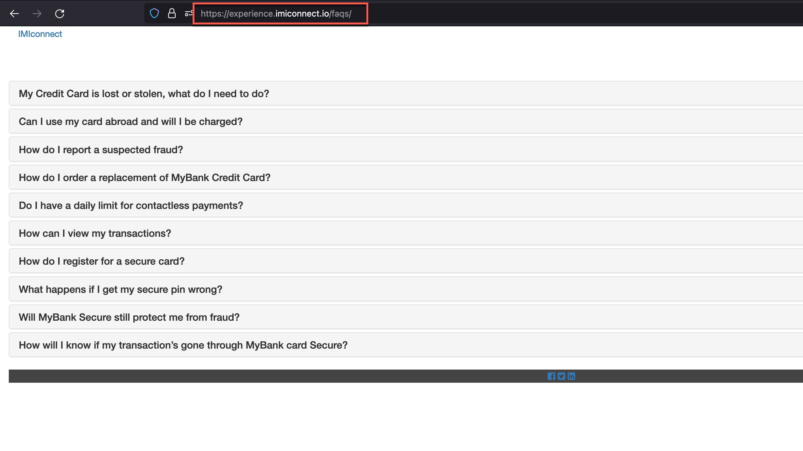
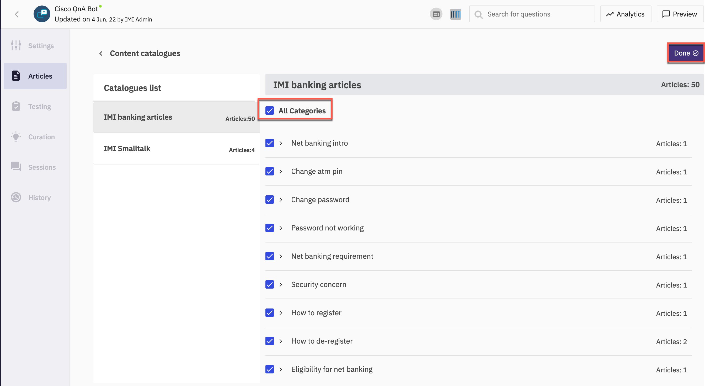
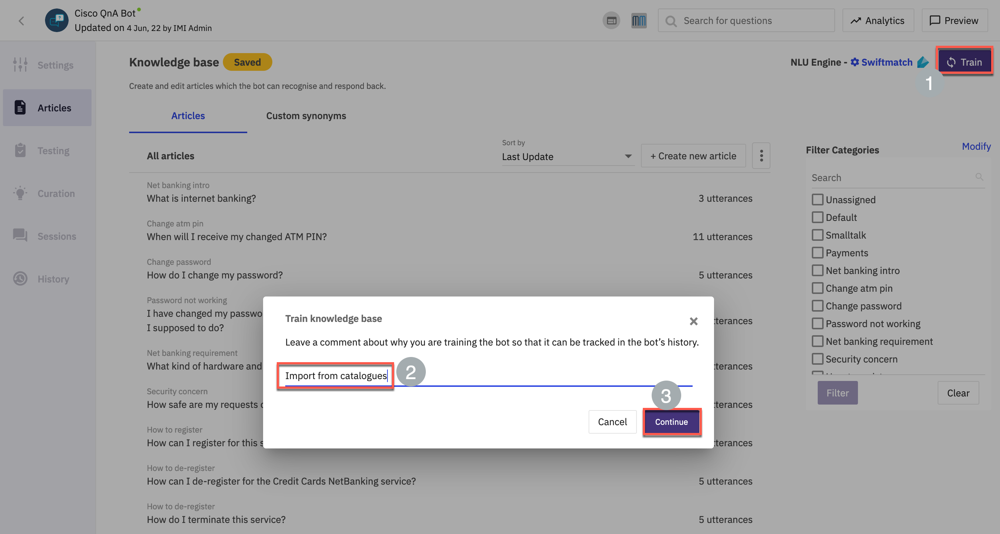
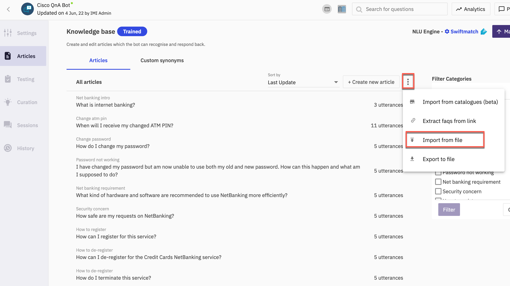
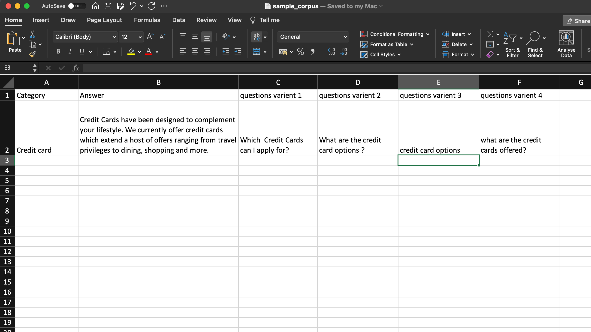
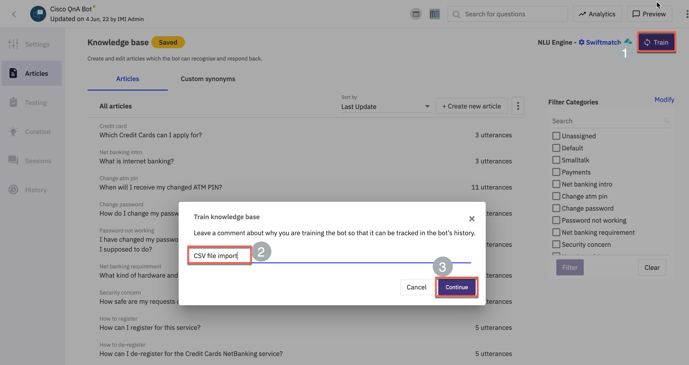
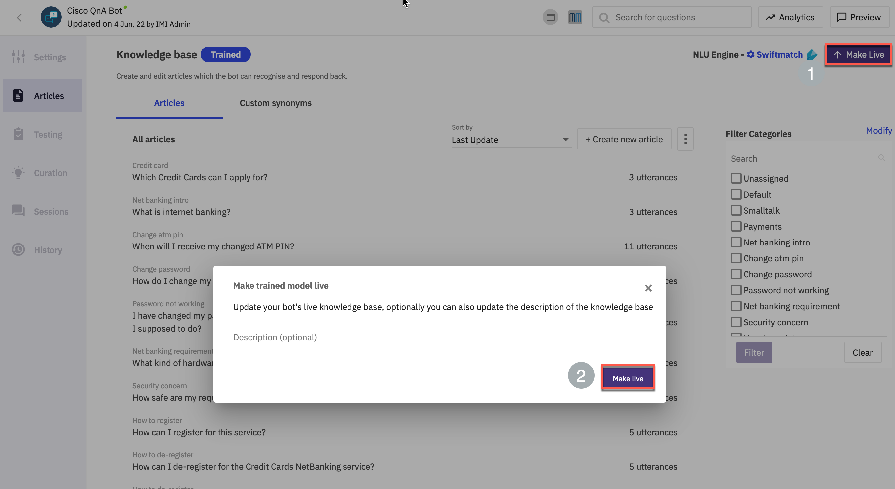
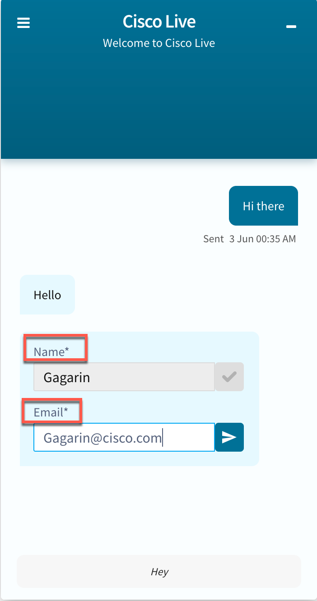

# Table of Contents
- [Table of Contents](#table-of-contents)
- [Introduction](#introduction)
    - [Lab Objective](#lab-objective)
    - [Pre-requisites](#pre-requisites)
    - [Quick Links](#quick-links)
- [Lab Section](#lab-section)
  - [Step 1. Navigate to Bot builder and access QnA bot](#step-1-navigate-to-bot-builder-and-access-qna-bot)
  - [Step 2. Integrate an external FAQ page with QnA bot (Option-1)](#step-2-integrate-an-external-faq-page-with-qna-bot-option-1)
  - [Step 3. Integrate QnA articles from catalogues (Option-2)](#step-3-integrate-qna-articles-from-catalogues-option-2)
  - [Step 4. Import sample corpus QnA articles json (Option-3)](#step-4-import-sample-corpus-qna-articles-json-option-3)
  - [Step 5: Bot flow verification](#step-5-bot-flow-verification)
  - [Back to top](#back-to-top)
    - [Congratulations, you have completed this section!](#congratulations-you-have-completed-this-section)

# Introduction

### Lab Objective

In this Lab, we will go through the tasks that are required to complete the integration of a FAQ (Frequently Asked Questions) article with Webex Connect Question and Answer bot.

### Pre-requisites

- You have received the access credentials with a full admin access 
- Lab 3 is successfully completed 

### Quick Links

> Control Hub: **[https://admin.webex.com](https://admin.webex.com){:target="_blank"}**\
> Portal: **[https://portal.wxcc-us1.cisco.com/portal](https://portal.wxcc-us1.cisco.com/portal){:target="_blank"}**\
> Agent Desktop: **[https://desktop.wxcc-us1.cisco.com](https://desktop.wxcc-us1.cisco.com){:target="_blank"}**\
> Connect: https://cl2pod**X**.imiconnect.io/ (where **X** is your POD number)

# Lab Section

## Step 1. Navigate to Bot builder and access QnA bot

- Login to your respective Webex Connect UI using the provided URL https://cl2pod**X**.imiconnect.io/ (where **X** is your POD number).
  
- Navigate to App Tray and Bot Builder

- Access the QnA bot created earlier in Lab-3 

> Note: There are 3 options to create articles for the QnA bot. We will explore and configre all 3 options in this lab

## Step 2. Integrate an external FAQ page with QnA bot (Option-1)

- Navigate to **Articles** > Click 3 dots on the right side > select **Extract faqs from link**

> Note: A pre-configured FAQ page is available here : https://experience.imiconnect.io/faqs/

- Confirm access to the FAQ page

- Input the FAQ page url > click **Extract** > Once the FAQs are detected, select **All FAQs** > Click **Import**

> Note: The Mindmeld engine requires at least 2 utterances for training. For the purpose of this lab, we will switch to Webex Connect in-house conversational AI engine - Swiftmatch 

- Click **Mindmeld** on the top right corner. Change the **Training Engine** as Swiftmatch > click **Update**

- Click **Train** on the top right corner > Input a description and click **Continue**

## Step 3. Integrate QnA articles from catalogues (Option-2)

- Click 3 dots on the right side > select **Import from catalogues**

- Select **All categories** and **Done**

- Click **Train** on the top right corner > Input a description and click **Continue**

## Step 4. Import sample corpus QnA articles json (Option-3)

- Bot articles can be pre created and be imported. In this step we will create a sample file for import. 
  
- Click 3 dots on the right side > select **Import from file**

- Select **CSV** as the option and **Download Sample**

- Add few sample question variants and answer in the sample file. An example is shown in the screenshot. 

- Select the file with questions and answers and click **Import**

- Click **Train** on the top right corner > Input a description and click **Continue**

- Make the bot live

## Step 5: Bot flow verification 

- Launch the website where chat code is deployed (this should have been completed as part of lab-2. Click the chat widget and then **New Conversation**

- Input chat form details and Enter. 

- Test the bot with the sample questions configured while creating the bot in earlier section of this lab and verify that the response received from bot matches one of the configured response variants. 

 

- To wrap up the contact, click the icon on top left of chat widget and select **End chat**

 

[Back to top](#table-of-contents)
---

### Congratulations, you have completed this section! 

<button onclick="mainPage()" style="
  border-radius: 5px;
  background-color: rgb(116,191,75);
  padding: 10px;">Go To Previous Lab</button>

<button onclick="nextLab()" style="
  position: absolute;
  right: 200px;
  border-radius: 5px;
  background-color: rgb(116,191,75);
  padding: 10px;">Go to the Next Lab</button>

