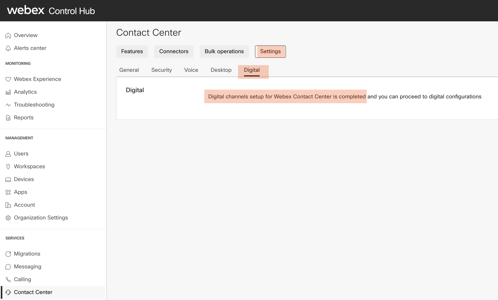
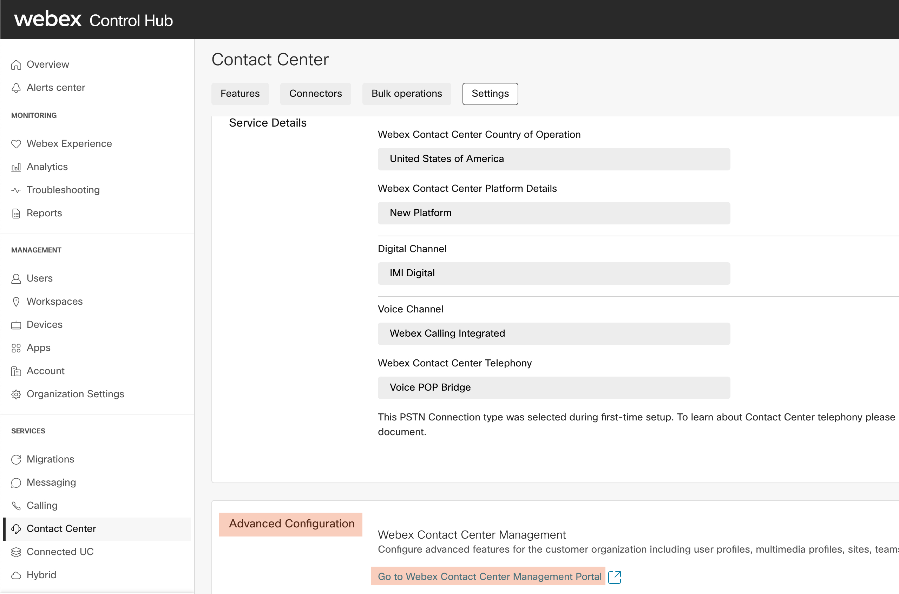
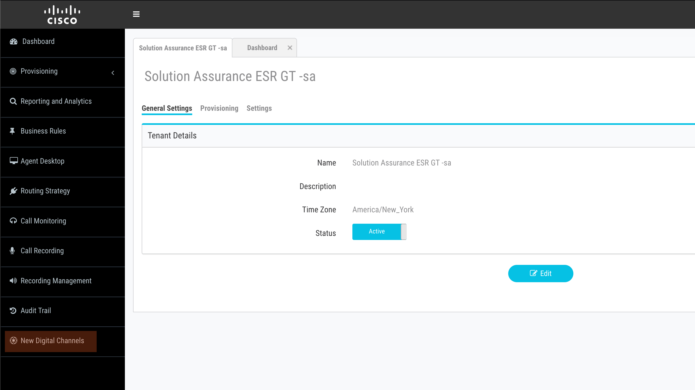

<iframe width="1024" height="576" src="https://www.youtube.com/embed/uGU7u4gPnB4" title="" frameborder="0" allow="accelerometer; autoplay; clipboard-write; encrypted-media; gyroscope; picture-in-picture" allowfullscreen></iframe>

# Table of Contents
1. [Control Hub Digital channels verfication](#1-control-hub-digital-channels-verification)
2. [New component cross-launch](#2-New-component-cross-launch)

# Introduction

## Lab Objective

This lab is designed to verify that the new digital channels is enabled in the tenat you are working and you are able to access the new components successfuly.   

## Pre-requisite

1. Admin credentials to login to Control Hub and WxCC administration portal.

# 1. Control Hub Digital channels verfication

- Go to https://admin.webex.com

- Login with tenant administrator credentials 

- Under 'Services' select  'Contact Center' > 'Settings' > 'General'
    - Verify under 'Service Details' > 'Digital Channel' is set to 'IMI Digital'

- Under 'Services' select  'Contact Center' > 'Settings' > 'Digital'
    - Verify Digital channels setup for Webex Contact Center is completed.

# 2. New component cross launch
- 'Services' select  'Contact Center' > 'Settings' > 'General' > 'Advanced Configuration' > Select 'Go to Webex Contact Center Management Portal' to cross launch to administration portal 

- In Administration portal, select 'New Digital Channels' to cross launch into the new component 'Engage' 
    - No additional login(or credentials) are required. The login to Engage portal should be seamless

- In Engage portal, select Users > Search 

- Verify that users with Administrator and Premium Agent previleges are replicated with role type 'Administrative' and 'Customer Care' roles

- Please note that the user account with which you have logged in will not show up in the engage user list. This is expected behaviour. 

---

### Congratulations, you have compleated this section! 
### We would like to keep track of your progress and make sure that we are giving you effective support. Please take approximately one minute to complete the short survey.

[Back to top](#table-of-contents)

---

Changelog:

| **Version** | **Comments** | **Author(s)** | **Date** |
| --- | --- | --- | --- |
| 1.0 | Initial Release | Gagarin JS (gasathiy@cisco.com) | 31 Oct 2021 |

	<button onclick="mainPage()" style="
  border-radius: 5px;
  background-color: rgb(116,191,75);
  padding: 10px;">Go back to Main Page</button>

<button onclick="nextLab()" style="
  position: absolute;
  right: 200px;
  border-radius: 5px;
  background-color: rgb(116,191,75);
  padding: 10px;">Take Survey and Go to Next Lab</button>

