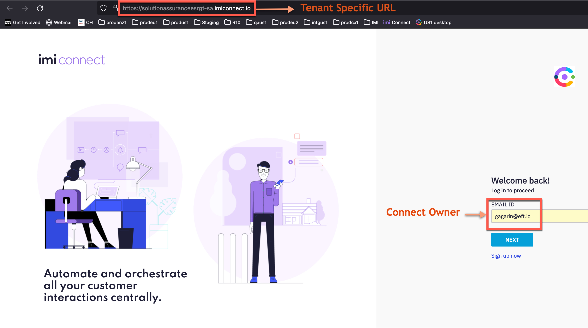
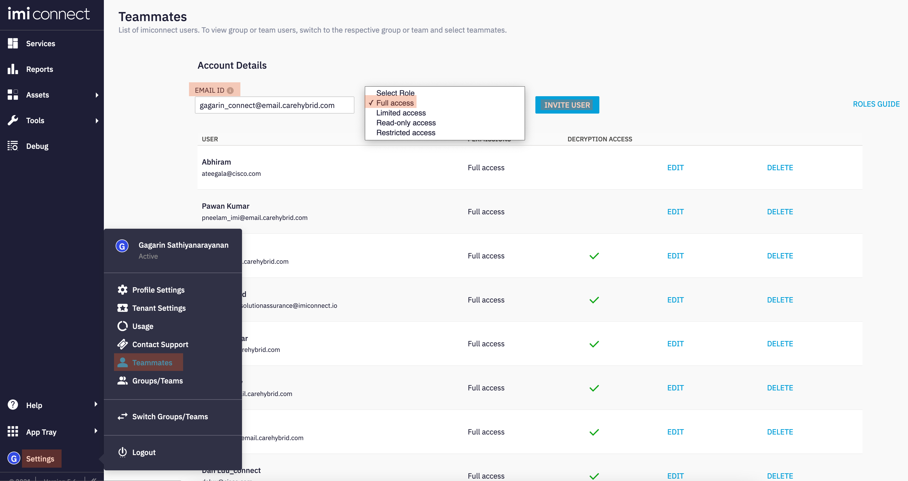
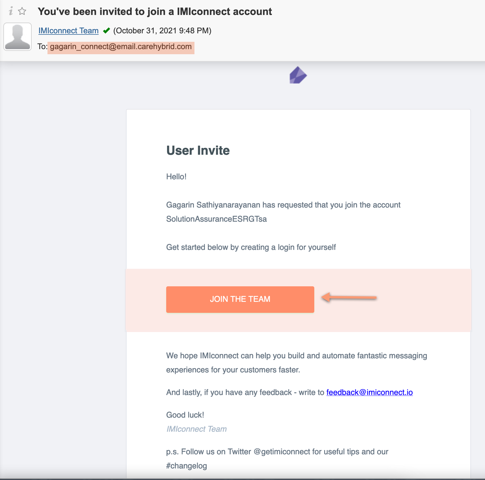

# Table of Contents
1. Login to Connect portal
2. Add new users with administrator role
3. New user activation

# Introduction

## Lab Objective

This lab is designed to add new administrator users in Connect. This is an optional lab if you want to add more administrators to the connect tenant. The connect portal will be used only by Webex Contact Centre administrators.

## Pre-requisite

1. IMI Connect portal URL
2. Tenant Owner credentials to login to IMI Connect portal

# 1. Login to Connect portal

- Access IMI connect URL (this is specific to the tenant you are using) 
- Login with tenant owner credentials 
- The owner credential is usually sent to the WxCC tenant (partner Gold tenant) administrator once the IMI tenant provisioning is complete
    - Please contact your Cisco Partner Success Account Manager (PSAM) if there are any challenges identifying the IMI connect owner details

# 2. Add new users with administrator role
- Once logged in to Connect, go to 'Settings' > 'Teammates'
- Add a new user (must be a working emailID) and select 'Full access' role and click 'Invite user'

# 3. New user activation
- Click 'Join the team' link in the welcome email to complete user registration
- Provide your name and setup the passwords, click 'Next'
- Fill out additional details about yourself and click 'Next'

Changelog:

| **Version** | **Comments** | **Author(s)** | **Date** |
| --- | --- | --- | --- |
| 1.0 | Initial Release | Gagarin JS (gasathiy@cisco.com) | 31 Oct 2021 |

