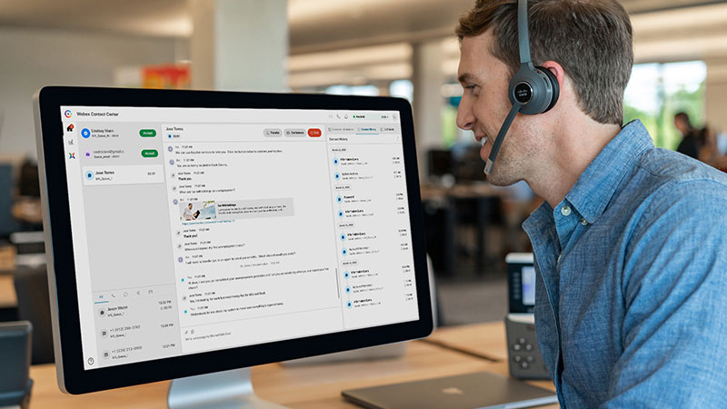

Welcome to the Lab Guide Library. Here you will find the step-by-step guides on how to setup Webex Contact Center features.

## Lab Schedule

| Lab ID     | Session                                | Corresponding Lab                                                                                      
| ---------- | -------------------------------------- | --------------------------------------------------------------------------------------------- 
| Lab 1 | Control Hub & Admin Portal  | [Control Hub & Admin Portal Lab](CH.md){:target="\_blank"}                               
| Lab 2 | IVR Contact Routing         | [IVR Contact Routing Lab](IVR.md){:target="\_blank"}                                      
| Lab 3 | Agent Desktop               | [Agent Desktop Lab](AgentSupervisor.md){:target="\_blank"}
| Lab 4 | CRM Integration                | [CRM Integration Lab](CRM.md){:target="\_blank"}  
| Lab 5 | Google CCAI & TTS Integration                | [Google CCAI & TTS Integration Lab](CCAI.md){:target="\_blank"} 
| Lab 6 | Analyzer Deep Dive        | [Analyzer Deep Dive Labs](Analyzer.md){:target="\_blank"}                  
| Lab 7 | WxM Integration               | [WxM Integration Lab](WxM.md){:target="\_blank"}  
| Lab 8 | API                        | [API Lab](APIs.md){:target="\_blank"} 
