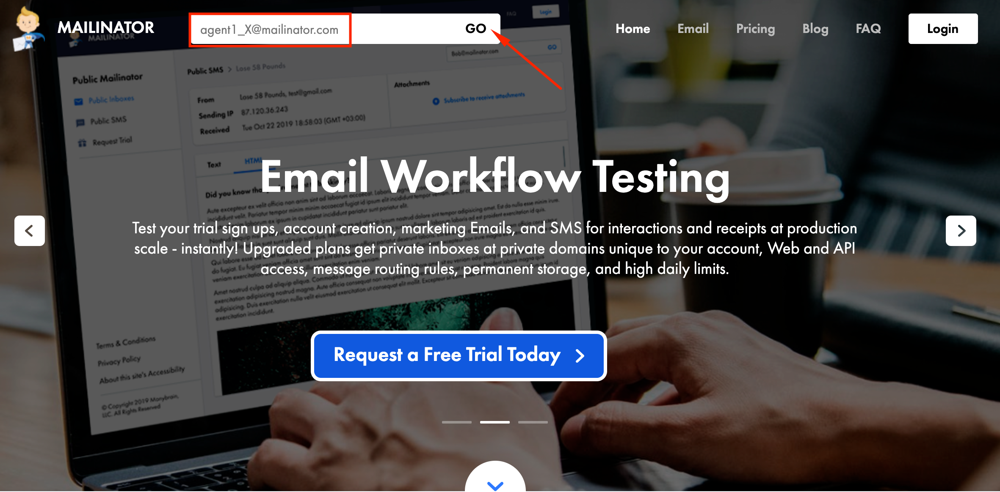

### Overview of the lab:

In this Lab, we will go through the tasks that are required to complete the general pre-configuration of a tenant. These tasks are to be undertaken by a customer administrator. By following each of the steps, you would have prepared your tenant to begin configuring different services offered by the platform. At the end of the lab, you should be able to log in to an agent interface with the configured user extension.

# Table of Contents

- [Part 1: Tenant Creation Walkthrough](#part-1-tenant-creation-walkthrough)
- [Part 2: Bonus Video Only Trial Tenant Setup](#part-2-bonus-trial-tenant-setup-video)
- [Part 3: Control Hub Calling and Telephony Settings](#part-3-control-hub-calling-and-telephony-settings)
- [Part 4: Control Hub User Management Admin Task](#part-4-control-hub-user-management-admin-task)
  - [Add a new admin user](#add-a-new-admin-user)
- [Part 5: Admin Portal Multimedia Profile, Site and Team Configuration](#part-5-admin-portal-multimedia-profile-site-and-team-configuration)
  - [1. Create new MultiMedia Profile](#1-create-new-multimedia-profile)
  - [2. Create new Site](#2-create-new-site)
  - [3. Create new Team 1](#3-create-new-team-1)
  - [4. Create new Team 2](#4-create-new-team-2)
- [Part 6: Admin Portal User Configuration](#part-6-admin-portal-user-configuration)
  - [1. Synchronize Webex Contact Center Users](#1-synchronize-webex-contact-center-users)
  - [2. Manage settings for existing user](#2-manage-settings-for-existing-user)

# Introduction

### Lab Objective

- This lab is designed to help you do the initial setup and configuration for your GOLD tenant and to be familiar with the control hub and admin portal UI.
- The lab contains multiple exercises on Control Hub and Admin Portal to make you comfortable with the Webex Contact Center application.

### Pre-requisites

- You have recived the **admin login** credentials with a full admin access.
- You have 2 **calling numbers** assigned to your POD.

### Quick Links

> Control Hub: **[https://admin.webex.com](https://admin.webex.com){:target="_blank"}**\
> Portal: **[https://portal.wxcc-us1.cisco.com/portal](https://portal.wxcc-us1.cisco.com/portal){:target="_blank"}**\
> Mailinator: **[https://www.mailinator.com/](https://www.mailinator.com/){:target="_blank"}**

# Lab Section

## Part 1: Control Hub Calling Configuration

> The following video outlines the Webex calling configuration steps that enable the administrator to use the configured default location and assign a number for those locations. This is a supportive video that does not require any actions since that part is already preconfigured on your tenant. 

<iframe width="1024" height="576" src="https://www.youtube-nocookie.com/embed/cr_QUKvu4yc?rel=0" title="WxCC Lab #1 Part 3: Control Hub Calling or Telephony Settings" frameborder="0" allow="accelerometer; autoplay; clipboard-write; encrypted-media; gyroscope; picture-in-picture" allowfullscreen></iframe>

## Part 2: Control Hub User Management Admin Task

> The following video outlines the process to manage different types of users to the Customer tenant. Following the steps, you will add new users and set the Calling extension. While adding the user, we will see how to select user roles. 

<iframe width="1024" height="576" src="https://www.youtube-nocookie.com/embed/-pgYPCFh6YI?rel=0" title="WxCC Lab #1 Part 4: Control Hub User Management Admin Task" frameborder="0" allow="accelerometer; autoplay; clipboard-write; encrypted-media; gyroscope; picture-in-picture" allowfullscreen></iframe>

| **User Role** | **User email**      | **User Extension**                   |
| ----------- | ----------------- | -------------------------------- |
| Agent        | agent1_\<ID\>@mailinator.com   | 1000 |
| Supervisor         | supervisor1_\<ID\>@mailinator.com  | 2000 |

> **NOTE:** Your \<ID\> is provided in the email in the **"Attendee ID"** line.

### 1. Add an agent and a supervisor users and configure the calling extension

- Login to the [Control Hub](https://admin.webex.com){:target="_blank"} with the admin account.

- Navigate to **_Users_**.

- Click on **_Manage Users_** button.

- Click on **_Manually Add or Modify User_**.

- Select **_Next_** in **_Manage Users_** pane.

- Input the **Email addresses** of the agent and supervisor users and click **_Next_**. 

- Verify that the **Email addresses** are same as in the table above and click **_Next_**.

- Check **_Webex Teams_** , **_Webex Calling (Enterprise)_** & **_Contact Center_**.

- Ensure that the License Type is **_Premium Agent_** and Role is **_Agent_** and click **_Next_**. 

- On the next page, make sure that the **_Location_** is selected under **_Assign Numbers_**. The correct value should be already selected by default. 

- The **_Phone Number_** left as **None**.

- On the same page, Enter the correct `Extension` under **_Assign Numbers_**. You can find this in the table above.

- Click **_Finish_**.

- On the next page, you should get confirmation **"2 Total records processed"**. Confirm the same by pressing **_Finish_**.

- Select the supervisor user and modify his role to **_Supervisor_** by clicking the top **_Edit_** button in front of **_Services_**. Click **_Save_** to confirm the changes.

- Validate the users by going to [https://www.mailinator.com/](https://www.mailinator.com/){:target="_blank"} and putting agent/supervisor email in to **_Enter Public Mailinator Inbox_** 

> **Note:** You do not need a password to open the inbox on mailinator. You can read any emails without mailbox credentials. Just insert agent name in the top right form and click **GO**.
> 

- Check the email inboxes and follow the **Cisco Webex** email instructions to activate the user accounts. For the user activation, you have to set the password twice for both users.

- Refresh the **_Users_** page in the Control Hub, make sure that all users are in **Active** status.

### 2. Optionally, add the rest of the users

- Follow the same steps as above to add any extra users that you want to add to the Contact Center.

[To top of this lab](#table-of-contents)

## Part 3: Admin Portal Multimedia Profile, Site and Team Configuration

> The following video outlines how to access the admin portal and navigate the different configuration menus to create a Site, Team, and Multimedia Profile that will be assigned to the Contact Center user. We will also see how to navigate to the Webex Contact Center Management Portal from Control Hub UI.

<iframe width="1024" height="576" src="https://www.youtube-nocookie.com/embed/hd56VM7Gdbs?rel=0" title="WxCC Lab #1 Part 5: Admin Portal Multimedia Profile, Site and Team Configuration" frameborder="0" allow="accelerometer; autoplay; clipboard-write; encrypted-media; gyroscope; picture-in-picture" allowfullscreen></iframe>

| **Entity**          | **Name** |
| ------------------- | -------- |
| Multimedia Profiles | MMP_\<ID\>_TS   |
| Site                | Site_\<ID\>_TS  |
| Team1               | Team1_\<ID\>_TS |
| Team2               | Team2_\<ID\>_TS |

### 1. Create new MultiMedia Profile

- Login to Control Hub by accessing [https://admin.webex.com](https://admin.webex.com){:target="\_blank"}.

- Enter the admin email id and the password.

- Navigate to **_Contact Center_** Card.

- Click **_Settings_** in the upper right corner.

- Scroll down to the **_Advanced Configuration_** section.

- Click on **_Go to Webex Contact Center Management Portal_**.

- Ensure that browser pop up blockers are not blocking the **_Admin Portal_** pop up.

- Click on **_Provisioning_** and select **_Multimedia Profiles_**.

- Click on `+ New Multimedia Profile` to open Multimedia Profile configuration page.

- Input Name as `MMP_ID_TS`.

- In the Media Details section, select the blended multimedia profile and input `1` for **_Voice_**, `3` for **_Chat_**, `3` for **_Email_**, `3` for **_Social Channel_** and click **_Save_**.

### 2. Create new Site

- Navigate to **_Provisioning_** and select **_Site_**.

- Click on `+ New Site` button and provide the Name as `Site_ID_TS`.

- Select `MMP_ID_TS` in the **_Multimedia Profile_** drop down and hit **_Save_**.

### 3. Create new Team 1

- Navigate to **_Provisioning_** and select **_Team_**.

- Click on `+ New Team`.

- Select `Site_ID_TS` from the **_Site_** drop-down.

- Input **_Name_** as `Team1_ID_TS`.

- Use the default **_Type_** `Agent Based`.

- Select `MMP_ID_TS` in the **_Multimedia Profile_** drop-down.

- Left as a default value **_Global Layout_** in the **_Desktop Layout_** drop-down and hit **_Save_**.

### 4. Create new Team 2

- Please follow the same steps as above to add an extra Team as `Team2_ID_TS`. Later we will use this team to assign a custom Desktop Layout.

[To top of this lab](#table-of-contents)

## Part 4: Admin Portal User Configuration

> The following video outlines how to configure the users in Admin Portal that were added first in Control Hub. This is a very critical task from the Contact Center perspective. We also would take a look at how to associate customer-created Site, Team, and Multi-Media Profile with those users. After this, we should be able to login as an agent.

<iframe width="1024" height="576" src="https://www.youtube-nocookie.com/embed/BXVdOrdh_Hw?rel=0" title="WxCC Lab #1 Part 6: Admin Portal User Configuration" frameborder="0" allow="accelerometer; autoplay; clipboard-write; encrypted-media; gyroscope; picture-in-picture" allowfullscreen></iframe>

### 1. Synchronize Webex Contact Center Users

- Login to Control Hub by accessing [https://admin.webex.com](https://admin.webex.com){:target="\_blank"}.

- Enter the admin email id and the password.

- Navigate to **_Contact Center_** card.

- Click on **_Settings_** and then `Synchronize Users`.

### 2. Manage settings for existing user

- Go back to the **_Webex Contact Center Management Portal_**.

- Click on **_Provisioning_** and select **_Users_**.

- Click on `...` for the first user, to launch the **_Edit_** view for a particular User configuration.

- Click on **_Contact Center Enabled_** toggle to move it to **_On_**.

- In the **_Agent Settings_** section, select `Site_ID_TS` in the **_Site_** drop-down.

- Click the **_Teams_** area and select `Team1_ID_TS` and `Team2_ID_TS`.

- Select `MMP_ID_TS` in the **_Multimedia Profile_** drop-down and hit **_Save_**.

- Make sure that the user are now shown with the **_Contact Center Enabled_** flag as `Yes` and **_Status_** as `Active`.

[To top of this lab](#table-of-contents)

## Part 4: Webex Calling App Installation
>The following video explains the process to access the Agent Desktop. Following the steps, you will log in with your credentials and indicate the number where you want to receive the calls. 

<iframe width="1024" height="576" src="https://www.youtube-nocookie.com/embed/HmovpwYlcLs?rel=0" title="WxCC Lab #2 Part 1: Access to the Agent Desktop" frameborder="0" allow="accelerometer; autoplay; clipboard-write; encrypted-media; gyroscope; picture-in-picture" allowfullscreen></iframe>

### 1. Activate Webex Calling

- Login the **[Control Hub](https://admin.webex.com/){:target="_blank"}** with your admin credentials.

- Navigate to **_Users_**.

- Select the **Agent** user `agent1_<ID>@mailinator.com` created in the previus lab.

- In the User settings, make sure that the following **_Services_** are listed:
   -  **_Messaging_** as **Cisco Webex Teams**.
   -  **_Calling_** as **Webex Calling Enterprise**.
   -  **_Contact Center_**.

- Scroll down to **_Calling Behaviour_** and select **_Webex Calling app_**. Click **_Save_**.

- Repeat the same steps for **Supervisor** user `supervisor1_<ID>@mailinator.com`. Make sure that **_Webex Calling app_** has been activated.

### 2. Download and Login in the Webex Calling app for PC or Mac

> **Note:** You need two Webex Calling app for placing a call to Entry Point and accepting on the agent side. Alternatively, if you have a US number, you can use it as an agent's extension. This tenant does not allow numbers outside of the United States. In this lab, we will use the Webex Calling app for PC or Mac for **agent** account.

- Login to **[https://settings.webex.com/](https://settings.webex.com/){:target="_blank"}** by using account `agent1_<ID>@mailinator.com`.

- Click on **_Webex Calling_** this will cross launch CUP in a new browser tab.

- Go to **_My Apps_**.

- Click `Download` the Webex Calling Client **Desktop Software**.

- Install the application on your PC/Mac.

- Open Webex Calling and сlick **Sign In**. Specify the agent credentials for `agent1_<ID>@mailinator.com`.

- Navigate to **_File > Edit Server Address_** and make sure you have selected **North America** region

### 3. Download and Login in the Webex Calling app for mobile 

> **Note:** You need two Webex Calling app for placing a call to Entry Point and accepting on the agent side. In this lab, we will use the Webex Calling app for mobile for **supervisor** account.

- Open the Application Manager (**Play Store** or **App Store**) on your mobile phone.

- Search for **_webex calling_**.

- **Download** and **Open** the app. Click `Get Started`.

- Login in the app by selecting **_Region_** as **North America**.

- Set **_Email address_** and **_Password_** as the supervisor account `supervisor1_<ID>@mailinator.com`.

> **Note:** Make sure that you give access to the phone's microphone for the calling app.

## Part 5: **BONUS** Tenant Creation Walkthrough

> The initial walkthrough assumes that a new partner is creating both Webex Control Hub and Webex Contact Center Gold Tenant. This process is shown for setting up your GOLD tenant using Webex Calling. If you are using the VPOP bridge option then the prerequisite would be that your CUBE has already been configured and `tested`. VPOP option requires additional configuration that is done internally through a manual process. If you are using VPOP please be sure you are in communication with your PSAM to have the additional steps done for the VPOP Bridge.

<iframe width="1024" height="576" src="https://www.youtube-nocookie.com/embed/zxdl28izCJw?rel=0" title="WxCC Lab #1 Part 1: GOLD Tenant Initial Provisioning" frameborder="0" allow="accelerometer; autoplay; clipboard-write; encrypted-media; gyroscope; picture-in-picture" allowfullscreen></iframe>

### Provisioning Tasks

- Initially, an example is given if you choose to delegate the provisioning task to someone else.

- Once your Control Hub provisioning email has been received, click the link to begin the provisioning process.

  > **Note:** If you do not need to setup Control Hub in your organization, you can skip to the video section using the link below for WxCC 2.0 provisioning
  >
  > - <a href="https://www.youtube.com/embed/zxdl28izCJw?start=317" target="_blank">Provisioning Webex Contact Center </a>

- The provisioning wizard will guide you through the process and initially there are validation tasks. `Pay close attention to the validation information as any errors here may cause many problems later that cannot easily be resolved`.

- For the 'Identify Customer Admin' section, if this were a `customer` build, you would enter the actual customer email who will be a local administrator. However, since this is intended to be a GOLD tenant, enter your own email or that of someone else in your org.

- Validate all the information for your Control Hub in the following setup screens ensuring that `United States of America` is the chosen location. Choosing a different country does have implications later on setup of Webex Contact Center.

- Once the Control Hub is complete, use the email you were sent for provisioning the Webex Contact Center GOLD Tenant.

- Click the link or copy into your browser and begin the process. `The process is very similar to the above process for Control Hub`.

- Validate the information and ensure all associations are correct. Failing to complete this step accurately will result in a failed provisioning process.

- Ensure that the `Identify Customer Admin` section has the appropriate Local Admin email address and continue.

- When asked to validate your country of origin, it is important that `United States of America` is chosen to complete your GOLD Tenant configuration.

- Continue with the setup process in the Wizard which will allow you to enter your information as well as assign the location and tenant time zone.

- Once you get to the section to `Select the Platform` be sure to select **Default Platform**. The Default Platform is Webex Contact Center 2.0.

- If you chose a different country or your contract order did not include Webex Calling then your only option for Webex Contact Center Telephony will be VPOP Bridge.

  - If you are using VPOP Bridge you **must** ensure that CUBE is setup correctly and the provisioning process for your CUBE information has been completed

  - Failure to complete that step for VPOP Bridge will mean no voice is possible to your tenant until this is complete

- Choose Webex Calling if you ordered this option and continue in the setup process.

- Validate through the next settings and click `Finish`.

- Once in Control Hub, give the provisioning process about 60 seconds to complete and then click `Refresh` on your browser to see the option Contact Center.

  > **Note:** If Contact Center does not appear, give it more time and refresh again. If after some time this still does not appear, contact us using your Partner Teams room and the created Partner Enablement Bot to let us know so we can look at the configuration information.

- The last step in this process is clicking on the `Provision Webex Contact Center` button which takes a few seconds and then grays out.

- This is the end of this lab module.

## Part 6 **BONUS** Trial Tenant Setup Video

> This is not a lab video. It is a bonus video showing how to setup a Trial Tenant. The steps are similar but since this is a trial tenant it is not necessary to go through the ordering process. Trial tenants are a great option for customers who are willing to try Webex Contact Center prior to a purchase.

<iframe width="1024" height="576" src="https://www.youtube-nocookie.com/embed/m9QamZh4LwI?rel=0" title="Trial Tenant Setup - BONUS Video" frameborder="0" allow="accelerometer; autoplay; clipboard-write; encrypted-media; gyroscope; picture-in-picture" allowfullscreen></iframe>

### Congratulations, you have compleated Lab1 tasks!

	<button onclick="mainPage()" style="
  border-radius: 5px;
  background-color: rgb(116,191,75);
  padding: 10px;">Go back to Main Page</button>

<button onclick="nextLab()" style="
  position: absolute;
  right: 200px;
  border-radius: 5px;
  background-color: rgb(116,191,75);
  padding: 10px;">Next Lab 2: Exploring the Agent Desktop</button>

